---
## Front matter
lang: ru-RU
title: Выполнение внешнего курса
subtitle: Блок №1. Введение
author:
  - Сергеев Д. О.
institute:
  - Российский университет дружбы народов, Москва, Россия
date: 9 мая 2025

## i18n babel
babel-lang: russian
babel-otherlangs: english

## Formatting pdf
toc: false
toc-title: Содержание
slide_level: 2
aspectratio: 169
section-titles: true
theme: metropolis
header-includes:
 - \metroset{progressbar=frametitle,sectionpage=progressbar,numbering=fraction}
---

# Информация

## Докладчик

:::::::::::::: {.columns align=center}
::: {.column width="70%"}

  * Сергеев Даниил Олегович
  * Студент
  * Направление: Прикладная информатика
  * Российский университет дружбы народов
  * [1132246837@pfur.ru](mailto:1132246837@pfur.ru)

:::
::::::::::::::

# Цель работы

Получить основные навыки работы с ОС Linux путем прохождения внешнего курса на образовательной платформе stepik.

# Задание

- Пройти курс.
- Получить сертификат.
- Записать видео по каждому разделу.
- Записать итоговую презентацию по каждому этапу.
- Написать отчёт по прохождению контрольных мероприятий по каждому разделу.

# Выполнение лабораторной работы

Приступим к выполнению первого блока заданий внешнего курса -- Введению.

# Общая информация о курсе

## Общая информация о курсе

:::::::::::::: {.columns align=center}
::: {.column width="50%"}

1. Вопрос 1-й: Достаточно простое задание, чтобы узнать название курса, посмотрим в левый верхний угол сайта: Введение в Linux. Выбираем соответствующий ответ.

:::
::: {.column width="50%"}

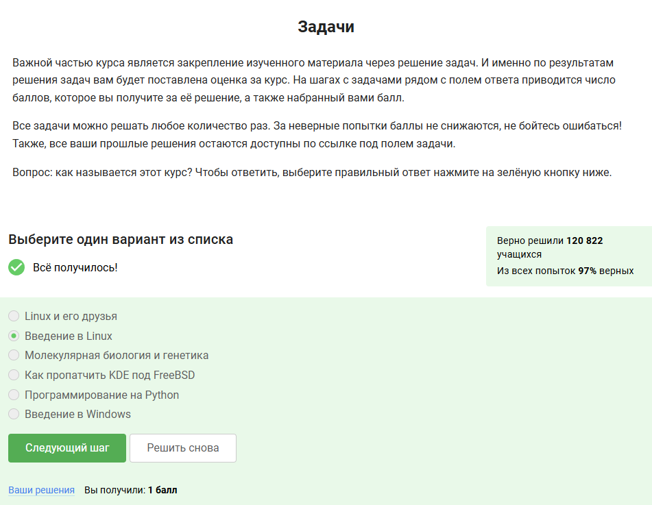{#fig:001 width=70%}

:::
::::::::::::::

## Общая информация о курсе

:::::::::::::: {.columns align=center}
::: {.column width="50%"}

2. Вопрос 2-й: Задание требует, чтобы мы проверили информацию об условиях прохождения курса (например: За каждую неверную попытку снимается 1 балл, но баллы не могут стать меньше 0). Ознакамливаемся с условиями курса и выбираем ответы.

:::
::: {.column width="50%"}

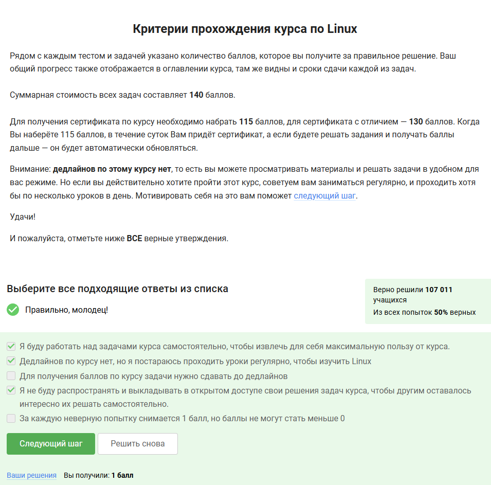{#fig:002 width=70%}

:::
::::::::::::::

# Как установить Linux

## Как установить Linux

:::::::::::::: {.columns align=center}
::: {.column width="50%"}

1. Вопрос 3-й: Автор ознакамливает нас с типом заданий на выбор нескольких вариантов ответа (от 0 до всех). Выбираем все, хотя любой ответ будет верный, и идем дальше.

:::
::: {.column width="50%"}

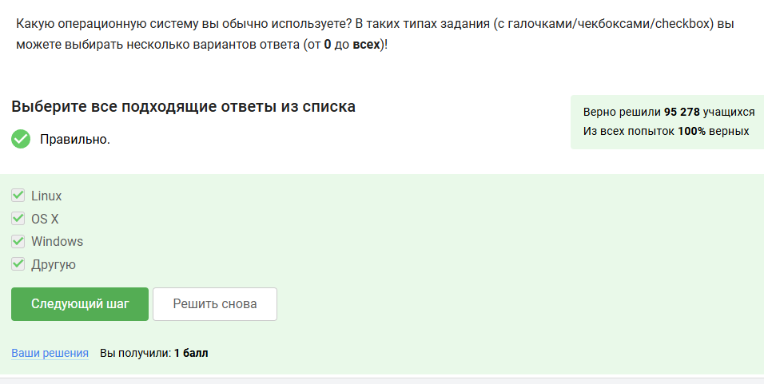{#fig:003 width=70%}

:::
::::::::::::::

## Как установить Linux

:::::::::::::: {.columns align=center}
::: {.column width="50%"}

2. Вопрос 4-й: Виртуальная машина - это специальная программа или вычислительная среда, имитирующая операционную систему и её аппаратуру, поэтому подходит вариант ответа с номером три.

:::
::: {.column width="50%"}

{#fig:004 width=70%}

:::
::::::::::::::

## Как установить Linux

:::::::::::::: {.columns align=center}
::: {.column width="50%"}

3. Вопрос 5-й: Учитывая выполнение предыдущих работ курса архитектуры компьютера, очевидно что ответ -- да.

:::
::: {.column width="50%"}

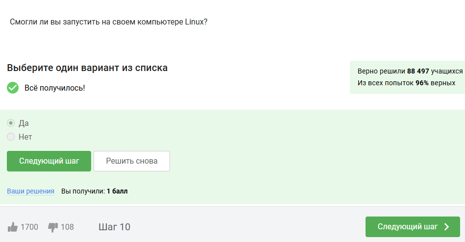{#fig:005 width=70%}

:::
::::::::::::::

# Осваиваем Linux

## Осваиваем Linux

1. Вопрос 6-й: Установим LibreOffice на нашу ОС с помощью команды sudo dnf -y install libreoffice. Откроем его и запишем туда строку 'Hello, Linux!', после сохраним файл в формате FODT и отправим на сайт курса.

:::::::::::::: {.columns align=center}
::: {.column width="50%"}

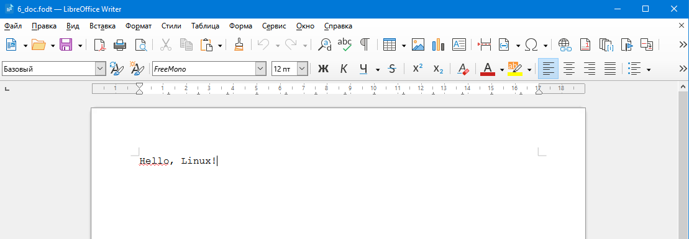{#fig:006 width=70%}

:::
::: {.column width="50%"}

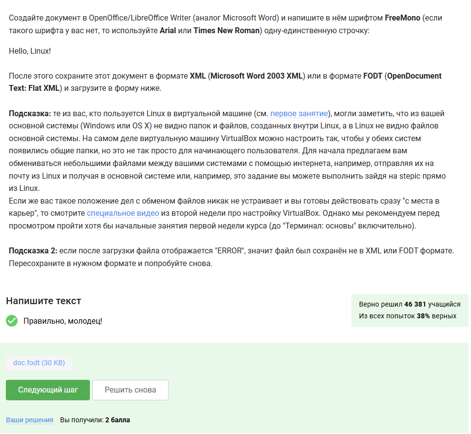{#fig:007 width=70%}

:::
::::::::::::::

## Осваиваем Linux

:::::::::::::: {.columns align=center}
::: {.column width="50%"}

2. Вопрос 7-й: Обычно установочные пакеты в Linux, основанных на Debian, имеют расширение DEB.

:::
::: {.column width="50%"}

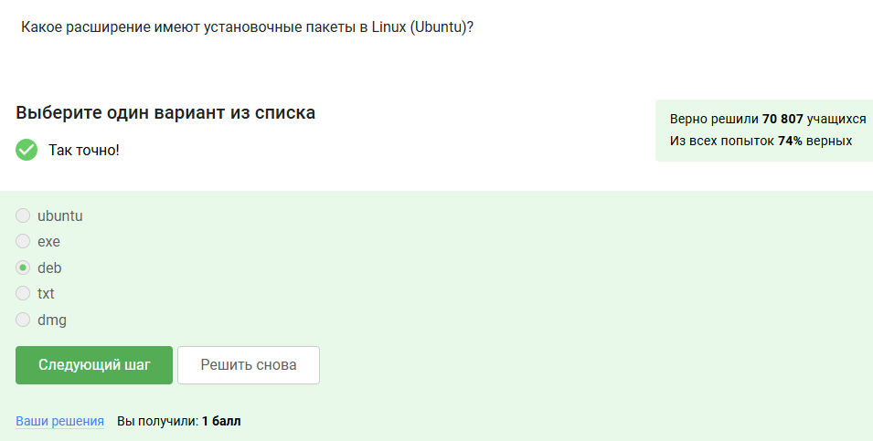{#fig:008 width=70%}

:::
::::::::::::::

## Осваиваем Linux

3. Вопрос 8-й: Установим VLC на нашу ОС с помощью команды sudo dnf -y install vlc. Откроем программу, перейдем в раздел Помощь->О программе->Авторы и выпишем фамилию первого разработчика -- Denis-Courmont.

:::::::::::::: {.columns align=center}
::: {.column width="50%"}

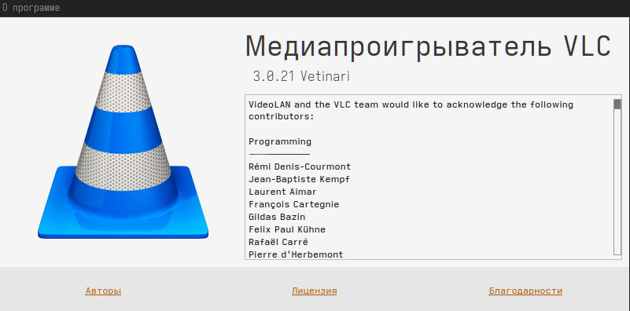{#fig:009 width=70%}

:::
::: {.column width="50%"}

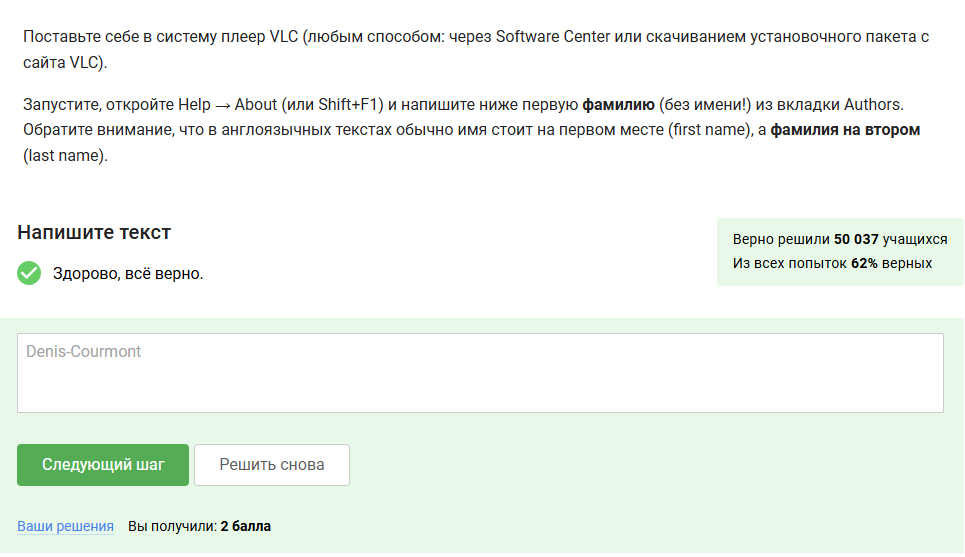{#fig:010 width=70%}

:::
::::::::::::::

## Осваиваем Linux

:::::::::::::: {.columns align=center}
::: {.column width="50%"}

4. Вопрос 9-й: Из официальной справки узнаем для чего нужен update-manager: Update-manager is especially designed for upgrading your system, or migrating your system towards a more recent version. Выберем соответствующие ответы.

:::
::: {.column width="50%"}

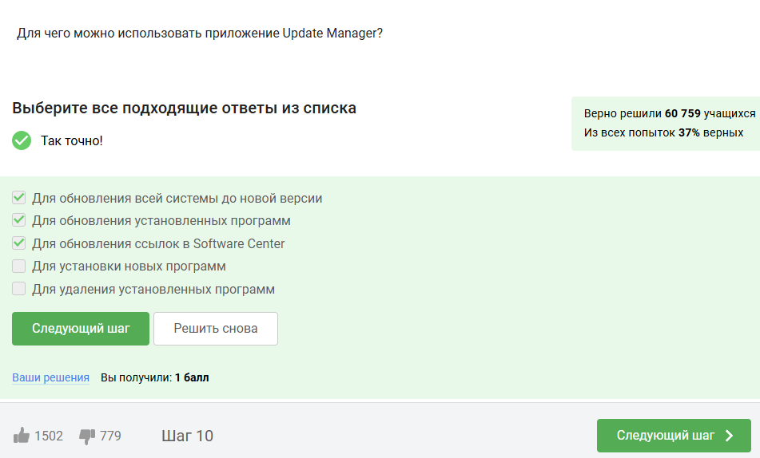{#fig:011 width=70%}

:::
::::::::::::::

# Terminal: основы

## Terminal: основы

:::::::::::::: {.columns align=center}
::: {.column width="50%"}

1. Вопрос 10-й: Командную строку также называют терминалом или консолью, но точно не термином или ассолью.

:::
::: {.column width="50%"}

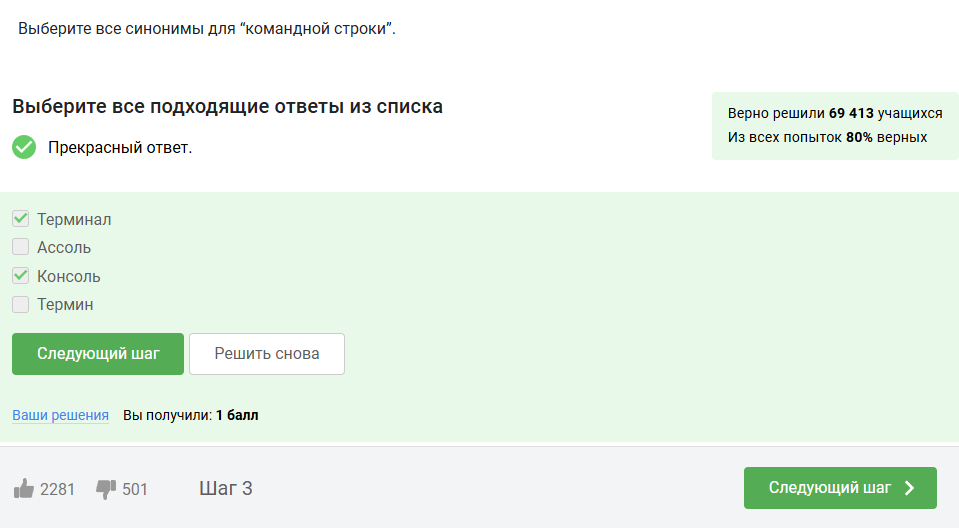{#fig:012 width=70%}

:::
::::::::::::::

## Terminal: основы

:::::::::::::: {.columns align=center}
::: {.column width="50%"}

2. Вопрос 11-й: Linux чувствителен к регистру, поэтому подходит только pwd.

:::
::: {.column width="50%"}

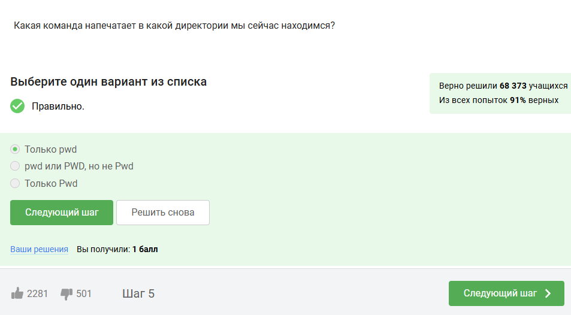{#fig:013 width=70%}

:::
::::::::::::::

## Terminal: основы

:::::::::::::: {.columns align=center}
::: {.column width="55%"}

3. Вопрос 12-й: Изчим опции команды ls. Все варианты подходят, так как порядок вызова опций не имеет значения, а сами опции можно писать в любом формате (полном или кратком). Также опции, не ожидающие аргумента, можно указывать в любом порядке под одним символом тире.

- ```-A``` или ```--almost-all``` -- показывает все файлы и папки, включая скрытые.
- ```-h``` или ```--human-readable``` -- выводит размеры файлов в более удобном для человека формате.
- ```-l``` -- включает длинный формат вывода с большим количеством информации

:::
::: {.column width="45%"}

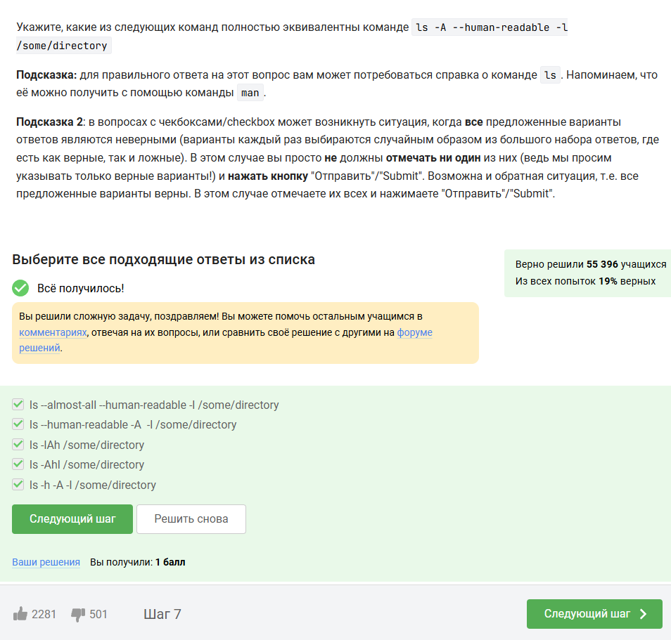{#fig:014 width=90%}

:::
::::::::::::::

## Terminal: основы

:::::::::::::: {.columns align=center}
::: {.column width="50%"}

4. Вопрос 13-й: Можно указать полный путь, символ домашней директории (~) или перейти выше по иерархии каталогов в домашнюю директорию и из неё вывести содержимое Downloads. Первый вариант не подходит, так как мы находимся в /home/bi/Documents, в которой нет Downloads.

:::
::: {.column width="50%"}

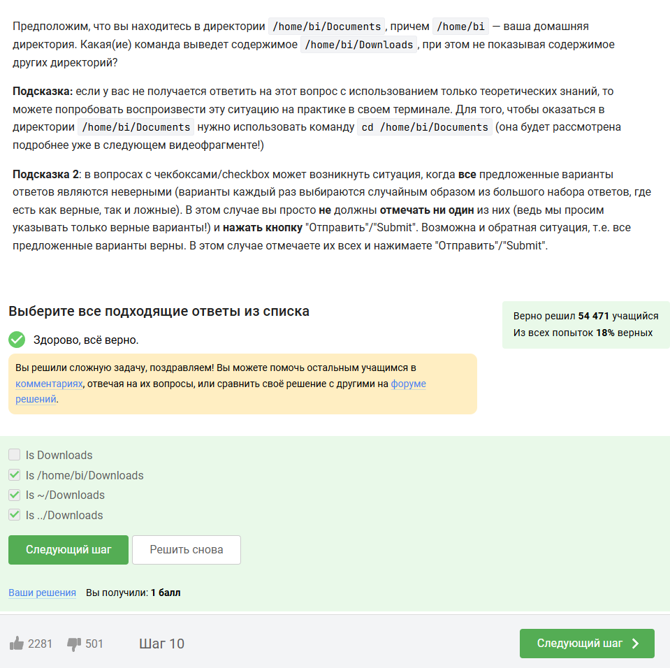{#fig:015 width=70%}

:::
::::::::::::::

## Terminal: основы

:::::::::::::: {.columns align=center}
::: {.column width="50%"}

5. Вопрос 14-й: Чтобы удалить директорию командой rm, нужно обязательно указать ключ -r.

:::
::: {.column width="50%"}

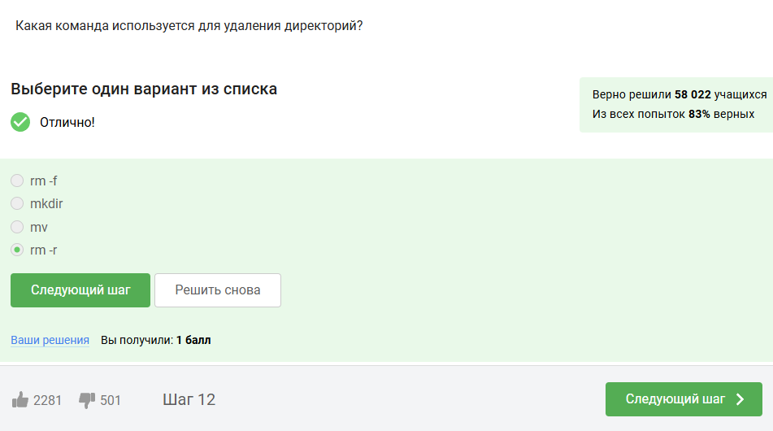{#fig:016 width=70%}

:::
::::::::::::::

# Запуск исполняемых файлов

## Запуск исполняемых файлов

:::::::::::::: {.columns align=center}
::: {.column width="50%"}

1. Вопрос 15-й: С помощью команды firefox запустится браузер, однако терминал останется заблокированным, дожидаясь завершения этого процесса. Поэтому команда exit не будет воспринята и ничего не закроется.

:::
::: {.column width="50%"}

{#fig:017 width=70%}

:::
::::::::::::::

## Запуск исполняемых файлов

:::::::::::::: {.columns align=center}
::: {.column width="50%"}

2. Вопрос 16-й: Запуск программы с амперсандом эквивалентен запуску в фоновом режиме, т.е. второй последовательности команд.

:::
::: {.column width="50%"}

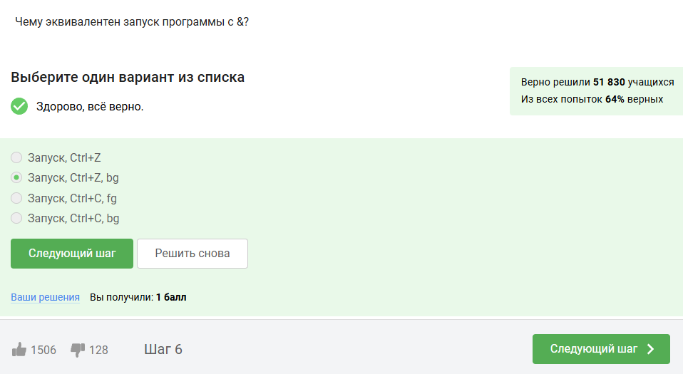{#fig:018 width=70%}

:::
::::::::::::::

## Запуск исполняемых файлов

3. Вопрос 17-й: Скачаем файл и сделаем его исполняемым командой chmod a+x 17_lec1_frag4_current_time.py. Т.е. выдадим пользователю, группе и остальным право на исполнение (x).

:::::::::::::: {.columns align=center}
::: {.column width="50%"}

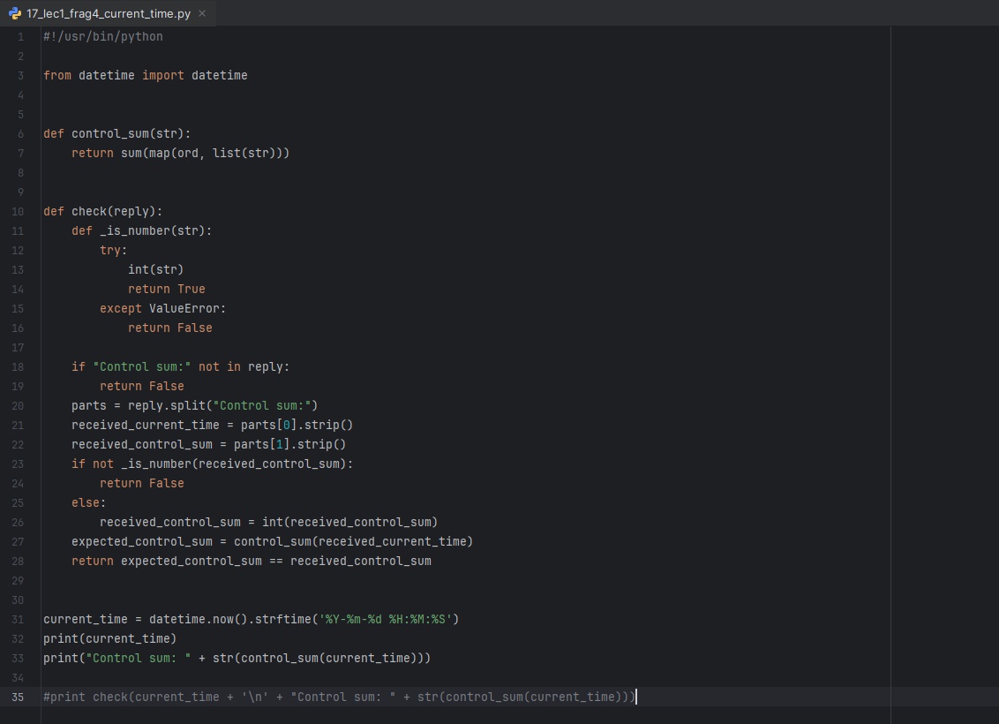{#fig:019 width=70%}

:::
::: {.column width="50%"}

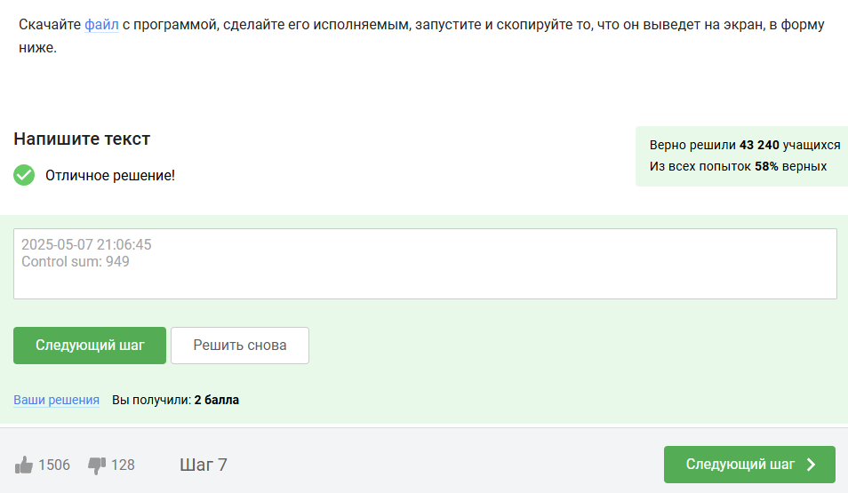{#fig:020 width=70%}

:::
::::::::::::::

# Ввод / вывод

## Ввод / вывод

:::::::::::::: {.columns align=center}
::: {.column width="50%"}

1. Вопрос 18-й: По умолчанию поток ошибок программы выводится на экран (или же в терминал).

:::
::: {.column width="50%"}

{#fig:021 width=70%}

:::
::::::::::::::

## Ввод / вывод

:::::::::::::: {.columns align=center}
::: {.column width="50%"}

2. Вопрос 19-й: Операция перенаправления потока вывода всегда обозначается через стрелку вправо, а цифра перед ней указывает на конкретный поток вывода (в случае с 2 -- поток ошибок).

:::
::: {.column width="50%"}

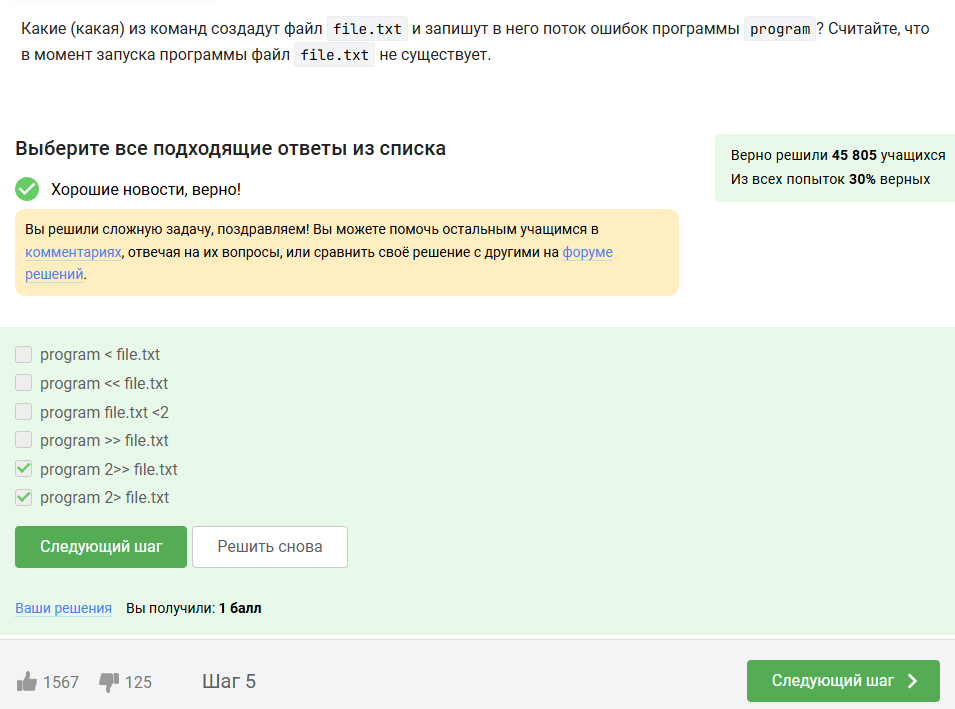{#fig:022 width=70%}

:::
::::::::::::::

## Ввод / вывод

:::::::::::::: {.columns align=center}
::: {.column width="50%"}

3. Вопрос 20-й: По стандарту, сообщения об ошибках выводятся на экран при объединении в конвейер.

:::
::: {.column width="50%"}

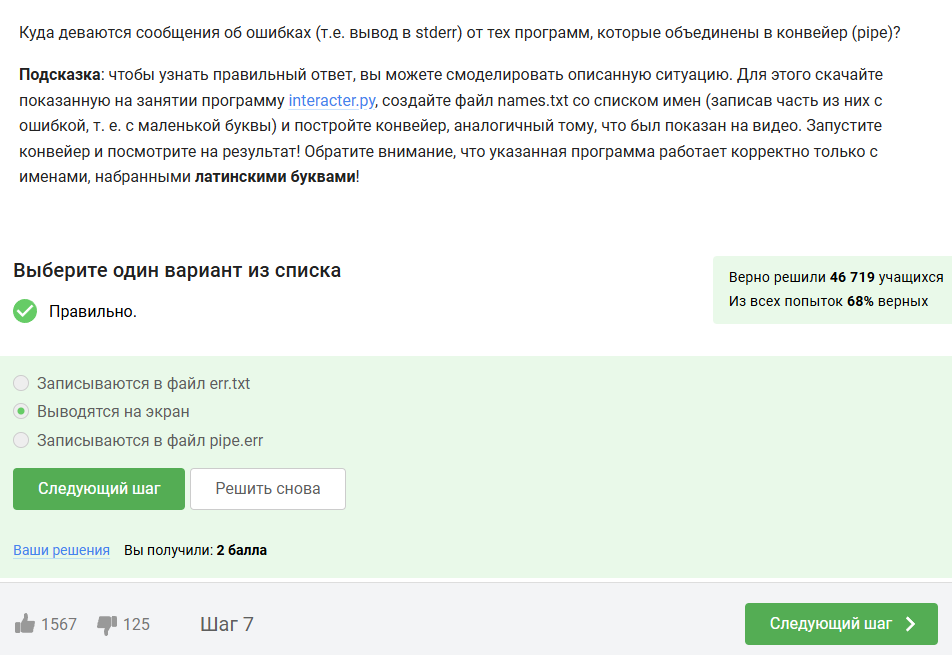{#fig:023 width=70%}

:::
::::::::::::::

# Скачивание файлов из интернета

## Скачивание файлов из интернета

:::::::::::::: {.columns align=center}
::: {.column width="50%"}

1. Вопрос 21-й: Опция -O перезаписывает путь, указанный в -P /home/alex/Pictures, поэтому файл окажется в текущей директории: ./1.jpg.

:::
::: {.column width="50%"}

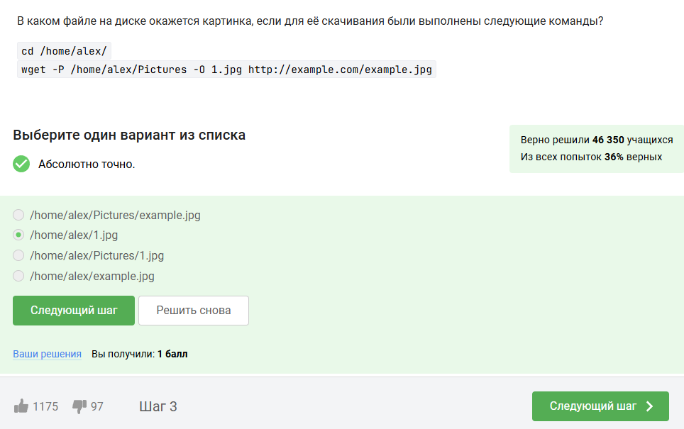{#fig:024 width=70%}

:::
::::::::::::::

## Скачивание файлов из интернета

:::::::::::::: {.columns align=center}
::: {.column width="50%"}

2. Вопрос 22-й: Откроем справку man wget и из неё найдем опцию: ```-q``` или же ```quiet```.

:::
::: {.column width="50%"}

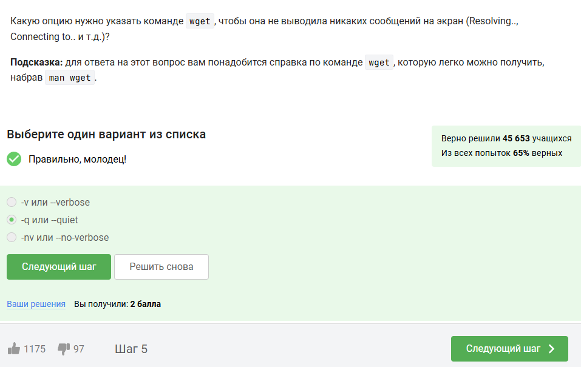{#fig:025 width=70%}

:::
::::::::::::::

## Скачивание файлов из интернета

:::::::::::::: {.columns align=center}
::: {.column width="50%"}

3. Вопрос 23-й: Опция -A позволяет включить в поиск только указанные форматы, однако фильтр не распространяются на формат HTML. Так как рекурсия происходит на один шаг (-l 1), то файлы HTML удалятся.

:::
::: {.column width="50%"}

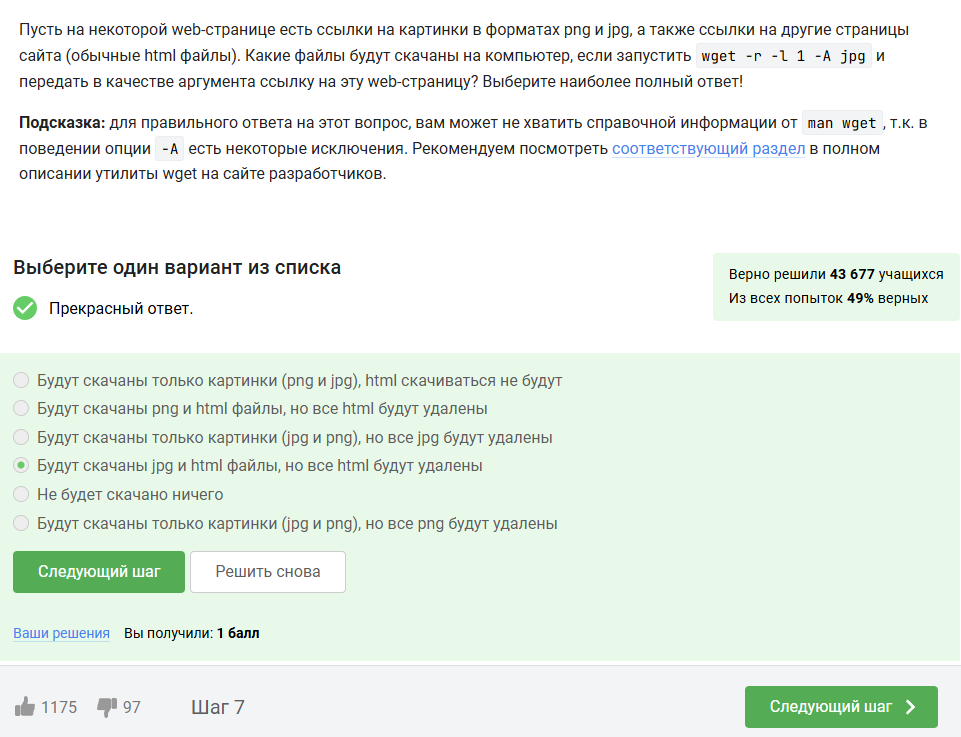{#fig:026 width=70%}

:::
::::::::::::::

# Работа с архивами

## Работа с архивами

:::::::::::::: {.columns align=center}
::: {.column width="50%"}

1. Вопрос 24-й: Архиватор gzip, в отличие от zip, удаляет архив после его распоковки.

:::
::: {.column width="50%"}

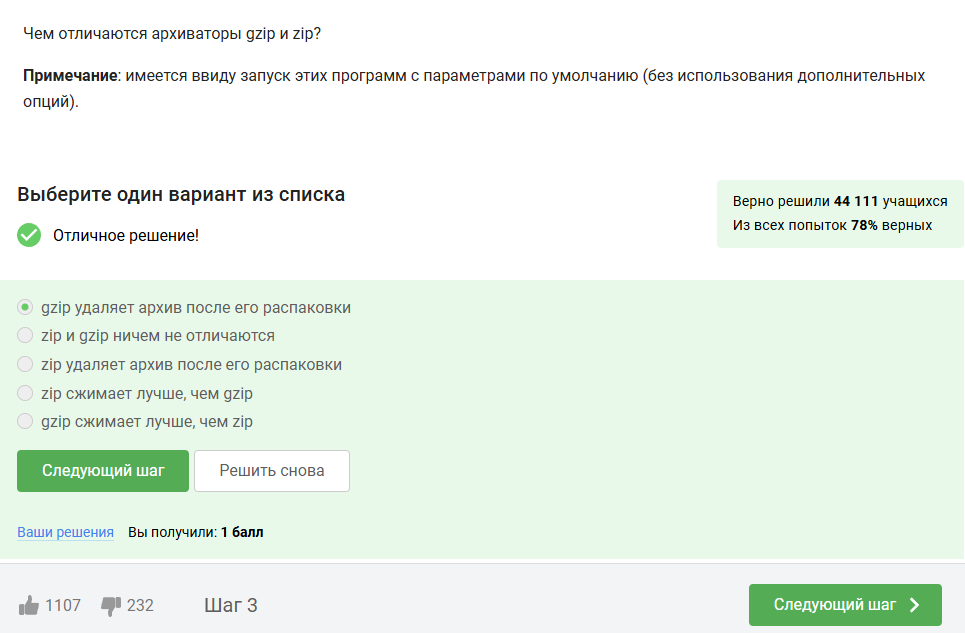{#fig:027 width=70%}

:::
::::::::::::::

## Работа с архивами

:::::::::::::: {.columns align=center}
::: {.column width="50%"}

2. Вопрос 25-й: Создать архив из директории с файлами могут tar и zip.

:::
::: {.column width="50%"}

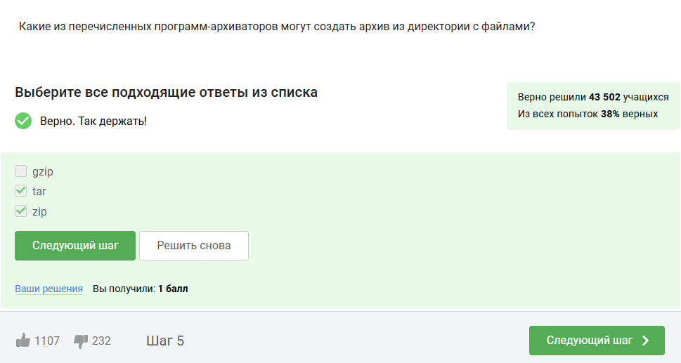{#fig:028 width=70%}

:::
::::::::::::::

## Работа с архивами

:::::::::::::: {.columns align=center}
::: {.column width="50%"}

3. Вопрос 26-й: Подходит третий вариант, так как опция ```-c``` позволит создать новый архив, ```-j``` укажет формат ```.bz2```, а ```-f``` позволит создать файл архива my_archive.tar.

:::
::: {.column width="50%"}

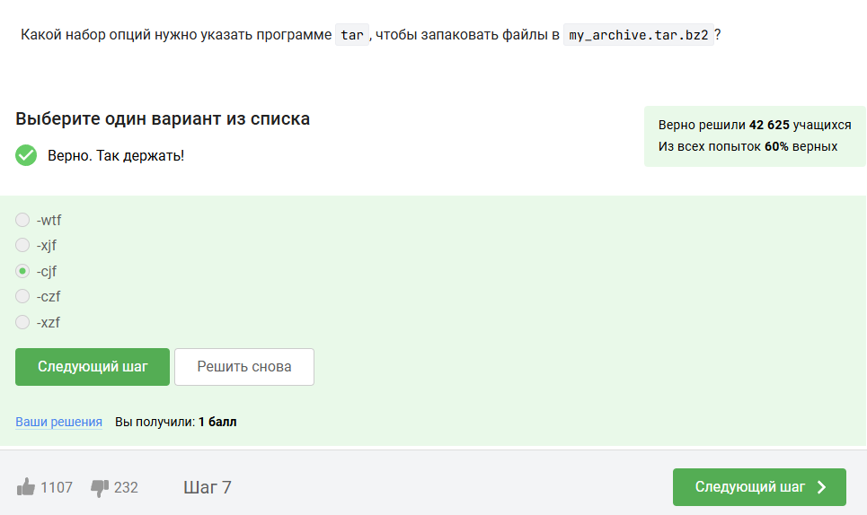{#fig:029 width=70%}

:::
::::::::::::::

# Поиск файлов и слов в файлах

## Поиск файлов и слов в файлах

:::::::::::::: {.columns align=center}
::: {.column width="55%"}

1. Вопрос 27-й: Рассмотрим каждый вариант и выберем НЕПРАВИЛЬНЫЕ:

- Alexey.jpeg -- точное имя, вариант правильный;
- *.* -- любые две последовательности, между которыми стоит точка, вариант правильный;
- *.jpg -- любой файл, формат которого JPG, а не JPEG, вариант неправильный;
- Alex* -- любой файл, имя которого начинается с Alex, вариант правильный;
- alexey.* -- Linux чувствителен к регистру, поэтому вариант неправильный;
- *.? -- любой файл, имя которого заканчивается точкой, после которой идёт один любой символ, вариант неправильный;

:::
::: {.column width="45%"}

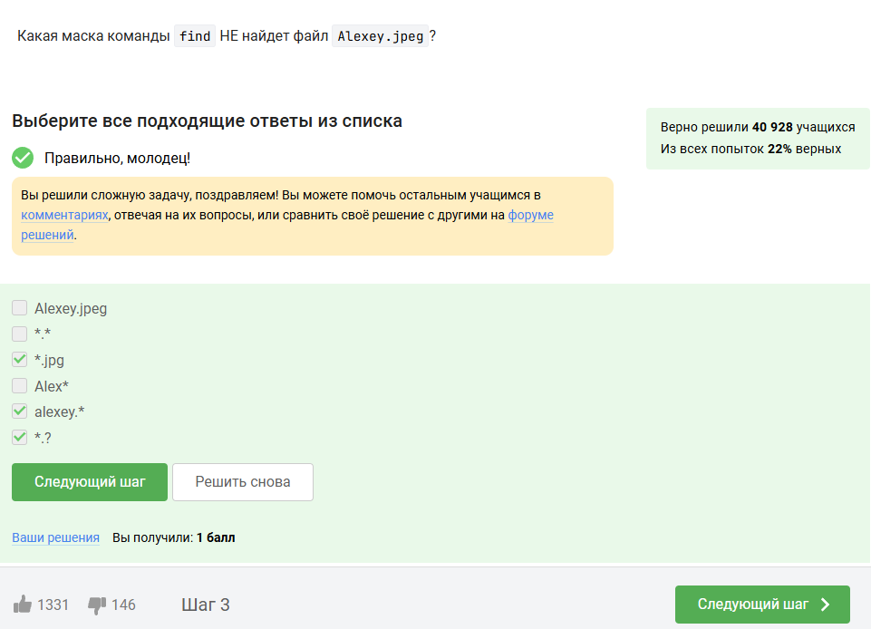{#fig:030 width=90%}

:::
::::::::::::::

## Поиск файлов и слов в файлах

:::::::::::::: {.columns align=center}
::: {.column width="50%"}

2. Вопрос 28-й: Команда grep выведет все строки, в которых содержится слово world с маленькой буквы и по отдельности или в составе других слов.

:::
::: {.column width="50%"}

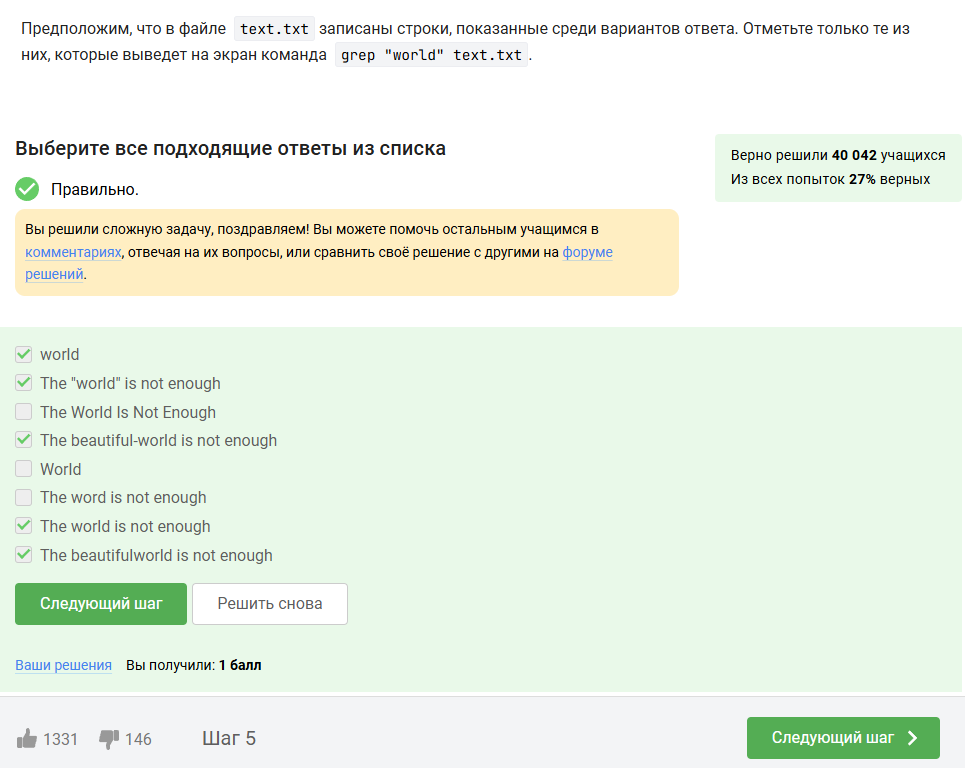{#fig:031 width=70%}

:::
::::::::::::::

## Поиск файлов и слов в файлах

:::::::::::::: {.columns align=center}
::: {.column width="50%"}

3. Вопрос 29-й: Используем команду ```find Shakespeare/* -name "*.txt" -print0 | xargs -0 cat | grep "love" > sh.txt```, которая сначала найдет все файлы в каталоге, имеющие формат TXT, потом поставит в конце нулевой символ и передаст вывод в xargs. Эта команда разделит файлы на разные аргументы по нулевому символу и передаст их в grep.

:::
::: {.column width="50%"}

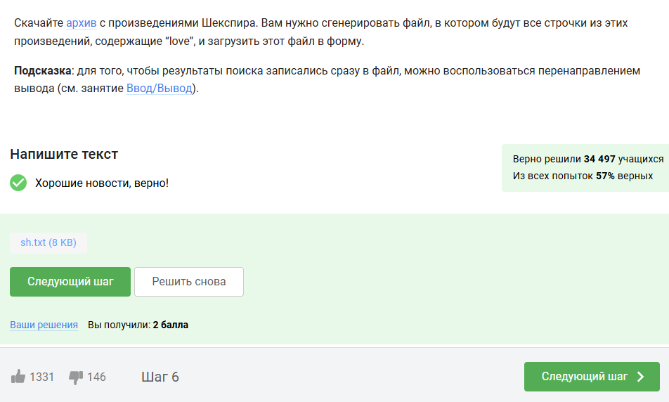{#fig:032 width=70%}

:::
::::::::::::::

# Вывод

В результате выполнения блока внешнего курса №1 "Введение" я ознакомился с базовыми командами Linux, научился устанавливать и запускать файлы, работать с архивами и использовать ввод/вывод.
