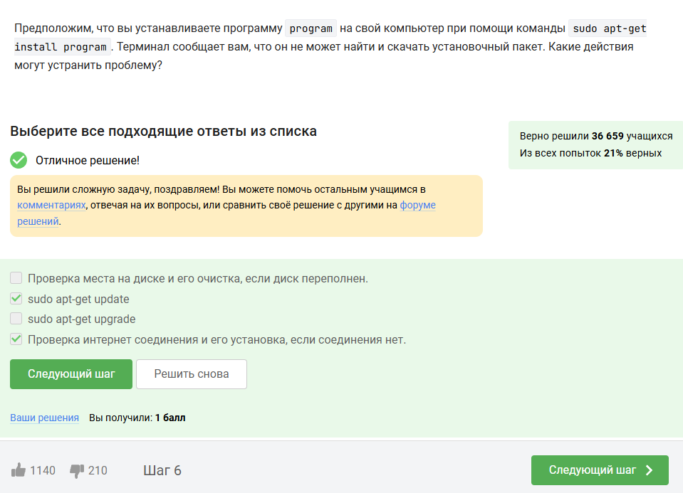
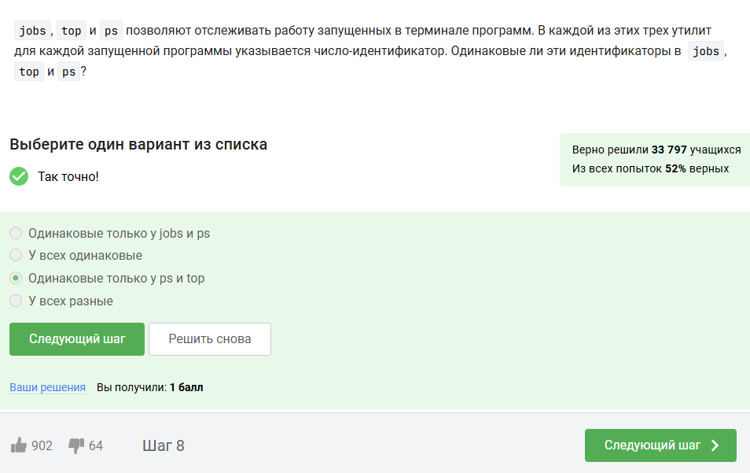
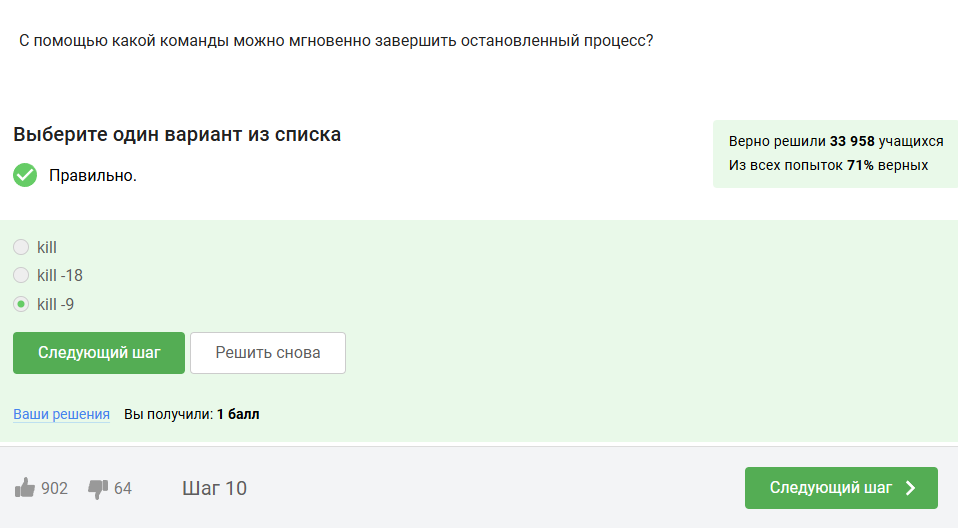
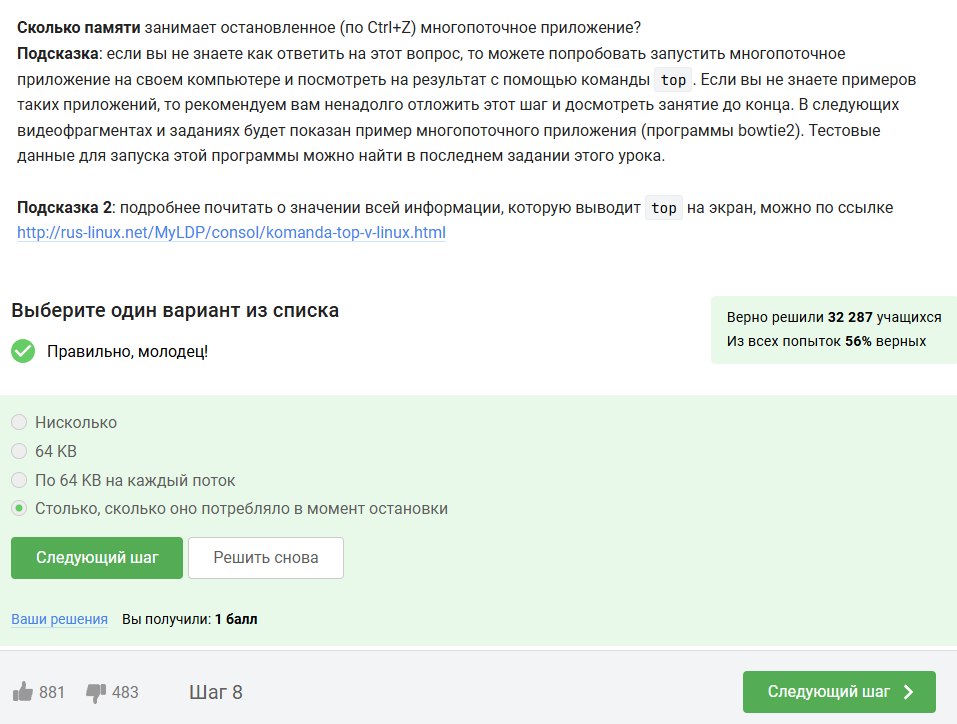
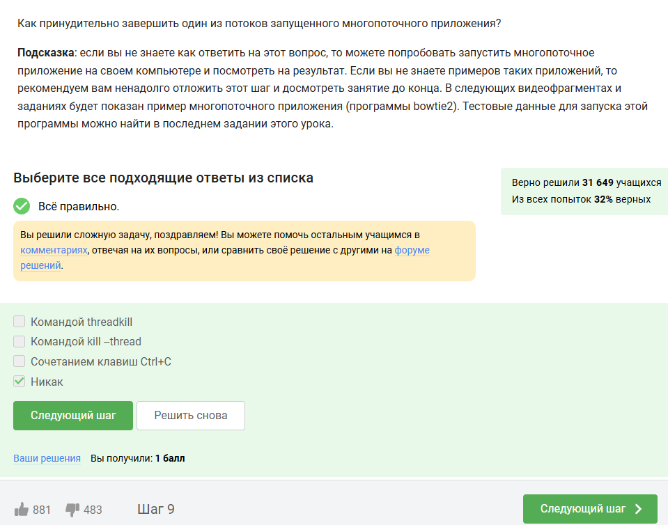
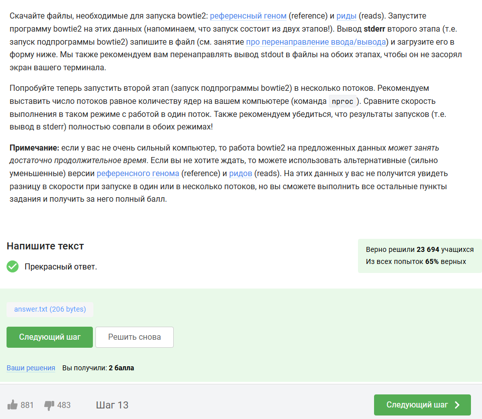
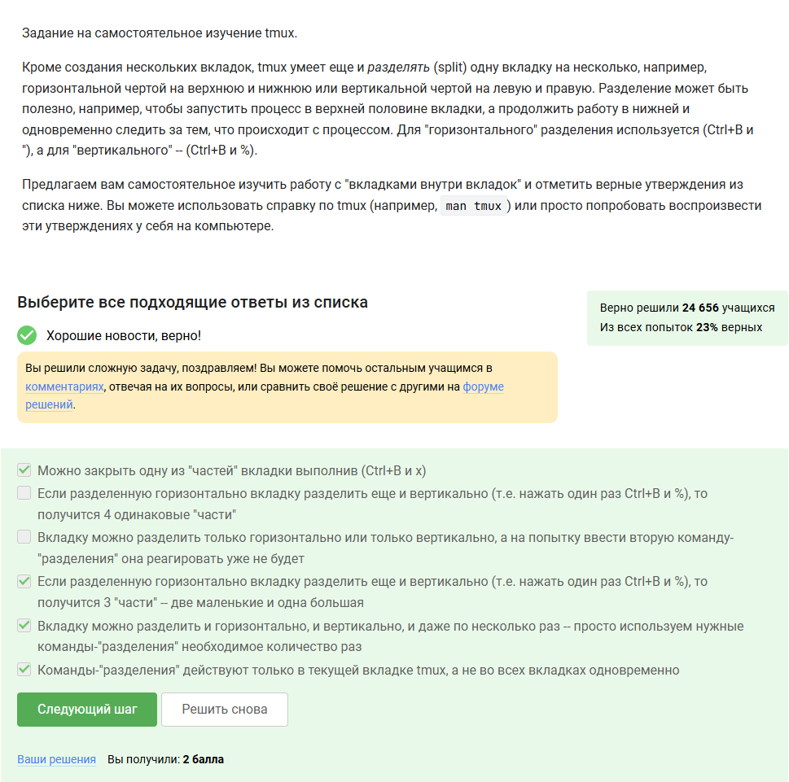

---
## Front matter
lang: ru-RU
title: Выполнение внешнего курса
subtitle: Блок №2. Работа на сервере
author:
  - Сергеев Д. О.
institute:
  - Российский университет дружбы народов, Москва, Россия
date: 9 мая 2025

## i18n babel
babel-lang: russian
babel-otherlangs: english

## Formatting pdf
toc: false
toc-title: Содержание
slide_level: 2
aspectratio: 169
section-titles: true
theme: metropolis
header-includes:
 - \metroset{progressbar=frametitle,sectionpage=progressbar,numbering=fraction}
---

# Информация

## Докладчик

:::::::::::::: {.columns align=center}
::: {.column width="70%"}

  * Сергеев Даниил Олегович
  * Студент
  * Направление: Прикладная информатика
  * Российский университет дружбы народов
  * [1132246837@pfur.ru](mailto:1132246837@pfur.ru)

:::
::::::::::::::

# Цель работы

Получить основные навыки работы с ОС Linux путем прохождения внешнего курса на образовательной платформе stepik.

# Задание

- Пройти курс.
- Получить сертификат.
- Записать видео по каждому разделу.
- Записать итоговую презентацию по каждому этапу.
- Написать отчёт по прохождению контрольных мероприятий по каждому разделу.

# Выполнение лабораторной работы

Приступим к выполнению второго блока заданий внешнего курса -- Работе на сервере.

# Знакомство с сервером

## Знакомство с сервером

:::::::::::::: {.columns align=center}
::: {.column width="50%"}

1. Вопрос 1-й: Все варианты ответа подходят, так как удаленный сервер используется как для хранения данных, так и для сложных вычислений.

:::
::: {.column width="50%"}

{#fig:001 width=70%}

:::
::::::::::::::

## Знакомство с сервером

:::::::::::::: {.columns align=center}
::: {.column width="50%"}

2. Вопрос 2-й: Ключ id_rsa.pub открытый (из-за того что он сгенерировался с подписью PUB), поэтому его можно спокойно пересылать по интернету.

:::
::: {.column width="50%"}

{#fig:002 width=70%}

:::
::::::::::::::

# Обмен файлами

## Обмен файлами

:::::::::::::: {.columns align=center}
::: {.column width="50%"}

1. Вопрос 3-й: Команда ssh позволяет удалённо выполнять команды на сервере, а scp безопасно копирует файл с сервера на компьютер и наоборот. Чтобы скопировать каталог вместе с его содрежимым, нужно указать ключ ```-r```.

:::
::: {.column width="50%"}

{#fig:003 width=70%}

:::
::::::::::::::

## Обмен файлами

:::::::::::::: {.columns align=center}
::: {.column width="50%"}

2. Вопрос 4-й: Если команда apt-get не может найти и скачать установленный пакеты, значит у пользователя отсутствует интернет соединение или установочные пакеты не обновлены. Значит подойдет второй и четвертый вариант.

:::
::: {.column width="50%"}

{#fig:004 width=70%}

:::
::::::::::::::

## Обмен файлами

:::::::::::::: {.columns align=center}
::: {.column width="50%"}

3. Вопрос 5-й: Filezilla -- это программа для копирования файлов между компьютером и удалёнными серверами с помощью FTP протокола.

:::
::: {.column width="50%"}

{#fig:005 width=70%}

:::
::::::::::::::

# Запуск приложений

## Запуск приложений

:::::::::::::: {.columns align=center}
::: {.column width="50%"}

1. Вопрос 6-й: Первое, что приходит на ум -- это проверить есть ли другая версия программы для терминала. Если же такой версии нет, то при необходимости можно вывести графику на экран компьютера. Если запустить программу у себя на компьютере, то смысл использования сервера теряется.

:::
::: {.column width="50%"}

{#fig:006 width=70%}

:::
::::::::::::::

## Запуск приложений

:::::::::::::: {.columns align=center}
::: {.column width="50%"}

2. Вопрос 7-й: Посмотрим справку по каждой из команд, кроме четвертого пункта. Команда ```program ?!``` не вызовет справочную информацию. Стоит отметить, что команда help работает только для встроенных команд оболочки Linux.

:::
::: {.column width="50%"}

{#fig:007 width=70%}

:::
::::::::::::::

## Запуск приложений

:::::::::::::: {.columns align=center}
::: {.column width="50%"}

3. Вопрос 8-й: Откроем справку по FastQC и оттуда узнаем поддерживаемые форматы, исследуя ключ ```-f```: FastQ, SAM, BAM.

:::
::: {.column width="50%"}

{#fig:008 width=70%}

:::
::::::::::::::

## Запуск приложений

:::::::::::::: {.columns align=center}
::: {.column width="50%"}

4. Вопрос 9-й: Откроем справку по Clustal версии для терминала, для удобства пропишем ```/align```, чтобы подсветились все вхождения этого слова: ключ ```-align``` позволяет сделать множественное выравнивание

:::
::: {.column width="50%"}

{#fig:009 width=70%}

:::
::::::::::::::

# Контроль запускаемых программ

## Контроль запускаемых программ
:::::::::::::: {.columns align=center}
::: {.column width="50%"}

1. Вопрос 10-й: Сочетание клавиш ```Ctrl+C``` полностью завершит процесс, а ```Ctrl+Z``` лишь приостановит его. После выполненных действий команда jobs выведет запущенные процессы -- program2 и program3.


:::
::: {.column width="50%"}

{#fig:010 width=70%}

:::
::::::::::::::

## Контроль запускаемых программ

:::::::::::::: {.columns align=center}
::: {.column width="50%"}

2. Вопрос 11-й: Команда jobs присваивает номера процессам, начиная с нуля, а команды top и ps в качестве идентификатора выводят PID процесса.

:::
::: {.column width="50%"}

{#fig:011 width=70%}

:::
::::::::::::::

## Контроль запускаемых программ

:::::::::::::: {.columns align=center}
::: {.column width="50%"}

3. Вопрос 12-й: Ключ ```-9``` аналогичен SIGKILL или же мгновенному завершению процесса.

:::
::: {.column width="50%"}

{#fig:012 width=70%}

:::
::::::::::::::

## Контроль запускаемых программ

:::::::::::::: {.columns align=center}
::: {.column width="50%"}

4. Вопрос 13-й: Команда kill без опций лишь посылает сигнал завершения, поэтому остановленный процесс не приступит к завершению, пока его не продолжат.

:::
::: {.column width="50%"}

{#fig:013 width=70%}

:::
::::::::::::::

# Многопоточные приложения

## Многопоточные приложения

:::::::::::::: {.columns align=center}
::: {.column width="50%"}

1. Вопрос 14-й: Остановленное многопоточное приложение не использует ресурсы ЦП, поэтому его нагрузка (при том, что 100% -- одно ядро, 200% -- два, и так далее) равна нулю.

:::
::: {.column width="50%"}

{#fig:014 width=70%}

:::
::::::::::::::

## Многопоточные приложения

:::::::::::::: {.columns align=center}
::: {.column width="50%"}

2. Вопрос 15-й: Не смотря на то, что остановленное многопоточное приложение не использует ресурсы ЦП, оно все ещё загружено в памяти, которая не меняется с момента остановки.

:::
::: {.column width="50%"}

{#fig:015 width=70%}

:::
::::::::::::::

## Многопоточные приложения

:::::::::::::: {.columns align=center}
::: {.column width="50%"}

3. Вопрос 16-й: Все потоки запущенного многопоточного приложения выполняют одну задачу, то есть части процесса распределены. Поэтому завершить один из потоков принудительно нельзя, иначе нарушится исполнение программы.

:::
::: {.column width="50%"}

{#fig:016 width=70%}

:::
::::::::::::::

## Многопоточные приложения

:::::::::::::: {.columns align=center}
::: {.column width="50%"}

4. Вопрос 17-й: Открыв справку, узнаем что обе программы можно запустить в несколько потоков, но в качестве ответа принимается вариант "Только bowtie2".

:::
::: {.column width="50%"}

{#fig:017 width=70%}

:::
::::::::::::::

## Многопоточные приложения

:::::::::::::: {.columns align=center}
::: {.column width="60%"}

5. Вопрос 18-й: Запустим первый этап командой ```bowtie2-build -f reference.fasta res```. В результате создадуться файлы формата BT2 с префиксом res. Во втором этапе запустим команду ```bowtie2 -x res -U reads.fastq.gz 2> answer.txt``` и запишем данные из файла TXT в качестве ответа. Здесь:

- В команде bowtie2-build: ```-f``` -- указание файла формата FASTA; ```res``` -- префикс для выходных файлов
- В команде bowtie2: ```-x``` -- опция для указания префикса; ```-U``` -- опция для указания файла ридов; ```2>``` -- команда перенаправления вывода ошибок;

:::
::: {.column width="40%"}

{#fig:018 width=100%}

:::
::::::::::::::

# Менеджер терминалов tmux

## Менеджер терминалов tmux

:::::::::::::: {.columns align=center}
::: {.column width="50%"}

1. Вопрос 19-й: Каждое окно в терминале tmux - отдельная сессия псевдотерминала со своими процессами. Процессы на одном из терминалов не будут отображатся на другом.

:::
::: {.column width="50%"}

{#fig:019 width=70%}

:::
::::::::::::::

## Менеджер терминалов tmux

:::::::::::::: {.columns align=center}
::: {.column width="50%"}

2. Вопрос 20-й: Если окон (вкладок) не останется, то tmux завершит работу после команды exit.

:::
::: {.column width="50%"}

{#fig:020 width=70%}

:::
::::::::::::::

## Менеджер терминалов tmux

:::::::::::::: {.columns align=center}
::: {.column width="50%"}

3. Вопрос 21-й: После запуска tmux, на сервере создастся отдельная сессия или же процесс, не зависящие от локального компьютера. Соединение прервется, но tmux продолжит работать.

:::
::: {.column width="50%"}

{#fig:021 width=70%}

:::
::::::::::::::

## Менеджер терминалов tmux

:::::::::::::: {.columns align=center}
::: {.column width="50%"}

4. Вопрос 22-й: Аналогично 19 вопросу, после закрытия вкладки закончится и сессия псевдотерминала с её процессами.

:::
::: {.column width="50%"}

{#fig:022 width=70%}

:::
::::::::::::::

## Менеджер терминалов tmux

:::::::::::::: {.columns align=center}
::: {.column width="50%"}

5. Вопрос 23-й: Переименовывание текущей вкладки происходит с помощью команды ```Ctrl+B ,(запятая)```

:::
::: {.column width="50%"}

{#fig:023 width=70%}

:::
::::::::::::::

## Менеджер терминалов tmux

:::::::::::::: {.columns align=center}
::: {.column width="50%"}

6. Вопрос 24-й: Изучим справку man tmux. Найдем комбинации с CTRL с помощью ```/C-```, исследуем нужные сочетания клавиш и выберем верные варианты ответа.

:::
::: {.column width="50%"}

{#fig:024 width=70%}

:::
::::::::::::::

# Вывод

В результате выполнения блока внешнего курса №2 "Работа на сервере" я ознакомился с методами и принципами обмена файламами, научился запускать и контролировать приложения, изучил основы работы с серверами и выполнил задачи с tmux.
