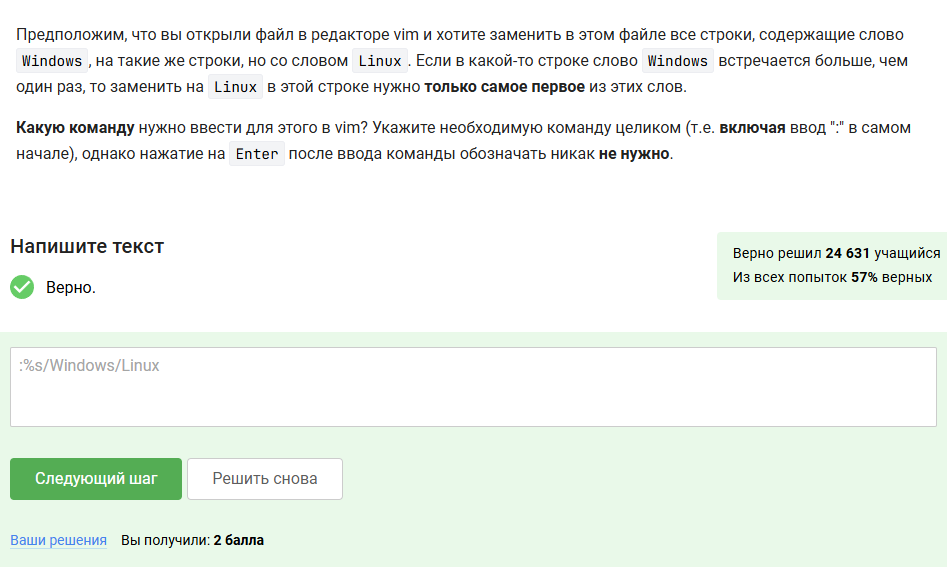
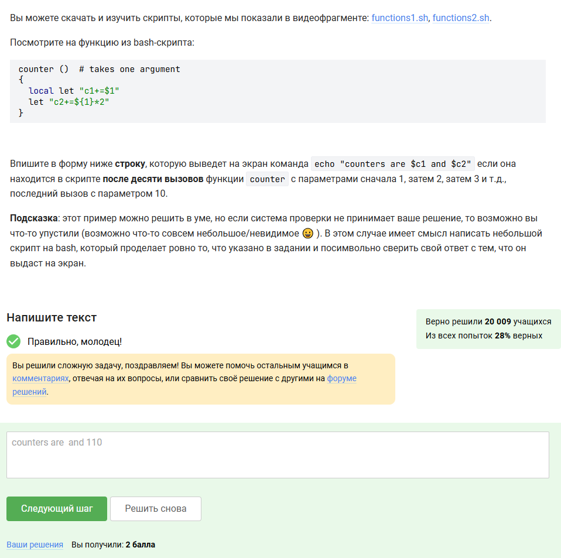
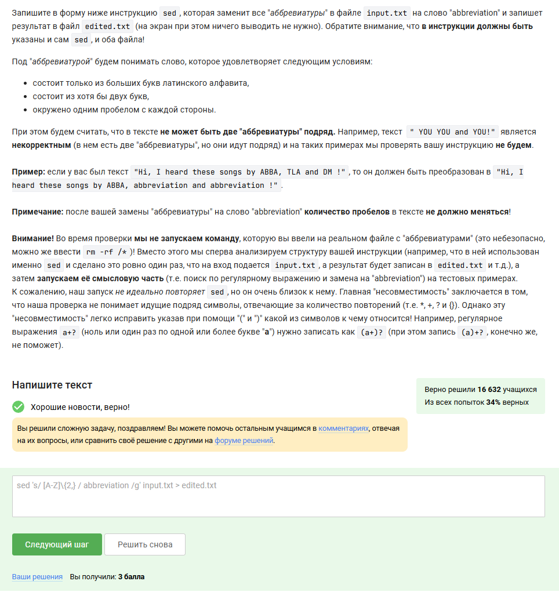
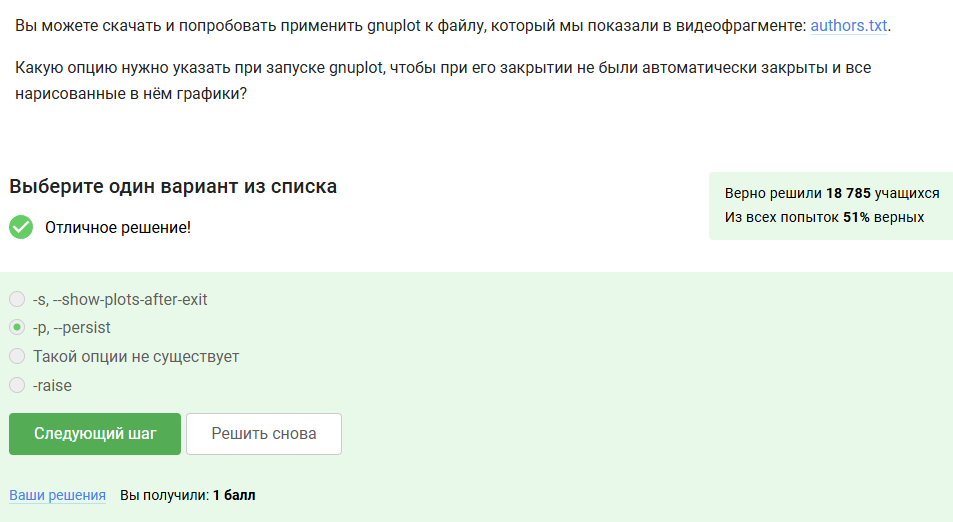
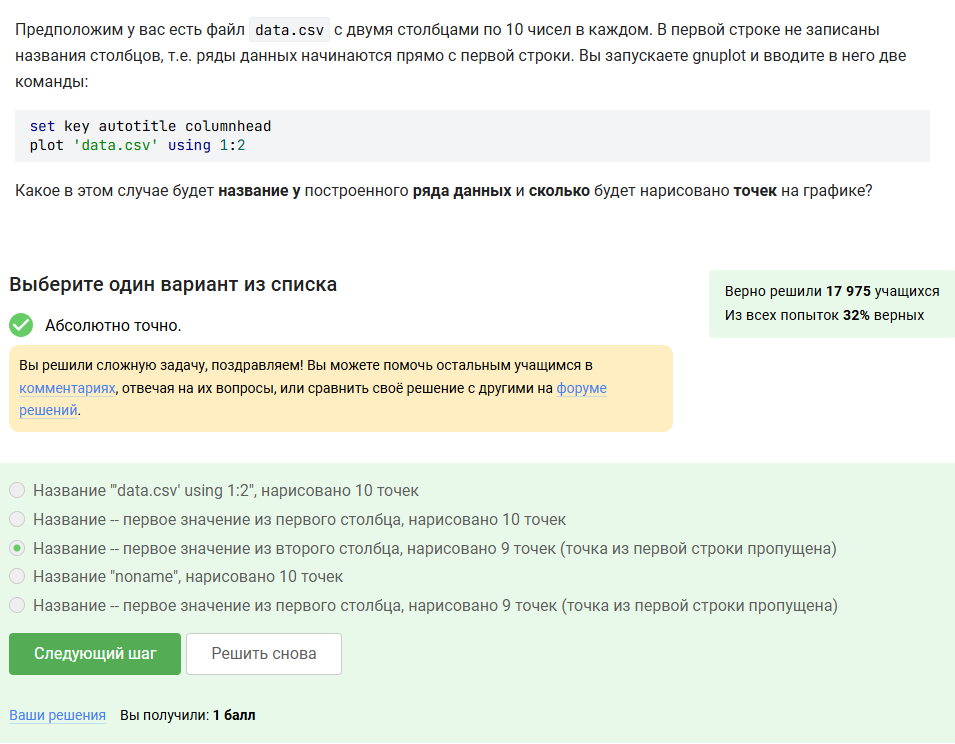

---
## Front matter
lang: ru-RU
title: Выполнение внешнего курса
subtitle: Блок №3. Продвинутые темы
author:
  - Сергеев Д. О.
institute:
  - Российский университет дружбы народов, Москва, Россия
date: 9 мая 2025

## i18n babel
babel-lang: russian
babel-otherlangs: english

## Formatting pdf
toc: false
toc-title: Содержание
slide_level: 2
aspectratio: 169
section-titles: true
theme: metropolis
header-includes:
 - \metroset{progressbar=frametitle,sectionpage=progressbar,numbering=fraction}
---

# Информация

## Докладчик

:::::::::::::: {.columns align=center}
::: {.column width="70%"}

  * Сергеев Даниил Олегович
  * Студент
  * Направление: Прикладная информатика
  * Российский университет дружбы народов
  * [1132246837@pfur.ru](mailto:1132246837@pfur.ru)

:::
::::::::::::::

# Цель работы

Получить основные навыки работы с ОС Linux путем прохождения внешнего курса на образовательной платформе stepik.

# Задание

- Пройти курс.
- Получить сертификат.
- Записать видео по каждому разделу.
- Записать итоговую презентацию по каждому этапу.
- Написать отчёт по прохождению контрольных мероприятий по каждому разделу.

# Выполнение лабораторной работы

Приступим к выполнению третьего блока заданий внешнего курса -- Продвинутым темам.

# Текстовый редактор vim

## Текстовый редактор vim

:::::::::::::: {.columns align=center}
::: {.column width="50%"}

1. Вопрос 1-й: Из только что открытого в vim файла можно выйти перейдя в командный режим с помощью ```:``` и написав ```q```, затем ENTER. (если не производилось изменение файла)

:::
::: {.column width="50%"}

{#fig:001 width=70%}

:::
::::::::::::::

## Текстовый редактор vim

:::::::::::::: {.columns align=center}
::: {.column width="50%"}

2. Вопрос 2-й: Введем тестовую строку и проведем на ней указанные операции, выберем правильные ответы.

:::
::: {.column width="50%"}

{#fig:002 width=70%}

:::
::::::::::::::

## Текстовый редактор vim

:::::::::::::: {.columns align=center}
::: {.column width="50%"}

3. Вопрос 3-й: Проверим каждую комбинацию в редакторе vim. Укажем правильные ответы.

:::
::: {.column width="50%"}

{#fig:003 width=70%}

:::
::::::::::::::

## Текстовый редактор vim

:::::::::::::: {.columns align=center}
::: {.column width="50%"}

4. Вопрос 4-й: В командном режиме можно совершить замену первого вхождения слова в строке. Для этого укажем строку ```:%s/Windows/Linux```, где:

- ```%``` -- диапазон (всего файла)
- ```s``` -- команда замены
- ```Windows``` -- то что заменяем
- ```Linux``` -- то на что заменяем

:::
::: {.column width="50%"}

{#fig:004 width=70%}

:::
::::::::::::::

## Текстовый редактор vim

:::::::::::::: {.columns align=center}
::: {.column width="50%"}

5. Вопрос 5-й: Проверим каждую опцию из предложенного списка, выберем правильные ответы.

:::
::: {.column width="50%"}

{#fig:005 width=70%}

:::
::::::::::::::

# Скрипты на bash: основы

## Скрипты на bash: основы

:::::::::::::: {.columns align=center}
::: {.column width="50%"}

1. Вопрос 6-й: Каждая оболочка хранит свойфайл независимо, поэтому в последней оболочке будут лишь команды C1, C2, C3.

:::
::: {.column width="50%"}

{#fig:006 width=70%}

:::
::::::::::::::

## Скрипты на bash: основы

:::::::::::::: {.columns align=center}
::: {.column width="50%"}

2. Вопрос 7-й: Исходя из скрипта, мы перейдем в домашнюю директорию, после в ней создастся файл file1.txt и команда отправит нас в каталог /home/bi/Desktop. В итоге выбираем второй вариант.

:::
::: {.column width="50%"}

{#fig:007 width=70%}

:::
::::::::::::::

## Скрипты на bash: основы

:::::::::::::: {.columns align=center}
::: {.column width="50%"}

3. Вопрос 8-й: В языке программирования bash в названия переменных допускаются нижние подчёркивания, числа и буквы, однако имена не должны начинаться с цифры. Выберем подходящие варианты ответа.

:::
::: {.column width="50%"}

{#fig:008 width=70%}

:::
::::::::::::::

## Скрипты на bash: основы

4. Вопрос 9-й: Используем команду echo для вывода сообщения. Чтобы символ доллара корректно отображался, укажем обратный слеш перед ним: ```...\$1...``` .

:::::::::::::: {.columns align=center}
::: {.column width="50%"}

{#fig:009 width=70%}

:::
::: {.column width="50%"}

```bash
echo Arguments are: \$1=$1 \$2=$2
```

:::
::::::::::::::

# Скрипты на bash: ветвления и циклы

## Скрипты на bash: ветвления и циклы

:::::::::::::: {.columns align=center}
::: {.column width="50%"}

1. Вопрос 10-й: Двойные квадратные скобки -- усовершенствованная версия тестовой конструкции test, позволяющая совершать сравнения и тесты. Изучим возможные опции для этой конструкции и выберем подходящие варианты.

:::
::: {.column width="50%"}

{#fig:010 width=70%}

:::
::::::::::::::

## Скрипты на bash: ветвления и циклы

:::::::::::::: {.columns align=center}
::: {.column width="50%"}

2. Вопрос 11-й: Задание проверяет знание опций для ```[[]]```. Пройдемся по условиям с заданными параметрами и выберем правильные варианты из списка.

:::
::: {.column width="50%"}

{#fig:011 width=70%}

:::
::::::::::::::

## Скрипты на bash: ветвления и циклы

3. Вопрос 12-й: Будем считывать первый аргумент с помощью ```$1```. Для проходки по возможным вариантам используем оператор case.

:::::::::::::: {.columns align=center}
::: {.column width="50%"}

{#fig:012 width=70%}

:::
::: {.column width="50%"}

{#fig:013 width=70%}

:::
::::::::::::::

## Скрипты на bash: ветвления и циклы

:::::::::::::: {.columns align=center}
::: {.column width="50%"}

```bash
arg=$1
case $arg in
    0)
        echo No students
    ;;
    1)
        echo 1 student  
    ;;
    2)
        echo 2 students
    ;;
```

:::
::: {.column width="50%"}

```bash
    3)
        echo 3 students
    ;;
    4)
        echo 4 students
    ;;
    *)
        echo A lot of students
esac
```

:::
::::::::::::::
 
## Скрипты на bash: ветвления и циклы

:::::::::::::: {.columns align=center}
::: {.column width="50%"}

4. Вопрос 13-й: Команда запуститься 5 раз, так как знак запятой тоже считается отдельным значением переменной str. Условие ```[[ $str > "c" ]]``` проверяет по длине строк, поэтому команда закончится на последнем аргументе, не выводя сообщение finish.

:::
::: {.column width="50%"}

{#fig:014 width=70%}

:::
::::::::::::::

## Скрипты на bash: ветвления и циклы

5. Вопрос 14-й: Программу запишем в цикл while true. Сделаем отдельные переменные для имени и возраста, считаем значения через команду read, проверяя на пустую строку либо нулевой возраст. 

:::::::::::::: {.columns align=center}
::: {.column width="50%"}

{#fig:015 width=70%}

:::
::: {.column width="50%"}

{#fig:016 width=60%}

:::
::::::::::::::

## Скрипты на bash: ветвления и циклы

:::::::::::::: {.columns align=center}
::: {.column width="50%"}

```bash
name=""
age=""
while true
do
    echo enter your name:
    read name
    if [[ -z $name ]]
    then
    break
    fi
    echo enter your age:
    read age
    if [[ $age -eq 0 ]]
    then
```

:::
::: {.column width="50%"}

```bash
	break
    fi
    if [[ $age -le 16 ]]
    then
	echo $name, your group is child
    elif [[ $age -gt 16 ]] && [[ $age -le 25 ]]
    then
	echo $name, your group is youth
    elif [[ $age -gt 25 ]]
    then
	echo $name, your group is adult
    fi
done
echo bye
```

:::
::::::::::::::

# Скрипты на bash: разное

## Скрипты на bash: разное

:::::::::::::: {.columns align=center}
::: {.column width="50%"}

1. Вопрос 15-й: Выражения с командой let можно писать как в кавычках, так и без них. Во втором варианте происходит сложение (объединение) строк, а первый вариант не сработает из-за неправильного операнда.

:::
::: {.column width="50%"}

{#fig:017 width=70%}

:::
::::::::::::::

## Скрипты на bash: разное

:::::::::::::: {.columns align=center}
::: {.column width="50%"}

2. Вопрос 16-й: Обратные одинарные ковычки позволяют выполнять команды внутри сценария оболочки, поэтому вывод будет равен пути pwd, указанном в файле.

:::
::: {.column width="50%"}

{#fig:018 width=70%}

:::
::::::::::::::

## Скрипты на bash: разное

:::::::::::::: {.columns align=center}
::: {.column width="50%"}

3. Вопрос 17-й: Достать вывод потока ошибок можно через встроенную переменную ```$?``` либо через запись результата в какой-нибудь файл с последующим считыванием кода выхода уже этого условия.

:::
::: {.column width="50%"}

{#fig:019 width=70%}

:::
::::::::::::::

## Скрипты на bash: разное

:::::::::::::: {.columns align=center}
::: {.column width="50%"}

4. Вопрос 18-й: Подвох этой задачи заключается в том, что мы пытаемся вывести значение переменной ```$c1```, хотя она является локальной в теле функции counter. На выходе её значение будет равно пустой строке.

:::
::: {.column width="50%"}

{#fig:020 width=70%}

:::
::::::::::::::

## Скрипты на bash: разное

5. Вопрос 19-й: Напишем программу для вычисления НОД, используя алгоритм Евклида и рекурсивный вызов функции в bash.

:::::::::::::: {.columns align=center}
::: {.column width="50%"}

{#fig:021 width=70%}

:::
::: {.column width="50%"}

{#fig:022 width=70%}

:::
::::::::::::::

## Скрипты на bash: разное

:::::::::::::: {.columns align=center}
::: {.column width="50%"}

```bash
gcd()
{
    local let "M+=${1}"
    local let "N=${2}"
    if [[ M -eq N ]]
    then
	return $M
    elif [[ M -gt N ]]
    then
	let "r=$M-$N"
	gcd $r $N
    elif [[ M -lt N ]]
    then
	let "r=$N-$M"

```

:::
::: {.column width="50%"}

```bash
	gcd $M $r
    fi   
}
while true
do
    read num1 num2
    if [[ -z $num1 ]] || [[ -z $num2 ]]
    then
	echo bye
	break
    fi
    gcd $num1 $num2
    echo GCD is $?
done
```

:::
::::::::::::::

## Скрипты на bash: разное

6. Вопрос 20-й: Реализуем калькулятор. Будем считывать уже 3 аргумента командой read. Чтобы оператор case не путал умножение ```"*")``` и оставшиеся варианты ```*)```, поместим знак умножения в кавычки. 

:::::::::::::: {.columns align=center}
::: {.column width="50%"}

{#fig:023 width=70%}

:::
::: {.column width="50%"}

{#fig:024 width=70%}

:::
::::::::::::::

# Продвинутый поиск и редактирование

## Продвинутый поиск и редактирование

:::::::::::::: {.columns align=center}
::: {.column width="50%"}

1. Вопрос 21-й: Команда ```-iname``` не учитывает регистр, поэтому найдутся те варианты, которые начинаются с star и заканчиваются любым набором в любом регистре.

:::
::: {.column width="50%"}

{#fig:025 width=70%}

:::
::::::::::::::

## Продвинутый поиск и редактирование

:::::::::::::: {.columns align=center}
::: {.column width="50%"}

2. Вопрос 22-й: Изучим каждый вариант ответа и выберем верные.

:::
::: {.column width="50%"}

{#fig:026 width=70%}

:::
::::::::::::::

## Продвинутый поиск и редактирование

:::::::::::::: {.columns align=center}
::: {.column width="50%"}

3. Вопрос 23-й: Глубина поиска начинается с текущей директории, поэтому он будет проходить в области ```dir1 <-> dir2```, не заходя в каталог dir3.

:::
::: {.column width="50%"}

{#fig:027 width=70%}

:::
::::::::::::::

## Продвинутый поиск и редактирование

:::::::::::::: {.columns align=center}
::: {.column width="50%"}

4. Вопрос 24-й: Рассмотрим каждую из опций:

- ```-A n``` -- Вывод n строк контекста после группы найденных вхождений;
- ```-B n``` -- Вывод n строк контекста перез группой найденных вхождений;
- ```-C n``` -- Вывод n строк контекста до и после группы найденных вхождений;

Так как до и после 10 строк слов word нет текста, то контекста не будет, а размер всех файлов будет одинаковый.

:::
::: {.column width="50%"}

{#fig:028 width=70%}

:::
::::::::::::::

## Продвинутый поиск и редактирование

:::::::::::::: {.columns align=center}
::: {.column width="50%"}

5. Вопрос 25-й: Команда выведет только строки, которые: заканчиваются на слове Ubuntu или ubuntu, перед которым слитно находится не более одного вхождения символов из набора xklXKL.

:::
::: {.column width="50%"}

{#fig:029 width=70%}

:::
::::::::::::::

## Продвинутый поиск и редактирование

:::::::::::::: {.columns align=center}
::: {.column width="50%"}

6. Вопрос 26-й: Без опции ```-n``` происходит автоматический вывод всех строк, при этом p в конце выражения указывает на то, что дополнительно должны быть выведены строки, удовлетворяющие шаблону. Произойдет задвоение строк.

:::
::: {.column width="50%"}

{#fig:030 width=70%}

:::
::::::::::::::

## Продвинутый поиск и редактирование

:::::::::::::: {.columns align=center}
::: {.column width="50%"}

7. Вопрос 27-й: Используем команду ```sed "s/ [A-Z]\{2,} / abbreviation /g" input.txt > edited.txt```, в которой:

- ```s``` -- указание на копирование;
- ```[A-Z]``` -- любые символы из набора от A до Z;
- ```\{2,}``` -- хотя бы две буквы из набора;
- ``` abbreviation ``` -- то на что заменяем;
- ```g``` -- каждое вхождение в строке;

:::
::: {.column width="50%"}

{#fig:031 width=70%}

:::
::::::::::::::

# Строим графики в gnuplot

## Строим графики в gnuplot

:::::::::::::: {.columns align=center}
::: {.column width="50%"}

1. Вопрос 28-й: Изучим справку man gnuplot. Из неё получим, что существует ключ ```-p``` или же ```--persist```, который позволяет оставить окно графика после закрытия терминала.

:::
::: {.column width="50%"}

{#fig:032 width=70%}

:::
::::::::::::::

## Строим графики в gnuplot

:::::::::::::: {.columns align=center}
::: {.column width="50%"}

2. Вопрос 29-й: Первая строка указывает gnuplot использовать первую строку файла как название столбцов, так как файлы названий столбцов отсутствуют, gnuplot присвоит ряду стандартное название во второй строке -- ```'data.csv' using 1:2```.

:::
::: {.column width="50%"}

{#fig:033 width=70%}

:::
::::::::::::::

## Строим графики в gnuplot

:::::::::::::: {.columns align=center}
::: {.column width="50%"}

3. Вопрос 30-й: Установим деления командой set, укажем ось Ox с помощью xics и введем через запятую точки в формате ("название", значение).

:::
::: {.column width="50%"}

{#fig:034 width=70%}

:::
::::::::::::::

## Строим графики в gnuplot

4. Вопрос 31-й: В данном случае график:

- отразится зеркально, если поставить отрицание перед функцией и раскрыть скобки: ```splot -x**2-y**2```
- станет вращаться в обратную сторону, если поменять с 10 до 350 градусов: ```zrot=(zrot+350)%360```
- станет вращаться в два раза быстрее, если уменьшить задержку в два раза: ```pause 0.1```

:::::::::::::: {.columns align=center}
::: {.column width="50%"}

{#fig:035 width=60%}

:::
::: {.column width="50%"}

{#fig:036 width=70%}

:::
::::::::::::::

# Разное

## Разное

:::::::::::::: {.columns align=center}
::: {.column width="50%"}

1. Вопрос 32-й: Проверим каждую строку на правильность изменения прав файла и выберем нужные варианты ответа.

:::
::: {.column width="50%"}

{#fig:037 width=70%}

:::
::::::::::::::

## Разное

2. Вопрос 33-й: Так как изначальные права у root, то владелец с помощью sudo должен дать права пользователю. Без sudo права не поменяются. Выберем верные варианты ответа.

:::::::::::::: {.columns align=center}
::: {.column width="50%"}

{#fig:038 width=70%}

:::
::: {.column width="50%"}

{#fig:039 width=70%}

:::
::::::::::::::

## Разное

:::::::::::::: {.columns align=center}
::: {.column width="50%"}

3. Вопрос 34-й: Откроем справку по команде wc и просмотрим ключи:

- ```-l имя_файла``` -- вывести количество строк;
- ```-c имя_файла``` -- вывести количество байт;
- ```-m имя_файла``` -- вывести количество символов;
- ```-L имя_файла``` -- вывести длину самой длинной строки;
- ```-w имя_файла``` -- вывести количество слов;

:::
::: {.column width="50%"}

{#fig:040 width=70%}

:::
::::::::::::::

## Разное

:::::::::::::: {.columns align=center}
::: {.column width="50%"}

4. Вопрос 35-й: Выведем команду du, анализирующую занимаемое файловое пространство, с двумя ключами ```-h``` или ```--human-readable``` и ```-s``` или ```--summarize```.

:::
::: {.column width="50%"}

{#fig:041 width=70%}

:::
::::::::::::::

## Разное

:::::::::::::: {.columns align=center}
::: {.column width="50%"}

5. Вопрос 36-й: Создадим директорию с помощью, а номера укажем с помощью команды {1..3}, которая проходит по значениям от 1 до 3. 

:::
::: {.column width="50%"}

{#fig:042 width=70%}

:::
::::::::::::::

# Вывод

В результате выполнения блока внешнего курса №3 "Продвинутые темы" я ознакомился с редактором vim и написанием скриптов на bash, изучил продвинутый поиск файлов и их продвинутое редактирование и научился строить графики в gnuplot.
