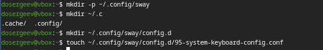

---
## Front matter
lang: ru-RU
title: Лабораторная работа №1
subtitle: Отчёт
author:
  - Сергеев Д. О.
institute:
  - Российский университет дружбы народов, Москва, Россия
date: 07 марта 2025

## i18n babel
babel-lang: russian
babel-otherlangs: english

## Formatting pdf
toc: false
toc-title: Содержание
slide_level: 2
aspectratio: 169
section-titles: true
theme: metropolis
header-includes:
 - \metroset{progressbar=frametitle,sectionpage=progressbar,numbering=fraction}
---

# Информация

## Докладчик

:::::::::::::: {.columns align=center}
::: {.column width="70%"}

  * Сергеев Даниил Олегович
  * Студент
  * Направление: Прикладная информатика
  * Российский университет дружбы народов
  * [1132246837@pfur.ru](mailto:1132246837@pfur.ru)

:::
::::::::::::::

# Цель работы

Приобретение практических навыков установки операционной системы на виртуальную машину, настройки минимально необходимых для дальнейшей работы сервисов.

# Задание

- Установить операционную систему.
- Обновить или установить необходимое программное обеспечение.
- Повысить комфорт работы с операционной системой.
- Настроить раскладку клавиатуры
- Установить программное обеспечение для создания документации.
- Создать локальный каталог для выполнения заданий по предмету.

# Ход выполнения лабораторной работы

## Создание виртуальной машины

Для начала откроем менеджер виртуальных машин Oracle VirtualBox и нажмем на кнопку создать в графическом интерфейсе. Выберем тип машины Linux, подтип Fedora. Зададим имя, удовлетворяющее соглашению о наименовании.

{#fig:001 width=45%}

## Создание виртуальной машины

Выделим размер основной памяти виртуальной машины до 4096 МБ и 4 процессора. Включим поддержку UEFI(EFI).

{#fig:002 width=50%}

## Создание виртуальной машины

Зададим жёсткий диск VDI с размером 80 ГБ.

{#fig:003 width=60%}

## Создание виртуальной машины

В качестве графического контроллера поставим VMSVGA, включим 3D ускорение, выделим 256 МБ видеопамяти.

{#fig:004 width=60%}

## Создание виртуальной машины

Включим общий буфер обмена и перетаскивание объектов между хостом и гостевой ОС.

{#fig:005 width=60%}

## Создание виртуальной машины

Запустим виртуальную машину. После вставим оптический диск с образом Fedora-Sway-Live-x86_64-41-1.4.iso и перезагрузим её.

{#fig:006 width=40%}

## Установка операционной системы

Запустим Fedora, перейдем в режим базовой графики в меню boot, чтобы не было проблем при отображении.

{#fig:007 width=60%}

{#fig:008 width=60%}

## Установка операционной системы

После запуска системы, нажмем Win+d и запустим установщик Anaconda командой liveinst.

{#fig:009 width=50%}

## Установка операционной системы

{#fig:010 width=50%}

## Установка операционной системы

Выберем язык интерфейса Русский

{#fig:011 width=50%}

## Установка операционной системы

Выберем стандартное место установки ОС.

{#fig:012 width=60%}

## Установка операционной системы

Установим имя и пароль для пользователя.

{#fig:013 width=60%}

## Установка операционной системы

Начнем установку ОС Fedora sway на жёсткий диск.

{#fig:014 width=60%}

## Установка операционной системы

Перезапустим виртуальную машину и войдем в качестве созданного пользователя.

{#fig:015 width=50%}

## Установка драйверов для VirtualBox

Запустим терминальный мультиплексор tmux, переключимся на роль супер-пользователя, установим средства разработки.

{#fig:016 width=60%}

## Установка драйверов для VirtualBox

Также установим пакет DKMS.

{#fig:017 width=60%}

## Установка драйверов для VirtualBox

Подмонтируем диск и запустим установку драйверов. В конце установки перезагрузим виртуальную машину.

{#fig:018 width=60%}

## Подключение общей папки

Внутри виртуальной машины добавим своего пользователя в группу vboxsf.

{#fig:019 width=60%}

## Подключение общей папки

В хостовой системе подключим общую папку с помощью графического интерфейса.

{#fig:020 width=60%}

## Установка и обновление программного обеспечения

Средства установки уже были установлены в предыдущих пунктах, поэтому начнем с обновления всех пакетов.

{#fig:021 width=60%}

## Установка и обновление программного обеспечения

Установим программу для удобства работы в консоли: Midnight commander.

{#fig:022 width=60%}

## Установка и обновление программного обеспечения

Теперь установим другой вариант консоли.

{#fig:023 width=60%}

## Установка и обновление программного обеспечения

Подключим автоматическое обновление. Для этого установим dnf-automatic и запустим таймер.

{#fig:024 width=60%}

## Установка и обновление программного обеспечения

Отключим SELinux. В файле /etc/selinux/config заменим значение selinux с enforcing на permissive. Перезагрузим виртуальную машину.

{#fig:025 width=50%}

## Настройка раскладки клавиатуры

Запустим терминальный мультиплексор tmux, создадим конфигурационный файл.

{#fig:026 width=60%}

## Настройка раскладки клавиатуры

Отредактируем созданный файл.

{#fig:027 width=60%}

## Настройка раскладки клавиатуры

Переключимся на роль супер-пользователя и отредактируем 00-keyboard.conf. Перезапустим виртуальную машину.

{#fig:028 width=60%}

## Установка ПО для создания документации

Запустим терминальный мультиплексор tmux, переключимя на роль супер-пользователя. Установим pandoc с помощью менеджера пакетов dnf.

{#fig:029 width=60%}

## Установка ПО для создания документации

Установим pandoc-crossref. Для начала проверим версию pandoc:

{#fig:030 width=60%}

## Установка ПО для создания документации

Получается, что версия pandoc - 3.1.11.1. Зайдем на github и найдем соответствующий релиз. Скачаем его и распакуем в /tmp.

{#fig:031 width=60%}

{#fig:032 width=30%}

## Установка ПО для создания документации

Скопируем все файлы из архива в каталог /usr/local/bin.

## Установка ПО для создания документации

{#fig:033 width=60%}

И скачаем дистрибутив TeXlive:

{#fig:034 width=60%}

# Ход выполнения домашнего задания

1. Дождемся загрузки графического окружения и откроем терминал. Пропишем команду dmesg и узнаем последовательность загрузки системы.

{#fig:035 width=60%}

## Ход выполнения домашнего задания

2. Получим имформацию о:
- Версии ядра Linux -> 6.13.5-200.fc41.x86_64
- Частоте процессора -> 3400 MHz
- Модели процессора -> AMD Ryzen 5 2600
- Объёме доступной ОЗУ -> ~4 GB
- Типе гипервизора -> KVM
- Типе файловой системы корневого раздела -> EXT4-fs
- Последовательности монтирования файловых систем -> BTRFS, EXT4-fs

## Ход выполнения домашнего задания

{#fig:036 width=70%}

# Вывод

В результате выполнения лабораторной работы я приобрел навыки установки операционной системы на виртуальную машину и научился минимально настраивать систему для дальнейшей работы сервисов.
