---
## Front matter
lang: ru-RU
title: Лабораторная работа №2
subtitle: Отчёт
author:
  - Сергеев Д. О.
institute:
  - Российский университет дружбы народов, Москва, Россия
date: 08 марта 2025

## i18n babel
babel-lang: russian
babel-otherlangs: english

## Formatting pdf
toc: false
toc-title: Содержание
slide_level: 2
aspectratio: 169
section-titles: true
theme: metropolis
header-includes:
 - \metroset{progressbar=frametitle,sectionpage=progressbar,numbering=fraction}
---

# Информация

## Докладчик

:::::::::::::: {.columns align=center}
::: {.column width="70%"}

  * Сергеев Даниил Олегович
  * Студент
  * Направление: Прикладная информатика
  * Российский университет дружбы народов
  * [1132246837@pfur.ru](mailto:1132246837@pfur.ru)

:::
::::::::::::::

# Цель работы

Изучить идеологию и применение средств контроля версий. Освоить умения по работе с git.

# Задание

- Создать базовую конфигурацию для работы с git.
- Создать ключ SSH.
- Создать ключ PGP.
- Настроить подписи git.
- Зарегистрироваться на Github.
- Создать локальный каталог для выполнения заданий по предмету.

# Выполнение лабораторной работы

## Установка необходимого ПО (git, gh)
Установим git и gh.

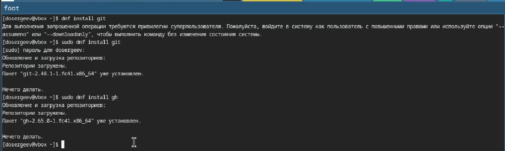{#fig:001 width=70%}

Необходимые пакеты уже установлены, поэтому продолжим.

## Базовая настройка git
Зададим имя и почту владельца репозитория, настроим utf-8 в выводе сообщений git, зададим имя начальной ветки master, параметр autocrlf и safecrlf.

{#fig:002 width=70%}

## Создание ключа ssh

Cоздадим ключ ssh по алгоритму ed25519.

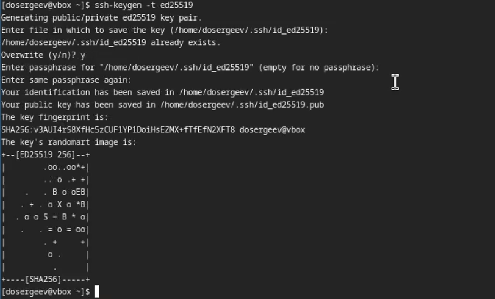{#fig:003 width=70%}

## Создание ключа ssh

Выведем ключ, скопируем и вставим в гит.

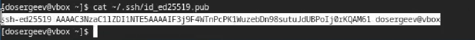{#fig:004 width=70%}

## Создание ключа ssh

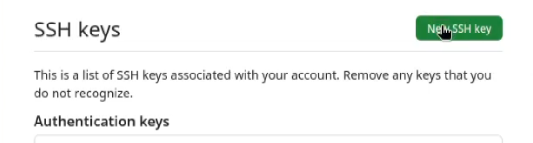{#fig:005 width=70%}

## Создание ключа ssh

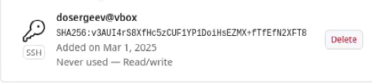{#fig:006 width=70%}

## Создание ключа gpg

:::::::::::::: {.columns align=center}
::: {.column width="50%"}

сгенерируем ключ с помощью команды gpg --full-generate-key. В предложенных вариантах выберем:
- тип RSA and RSA.
- размер 4096.
- срок действия по умолчанию.
- имя.
- адрес электронной почты.
- без комментария.

:::
::: {.column width="50%"}

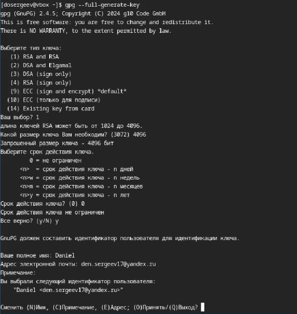{#fig:007 width=50%}

:::
::::::::::::::

## Добавление ключа gpg в GitHub

Выведем список ключей.

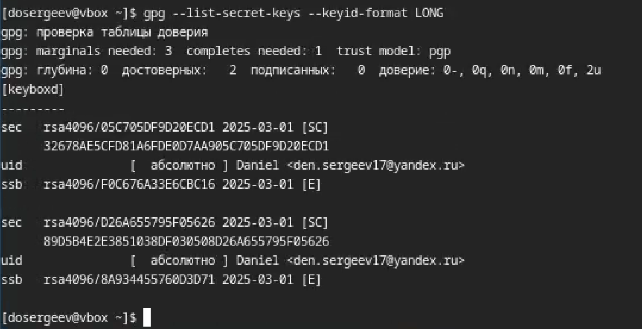{#fig:008 width=70%}

## Добавление ключа gpg в GitHub

Cкопируем сгенерированный ключ в буфер обмена с помощью его отпечатка

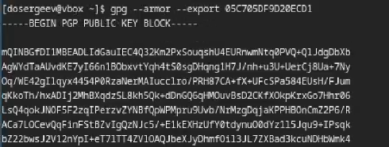{#fig:009 width=70%}

## Добавление ключа gpg в GitHub

Добавим ключ gpg в Github.

{#fig:010 width=70%}

## Добавление ключа gpg в GitHub

{#fig:011 width=60%}

## Добавление ключа gpg в GitHub

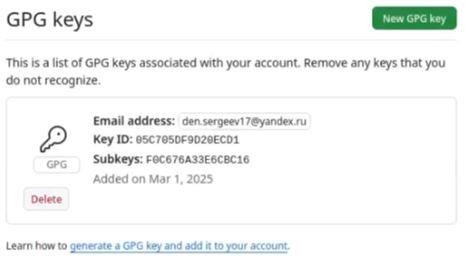{#fig:012 width=70%}

## Настройка автоматических подписей коммитов git

Указываем git-у применять адрес почты при подписи коммитов.

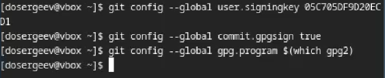{#fig:013 width=70%}

## Настройка автоматических подписей коммитов git

Авторизуемся через браузер.

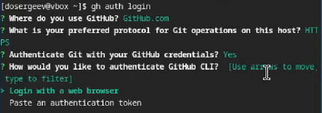{#fig:014 width=70%}

## Настройка автоматических подписей коммитов git

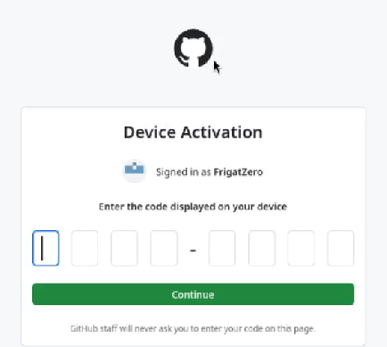{#fig:015 width=55%}

## Создание репозитория курса на GitHub

Создадим репозиторий гит и каталог курса.

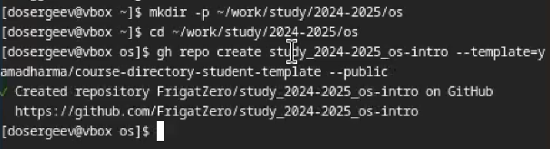{#fig:016 width=70%}

## Создание репозитория курса на GitHub

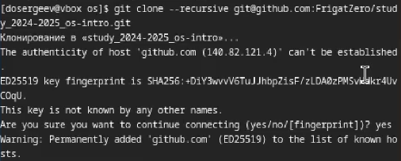{#fig:017 width=70%}

## Создание репозитория курса на GitHub

Перейдем в каталог курса и удалим лишние файлы. Создадим необходимые каталоги с помощью make prepare.

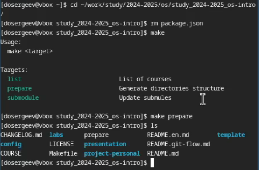{#fig:018 width=55%}

## Создание репозитория курса на GitHub

Отправим файлы на сервер.

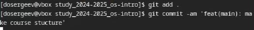{#fig:019 width=70%}

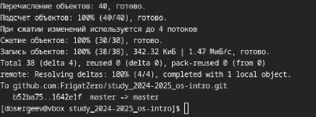{#fig:020 width=65%}

# Ответы на контрольные вопросы

1.Системы контроля версий - это инструменты, позволяющие организовать работу над проектом разработки, выкладывать его обновления и контролировать релизы и изменения кода. Они предназначаются для отслеживания изменений, защиты исходного кода от удаления и изменения, возможности отката изменений и командной работы для 10 и более человек.

## Ответы на контрольные вопросы

2.
* Хранилище - репозиторий в котором храняться файлы проекта в различных версиях.
* Commit - комментарий внесённых изменений в репозитории.
* История - история изменений файлов проекта.
* Рабочая копия - копия, созданная из определенной версии репозитория, которую модифицирует разработчик.

## Ответы на контрольные вопросы

3.Централизованные системы контроля версий имеют единый сервер под хранение проекта, для изменения которых необходимо скачать необходимые файлы, изменить и вернуть обратно на сервер. Пример центроализованной VCS: Subversion. Децентрализованные системы полностью копируют удалённый репозиторий в локальный. При этом внесенные изменения отправляются на сервер в качестве новой версии. Пример: git.

## Ответы на контрольные вопросы

4.Создается репозиторий для работы с проектом, при необходимости файлы обновляются локально и отправляются на сервер в качестве новой версии.

## Ответы на контрольные вопросы

5.Репозиторий копируется локально. После внесения изменений файлы загружаются на сервер в качестве отдельной версии. После этого измененная ветка может быть объединена с текущей и отправлена в релиз.

## Ответы на контрольные вопросы

6.Хранение файлов проекта, отслеживание версий, защита от изменений, работа в команде.

## Ответы на контрольные вопросы

7.
* git clone – клонирование проекта с сервера в указанный локальный репозиторий.
* git add – добавляет все изменённые или созданные файлы или каталоги.
* git commit – сохраняет изменения репозитория с комментарием.
* git push – загружает добавленные изменения на сервер
* git pull – получить последние изменения с сервера
* git rm – удаляет файл из индекса репозитория
* git status – просмотривает список измененных файлов в текущем репозитории

## Ответы на контрольные вопросы

8.С локальным: git add . , git commit -am commit, git push - добавление всех измененнных файлов в текущем каталоге, их сохранение с комментарием commit, git pull - получаем последние изменения с удалённого репозитория. С удалённым: git push - отправляем сохраненные изменения на сервер.

## Ответы на контрольные вопросы

9.Ветки - это различные версии исходного репозитория, являющиеся копиями с внесенными изменениями. Нужны для параллельной работы над проектом. Могут быть объединенны для внесения изменений. Их можно проигнорировать, добавив имя в .gitignore.

## Ответы на контрольные вопросы

10.Мы можем игнорировать некоторые файлы при коммитах, когда не хотим добавлять их в удаленный репозиторий для чистоты или упрощения. 

# Вывод

В результате выполнения лабораторной работы я изучил как применять средства контроля версий для работы с удалённым репозиторием и освоил умения по работе с git.

