---
## Front matter
title: "Лабораторная работа №2"
subtitle: "Отчёт"
author: "Сергеев Даниил Олегович"

## Generic otions
lang: ru-RU
toc-title: "Содержание"

## Bibliography
bibliography: bib/cite.bib
csl: pandoc/csl/gost-r-7-0-5-2008-numeric.csl

## Pdf output format
toc: true # Table of contents
toc-depth: 2
lof: true # List of figures
lot: true # List of tables
fontsize: 12pt
linestretch: 1.5
papersize: a4
documentclass: scrreprt
## I18n polyglossia
polyglossia-lang:
  name: russian
  options:
	- spelling=modern
	- babelshorthands=true
polyglossia-otherlangs:
  name: english
## I18n babel
babel-lang: russian
babel-otherlangs: english
## Fonts
mainfont: IBM Plex Serif
romanfont: IBM Plex Serif
sansfont: IBM Plex Sans
monofont: IBM Plex Mono
mathfont: STIX Two Math
mainfontoptions: Ligatures=Common,Ligatures=TeX,Scale=0.94
romanfontoptions: Ligatures=Common,Ligatures=TeX,Scale=0.94
sansfontoptions: Ligatures=Common,Ligatures=TeX,Scale=MatchLowercase,Scale=0.94
monofontoptions: Scale=MatchLowercase,Scale=0.94,FakeStretch=0.9
mathfontoptions:
## Biblatex
biblatex: true
biblio-style: "gost-numeric"
biblatexoptions:
  - parentracker=true
  - backend=biber
  - hyperref=auto
  - language=auto
  - autolang=other*
  - citestyle=gost-numeric
## Pandoc-crossref LaTeX customization
figureTitle: "Рис."
tableTitle: "Таблица"
listingTitle: "Листинг"
lofTitle: "Список иллюстраций"
lotTitle: "Список таблиц"
lolTitle: "Листинги"
## Misc options
indent: true
header-includes:
  - \usepackage{indentfirst}
  - \usepackage{float} # keep figures where there are in the text
  - \floatplacement{figure}{H} # keep figures where there are in the text
---

# Цель работы

Изучить идеологию и применение средств контроля версий. Освоить умения по работе с git. [@tuis]

# Задание

- Создать базовую конфигурацию для работы с git.
- Создать ключ SSH.
- Создать ключ PGP.
- Настроить подписи git.
- Зарегистрироваться на Github.
- Создать локальный каталог для выполнения заданий по предмету.

# Выполнение лабораторной работы

## Установка необходимого ПО (git, gh)
Установим git и gh. (рис. [-@fig:001])

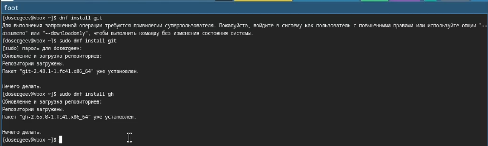{#fig:001 width=70%}

Необходимые пакеты уже установлены, поэтому продолжим.

## Базовая настройка git
Зададим имя и почту владельца репозитория, настроим utf-8 в выводе сообщений git, зададим имя начальной ветки master, параметр autocrlf и safecrlf. (рис. [-@fig:002])

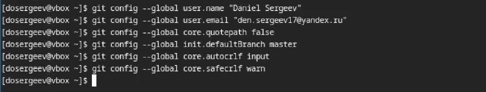{#fig:002 width=70%}

## Создание ключа ssh

Cоздадим ключ ssh по алгоритму ed25519. (рис. [-@fig:003])

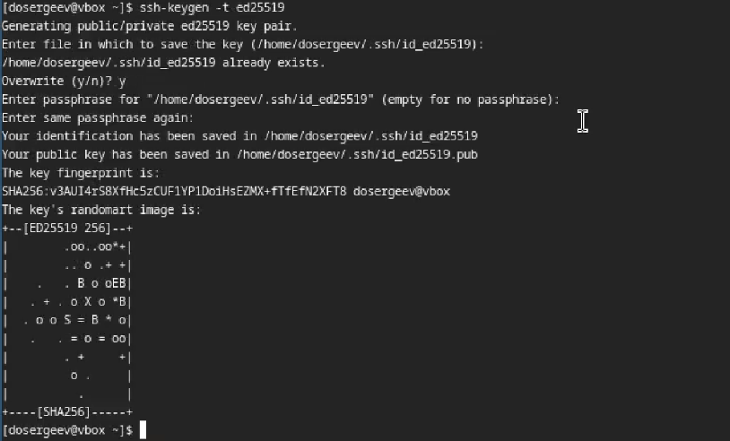{#fig:003 width=70%}

Выведем ключ, скопируем и вставим в гит.

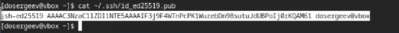{#fig:004 width=70%}

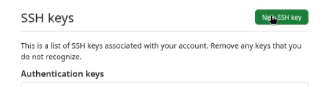{#fig:005 width=70%}

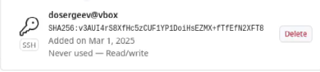{#fig:006 width=70%}

## Создание ключа gpg

сгенерируем ключ с помощью команды gpg --full-generate-key (рис. [-@fig:007]). В предложенных вариантах выберем:
- тип RSA and RSA.
- размер 4096.
- срок действия по умолчанию.
- имя.
- адрес электронной почты.
- без комментария.

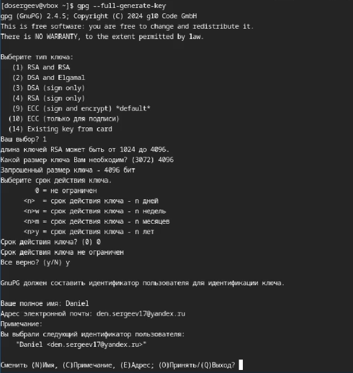{#fig:007 width=70%}

## Добавление ключа gpg в GitHub

Выведем список ключей. (рис. [-@fig:008])

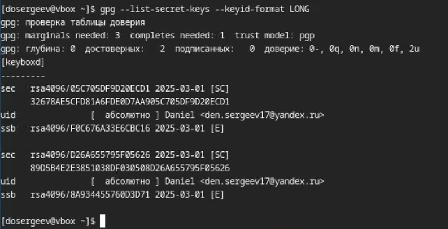{#fig:008 width=70%}

Cкопируем сгенерированный ключ в буфер обмена с помощью его отпечатка

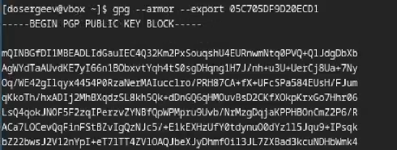{#fig:009 width=70%}

Добавим ключ gpg в Github.

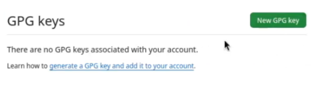{#fig:010 width=70%}

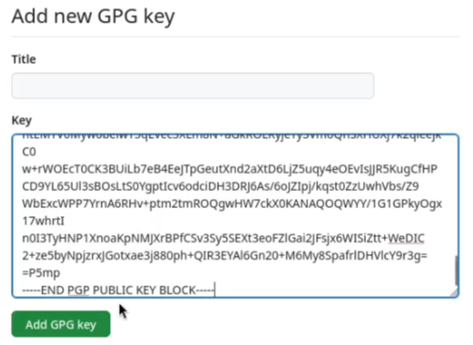{#fig:011 width=70%}

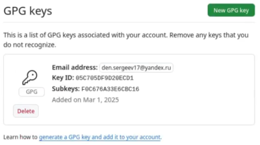{#fig:012 width=70%}

## Настройка автоматических подписей коммитов git

Указываем git-у применять адрес почты при подписи коммитов.

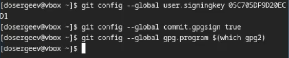{#fig:013 width=70%}

Авторизуемся через браузер.

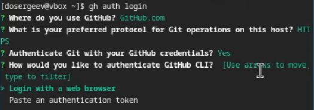{#fig:014 width=70%}

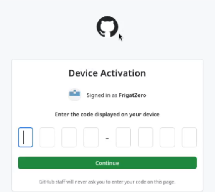{#fig:015 width=70%}

## Создание репозитория курса на GitHub

Создадим репозиторий гит и каталог курса. (рис. [-@fig:016])

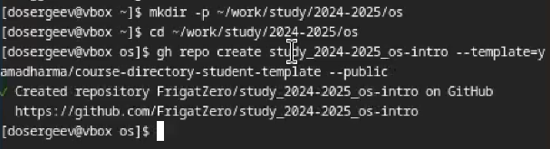{#fig:016 width=70%}

{#fig:017 width=70%}

Перейдем в каталог курса и удалим лишние файлы. Создадим необходимые каталоги с помощью make prepare.

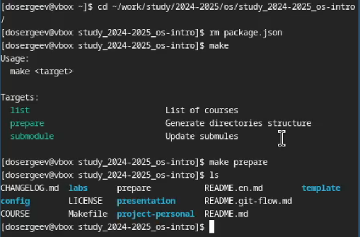{#fig:018 width=70%}

Отправим файлы на сервер.

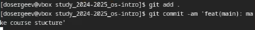{#fig:019 width=70%}

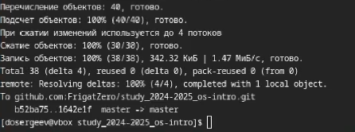{#fig:020 width=70%}

# Ответы на контрольные вопросы

1.Системы контроля версий - это инструменты, позволяющие организовать работу над проектом разработки, выкладывать его обновления и контролировать релизы и изменения кода. Они предназначаются для отслеживания изменений, защиты исходного кода от удаления и изменения, возможности отката изменений и командной работы для 10 и более человек.

2.
* Хранилище - репозиторий в котором храняться файлы проекта в различных версиях.
* Commit - комментарий внесённых изменений в репозитории.
* История - история изменений файлов проекта.
* Рабочая копия - копия, созданная из определенной версии репозитория, которую модифицирует разработчик.

3.Централизованные системы контроля версий имеют единый сервер под хранение проекта, для изменения которых необходимо скачать необходимые файлы, изменить и вернуть обратно на сервер. Пример центроализованной VCS: Subversion. Децентрализованные системы полностью копируют удалённый репозиторий в локальный. При этом внесенные изменения отправляются на сервер в качестве новой версии. Пример: git.

4.Создается репозиторий для работы с проектом, при необходимости файлы обновляются локально и отправляются на сервер в качестве новой версии.

5.Репозиторий копируется локально. После внесения изменений файлы загружаются на сервер в качестве отдельной версии. После этого измененная ветка может быть объединена с текущей и отправлена в релиз.

6.Хранение файлов проекта, отслеживание версий, защита от изменений, работа в команде.

7.
* git clone – клонирование проекта с сервера в указанный локальный репозиторий.
* git add – добавляет все изменённые или созданные файлы или каталоги.
* git commit – сохраняет изменения репозитория с комментарием.
* git push – загружает добавленные изменения на сервер
* git pull – получить последние изменения с сервера
* git rm – удаляет файл из индекса репозитория
* git status – просмотривает список измененных файлов в текущем репозитории

8.С локальным: git add . , git commit -am commit, git push - добавление всех измененнных файлов в текущем каталоге, их сохранение с комментарием commit, git pull - получаем последние изменения с удалённого репозитория. С удалённым: git push - отправляем сохраненные изменения на сервер.

9.Ветки - это различные версии исходного репозитория, являющиеся копиями с внесенными изменениями. Нужны для параллельной работы над проектом. Могут быть объединенны для внесения изменений. Их можно проигнорировать, добавив имя в .gitignore.

10.Мы можем игнорировать некоторые файлы при коммитах, когда не хотим добавлять их в удаленный репозиторий для чистоты или упрощения. 

# Вывод

В результате выполнения лабораторной работы я изучил как применять средства контроля версий для работы с удалённым репозиторием и освоил умения по работе с git.

# Список литературы{.unnumbered}

::: {#refs}
:::
