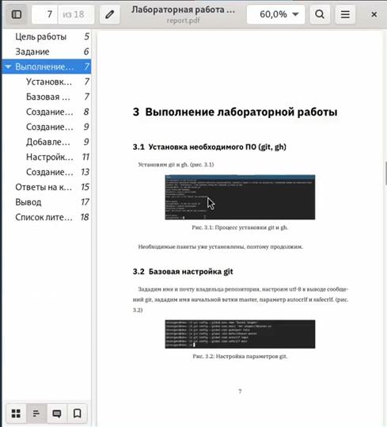

---
## Front matter
lang: ru-RU
title: Лабораторная работа №3
subtitle: Отчёт
author:
  - Сергеев Д. О.
institute:
  - Российский университет дружбы народов, Москва, Россия
date: 07 марта 2025

## i18n babel
babel-lang: russian
babel-otherlangs: english

## Formatting pdf
toc: false
toc-title: Содержание
slide_level: 2
aspectratio: 169
section-titles: true
theme: metropolis
header-includes:
 - \metroset{progressbar=frametitle,sectionpage=progressbar,numbering=fraction}
---

# Информация

## Докладчик

:::::::::::::: {.columns align=center}
::: {.column width="70%"}

  * Сергеев Даниил Олегович
  * Студент
  * Направление: Прикладная информатика
  * Российский университет дружбы народов
  * [1132246837@pfur.ru](mailto:1132246837@pfur.ru)

:::
::::::::::::::

# Цель работы

Научиться оформлять отчёты с помощью легковесного языка разметки Markdown.

# Задание

- Сделайте отчёт по предыдущей лабораторной работе в формате Markdown.
- В качестве отчёта просьба предоставить отчёты в 3 форматах: pdf, docx и md (в архиве, поскольку он должен содержать скриншоты, Makefile и т.д.)

# Ход выполнения лабораторной работы

## Создание отчёта

Перейдем каталог с файлами отчёта и откроем report.md.

{#fig:001 width=70%}

## Создание отчёта

{#fig:002 width=55%}

## Создание отчёта

Заменим титульный лист. 

{#fig:003 width=70%}

## Создание отчёта

Добавим цель, задание, ход выполнения лабораторной работы.

{#fig:004 width=70%}

## Создание отчёта

{#fig:005 width=70%}

## Создание отчёта

{#fig:006 width=55%}

## Создание отчёта

Начнем оформлять рисунки, используемые в лабораторной работе.

{#fig:007 width=70%}

## Создание отчёта

Для каждого нового изображения поменяем номер, чтобы небыло ошибок при генерации pdf.

{#fig:008 width=70%}

## Создание отчёта

Добавим ответы на контрольные вопросы.

{#fig:009 width=70%}

## Создание отчёта

Добавим вывод лабораторной работы.

{#fig:010 width=70%}

## Создание отчёта

К некоторым рисункам добавим ссылки.

{#fig:011 width=70%}

## Создание отчёта

Отредактируем относительный путь к рисункам, расставим строки через одну для корректного отображения отчёта в сгенерированных файлах.

{#fig:012 width=70%}

## Создание файлов отчёта в формате pdf и docx

Пропишем команду make для создания файлов отчёта в pdf и docx.

{#fig:013 width=70%}

## Создание файлов отчёта в формате pdf и docx

{#fig:014 width=45%}

## Отправка файлов на github

Проиндексируем все изменения и проведем коммит.

{#fig:015 width=30%}

## Отправка файлов на github

Отправим файлы на сервер github.

{#fig:016 width=70%}

## Отправка файлов на github

{#fig:017 width=70%}

# Вывод

В результате выполнения лабораторной работы я научиться оформлять отчёты с помощью легковесного языка разметки Markdown и создавать файлы отчёта в разных форматах.
