---
## Front matter
title: "Лабораторная работа №3"
subtitle: "Отчёт"
author: "Сергеев Даниил Олегович"

## Generic otions
lang: ru-RU
toc-title: "Содержание"

## Bibliography
bibliography: bib/cite.bib
csl: pandoc/csl/gost-r-7-0-5-2008-numeric.csl

## Pdf output format
toc: true # Table of contents
toc-depth: 2
lof: true # List of figures
lot: true # List of tables
fontsize: 12pt
linestretch: 1.5
papersize: a4
documentclass: scrreprt
## I18n polyglossia
polyglossia-lang:
  name: russian
  options:
	- spelling=modern
	- babelshorthands=true
polyglossia-otherlangs:
  name: english
## I18n babel
babel-lang: russian
babel-otherlangs: english
## Fonts
mainfont: IBM Plex Serif
romanfont: IBM Plex Serif
sansfont: IBM Plex Sans
monofont: IBM Plex Mono
mathfont: STIX Two Math
mainfontoptions: Ligatures=Common,Ligatures=TeX,Scale=0.94
romanfontoptions: Ligatures=Common,Ligatures=TeX,Scale=0.94
sansfontoptions: Ligatures=Common,Ligatures=TeX,Scale=MatchLowercase,Scale=0.94
monofontoptions: Scale=MatchLowercase,Scale=0.94,FakeStretch=0.9
mathfontoptions:
## Biblatex
biblatex: true
biblio-style: "gost-numeric"
biblatexoptions:
  - parentracker=true
  - backend=biber
  - hyperref=auto
  - language=auto
  - autolang=other*
  - citestyle=gost-numeric
## Pandoc-crossref LaTeX customization
figureTitle: "Рис."
tableTitle: "Таблица"
listingTitle: "Листинг"
lofTitle: "Список иллюстраций"
lotTitle: "Список таблиц"
lolTitle: "Листинги"
## Misc options
indent: true
header-includes:
  - \usepackage{indentfirst}
  - \usepackage{float} # keep figures where there are in the text
  - \floatplacement{figure}{H} # keep figures where there are in the text
---

# Цель работы

Научиться оформлять отчёты с помощью легковесного языка разметки Markdown. [@tuis]

# Задание

- Сделайте отчёт по предыдущей лабораторной работе в формате Markdown.
- В качестве отчёта просьба предоставить отчёты в 3 форматах: pdf, docx и md (в архиве, поскольку он должен содержать скриншоты, Makefile и т.д.)

# Ход выполнения лабораторной работы

## Создание отчёта

Перейдем каталог с файлами отчёта и откроем report.md. (рис. [-@fig:002])

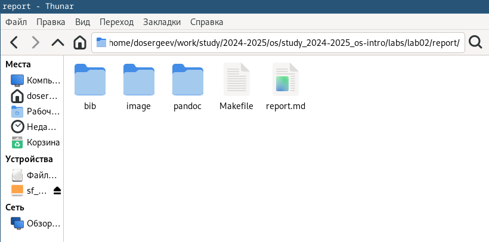{#fig:001 width=70%}

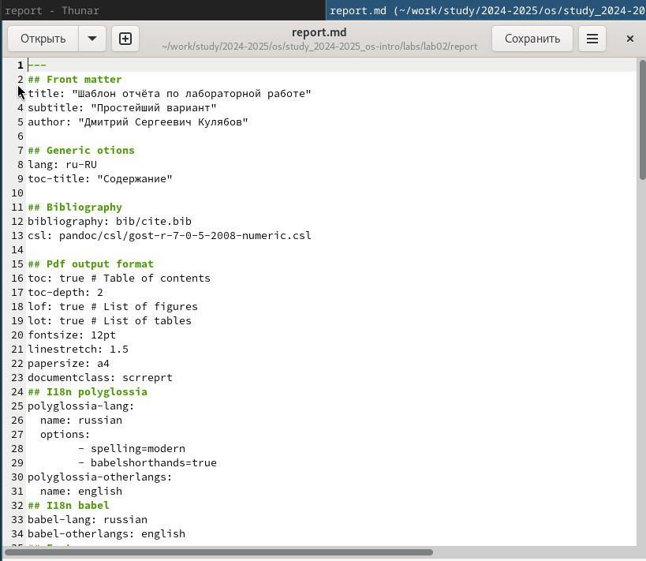{#fig:002 width=70%}

Заменим титульный лист. 

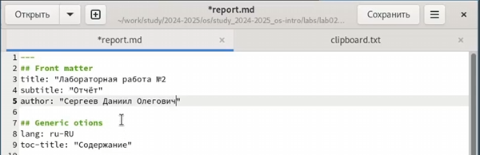{#fig:003 width=70%}

Добавим цель, задание, ход выполнения лабораторной работы.

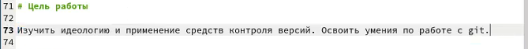{#fig:004 width=70%}

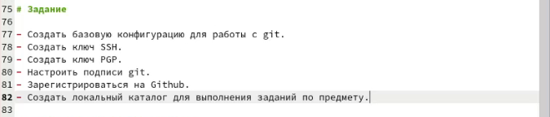{#fig:005 width=70%}

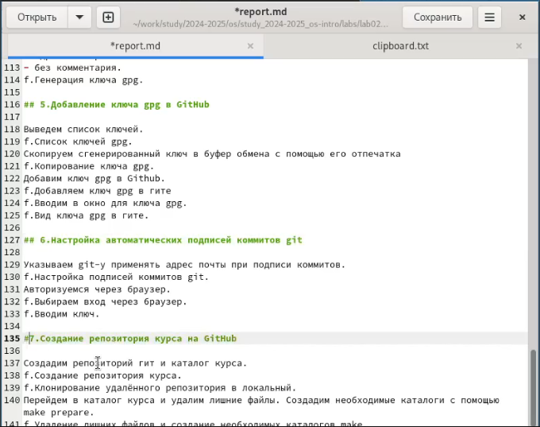{#fig:006 width=70%}

Начнем оформлять рисунки, используемые в лабораторной работе.

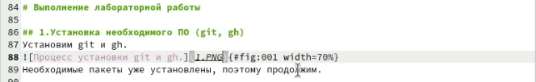{#fig:007 width=70%}

Для каждого нового изображения поменяем номер, чтобы небыло ошибок при генерации pdf. (рис. [-@fig:008])

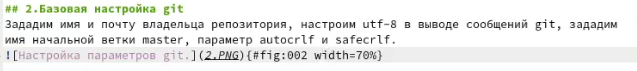{#fig:008 width=70%}

Добавим ответы на контрольные вопросы.

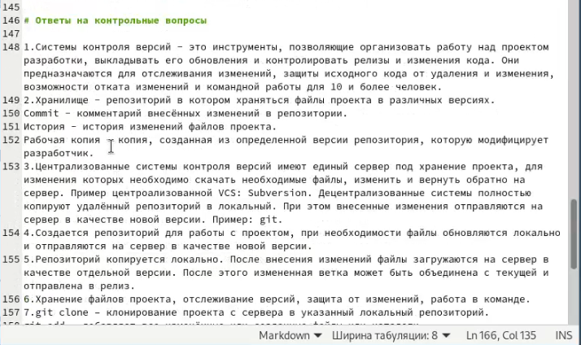{#fig:009 width=70%}

Добавим вывод лабораторной работы.

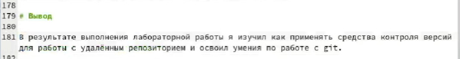{#fig:010 width=70%}

К некоторым рисункам добавим ссылки (рис. [-@fig:011])

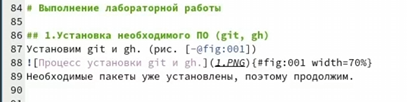{#fig:011 width=70%}

Отредактируем относительный путь к рисункам, расставим строки через одну для корректного отображения отчёта в сгенерированных файлах.

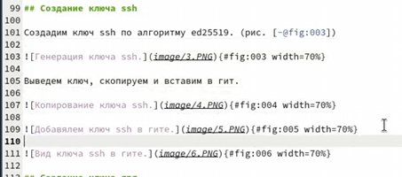{#fig:012 width=70%}

## Создание файлов отчёта в формате pdf и docx

Пропишем команду make для создания файлов отчёта в pdf и docx. (рис. [-@fig:013])

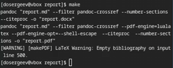{#fig:013 width=70%}

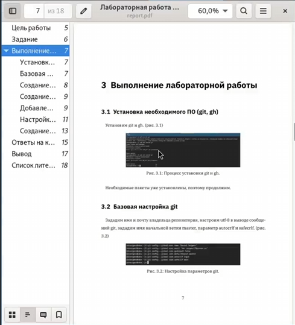{#fig:014 width=70%}

## Отправка файлов на github

Проиндексируем все изменения и проведем коммит.

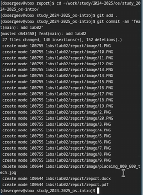{#fig:015 width=70%}

Отправим файлы на сервер github. (рис. [-@fig:016])

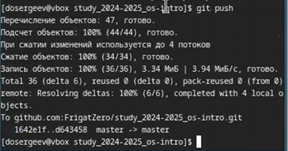{#fig:016 width=70%}

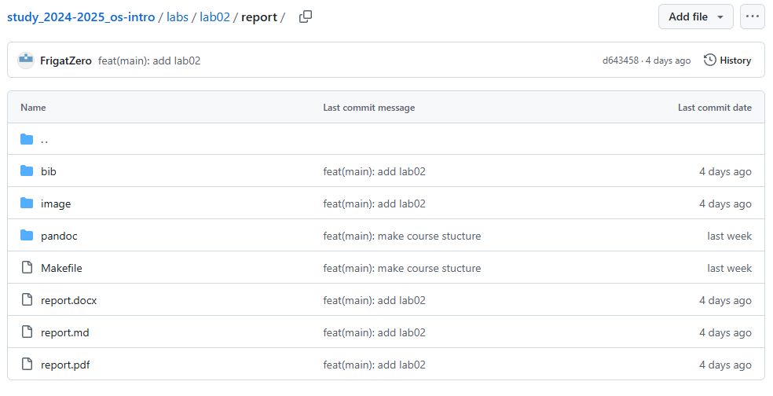{#fig:017 width=70%}

# Вывод

В результате выполнения лабораторной работы я научиться оформлять отчёты с помощью легковесного языка разметки Markdown и создавать файлы отчёта в разных форматах.

# Список литературы{.unnumbered}

::: {#refs}
:::
