---
## Front matter
lang: ru-RU
title: Лабораторная работа №4
subtitle: Отчёт
author:
  - Сергеев Д. О.
institute:
  - Российский университет дружбы народов, Москва, Россия
date: 08 марта 2025

## i18n babel
babel-lang: russian
babel-otherlangs: english

## Formatting pdf
toc: false
toc-title: Содержание
slide_level: 2
aspectratio: 169
section-titles: true
theme: metropolis
header-includes:
 - \metroset{progressbar=frametitle,sectionpage=progressbar,numbering=fraction}
---

# Информация

## Докладчик

:::::::::::::: {.columns align=center}
::: {.column width="70%"}

  * Сергеев Даниил Олегович
  * Студент
  * Направление: Прикладная информатика
  * Российский университет дружбы народов
  * [1132246837@pfur.ru](mailto:1132246837@pfur.ru)

:::
::::::::::::::

# Цель работы

Получение навыков правильной работы с репозиториями git.

# Задание

- Выполнить работу для тестового репозитория.
- Преобразовать рабочий репозиторий в репозиторий с git-flow и conventional commits.

# Ход выполнения лабораторной работы

## Установка необходимого ПО

Для начала поставим git-flow. Включим репозиторий copr и установим необходимую библиотеку.

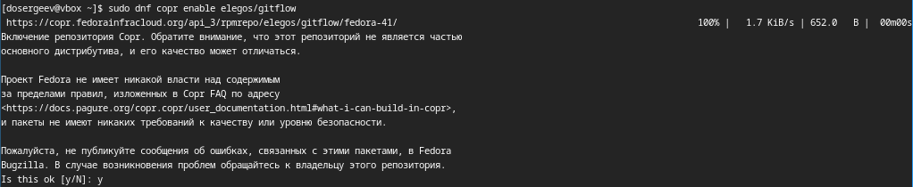{#fig:001 width=70%}

## Установка необходимого ПО

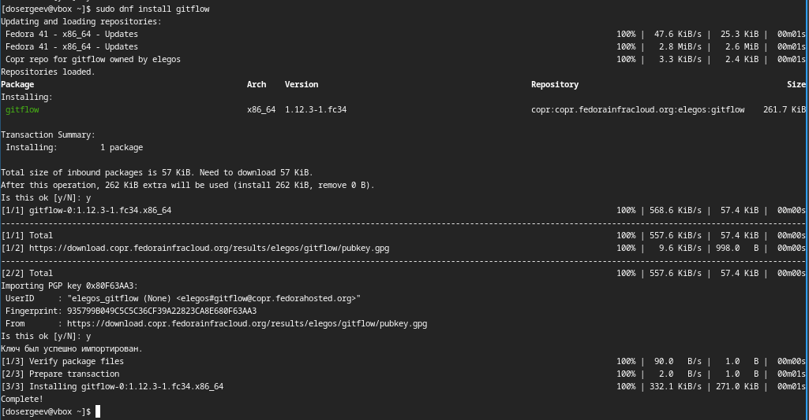{#fig:002 width=70%}

## Установка необходимого ПО

Теперь установим ПО для семантического версионирования и общепринятых коммитов. Поставим Node.js и pnpm.

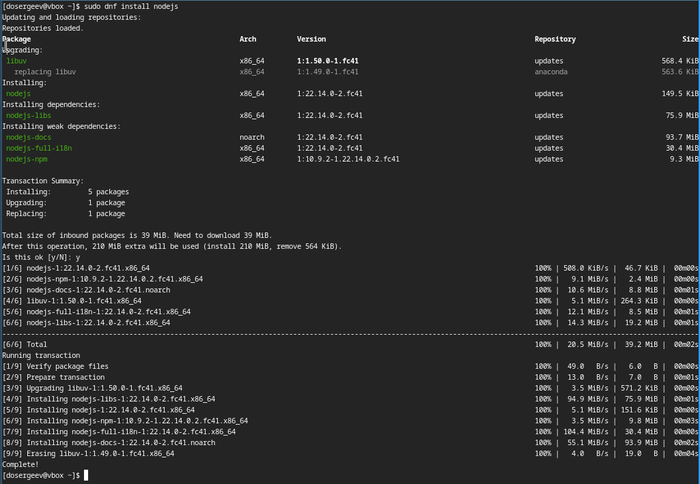{#fig:003 width=55%}

## Установка необходимого ПО

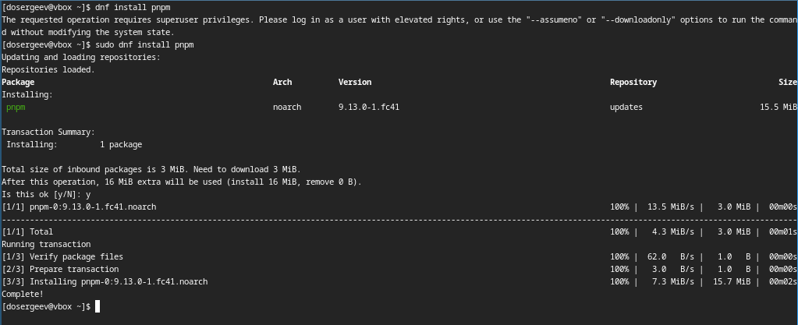{#fig:004 width=70%}

## Установка необходимого ПО

Запустим pnpm setup. В результате выходит ошибка: нет требуемой библиотеки sqlite3, установим её. 

{#fig:005 width=70%}

## Установка необходимого ПО

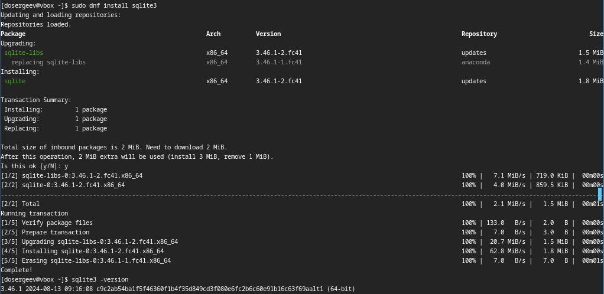{#fig:006 width=70%}

## Установка необходимого ПО

Теперь повторим запуск pnpm и выполним команду source ~/.bashrc для начала использования pnpm.

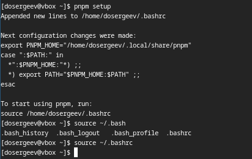{#fig:007 width=55%}

## Настройка общепринятых коммитов

Установим программу commitizen и скрипт git-cz для коммитов.

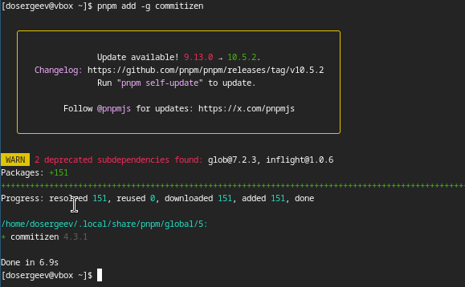{#fig:008 width=60%}

## Настройка общепринятых коммитов

Также установим standard-changelog для помощи в создании логов.

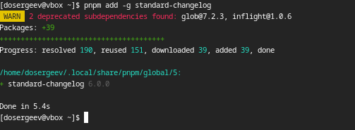{#fig:009 width=60%}

## Практическое использование git

Для получения опыта практического использования git выполним несколько действий. Первым делом создадим репозиторий git с именем git-extended.

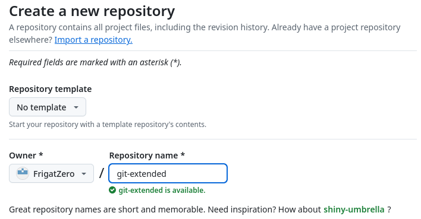{#fig:010 width=70%}

## Практическое использование git

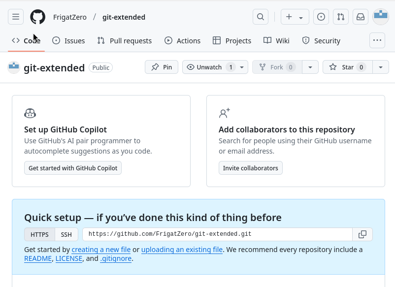{#fig:011 width=65%}

## Практическое использование git

Чтобы подключить локальный репозиторий с сервером, создаем каталог git-extended и инициализируем в нем пустой git репозиторий. Создадим в нем файл test.txt и что-нибудь в него запишем. После добавим его в индекс, коммитим, и подключаем наш локальный репозиторий к серверному с помощью ссылки и команды git remote add origin. Выкладываем изменения на github.

## Практическое использование git

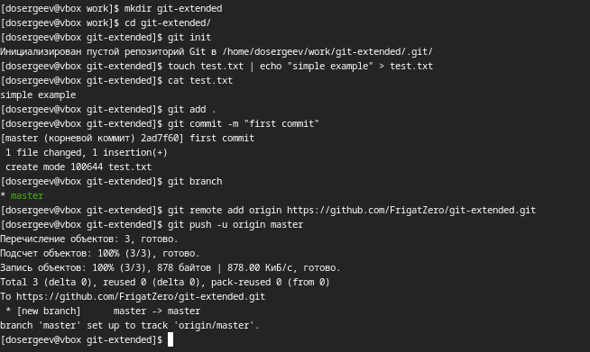{#fig:012 width=70%}

## Практическое использование git

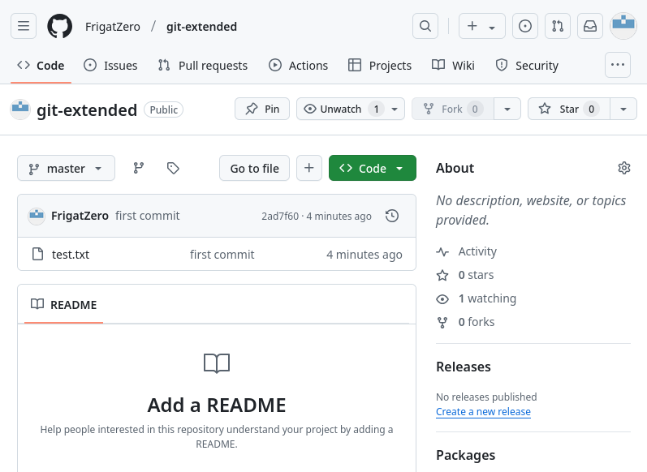{#fig:013 width=60%}

## Практическое использование git

Настроим общепринятые коммиты. Инициализируем конфигурацию для пакетов Node.js. Заполняем её рекомендованными параметрами:
- Лицензия CC-BY-4.0
- Меняем формат коммитов

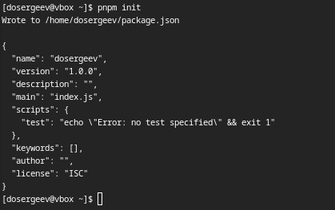{#fig:014 width=55%}

## Практическое использование git

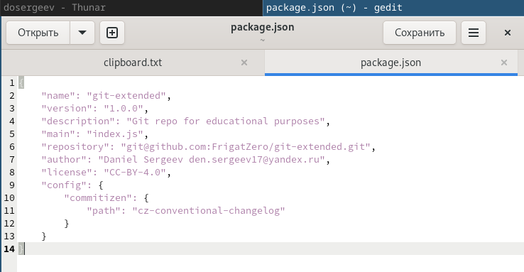{#fig:015 width=70%}

## Практическое использование git

Добавим новый файл для отправки на github. Назовем его anotherone.txt.

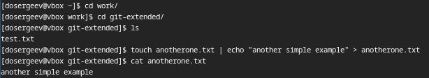{#fig:016 width=70%}

## Практическое использование git

Проиндексируем все изменения и выполним коммит командой git cz: теперь можно настроить коммит в редакторе. Завершаем коммит и отправляем изменения на github.

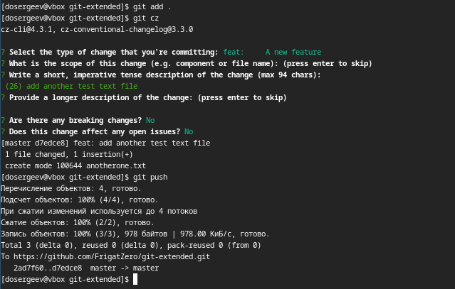{#fig:017 width=60%}

## Практическое использование git

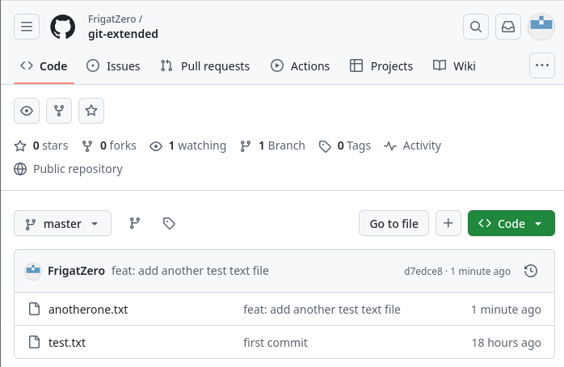{#fig:018 width=70%}

## Конфигурация git-flow

Инициализируем git-flow. Для каждого ярлыка установим префикс v.

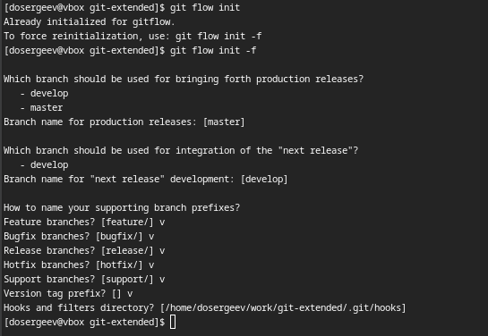{#fig:019 width=60%}

## Конфигурация git-flow

Проверим текущую ветку. Мы находимся на develop, тогда загрузим весь репозиторий в хранилище.

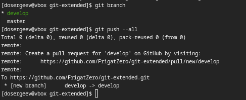{#fig:020 width=70%}

## Конфигурация git-flow

Установим внешнюю ветку как вышестоящую для ветки develop.

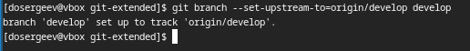{#fig:021 width=70%}

## Конфигурация git-flow

Создадим первый релиз с версией 1.0.0.

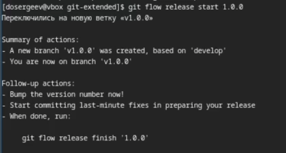{#fig:022 width=70%}

## Конфигурация git-flow

Создадим журнал изменений.

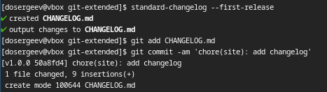{#fig:023 width=70%}

## Конфигурация git-flow

Проиндексируем журнал изменений и проведем коммит.

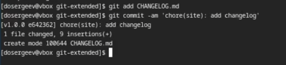{#fig:024 width=70%}

## Конфигурация git-flow

Зальём релизную ветку в основную ветку и отправим данные на github.

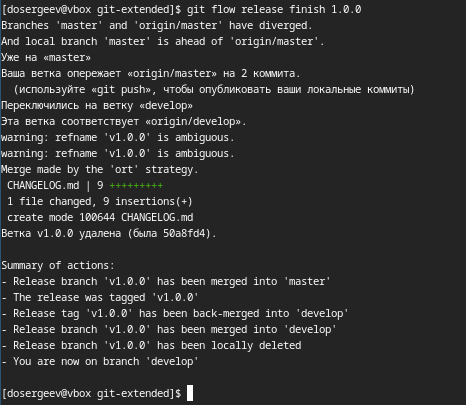{#fig:025 width=45%}

## Конфигурация git-flow

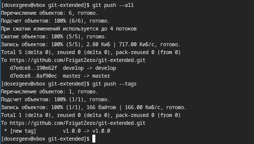{#fig:026 width=60%}

## Конфигурация git-flow

Создадим релиз на github с помощью утилиты работы с github: gh.

{#fig:027 width=55%}

## Конфигурация git-flow

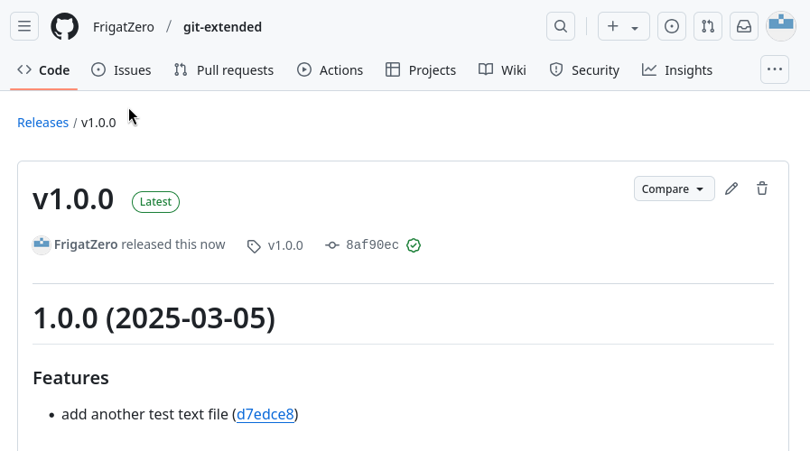{#fig:028 width=70%}

## Работа с репозиторием git

Создадим ветку для новой функциональности и в ней добавим новый файл. Следующим шагом объединяем ветку feature_branch с develop.

## Работа с репозиторием git

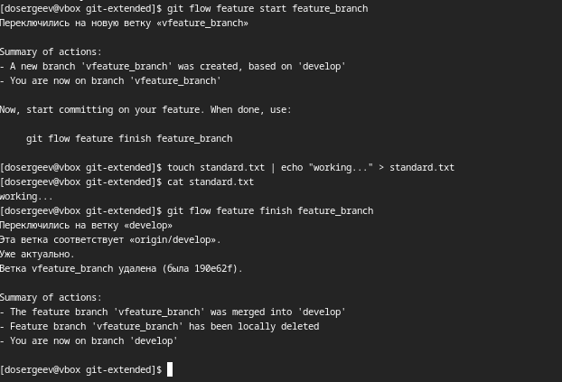{#fig:029 width=50%}

## Работа с репозиторием git

Создадим релиз с версией 1.2.3. Поменяем номер версии в файле package.json.

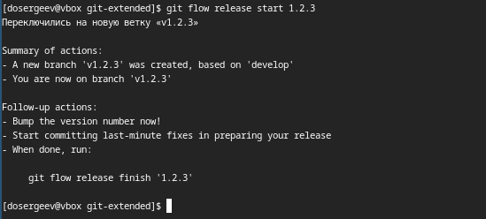{#fig:030 width=70%}

## Работа с репозиторием git

{#fig:031 width=70%}

## Работа с репозиторием git

Создадим журнал изменений, добавим его в индекс и зальём релизную ветку в основную.

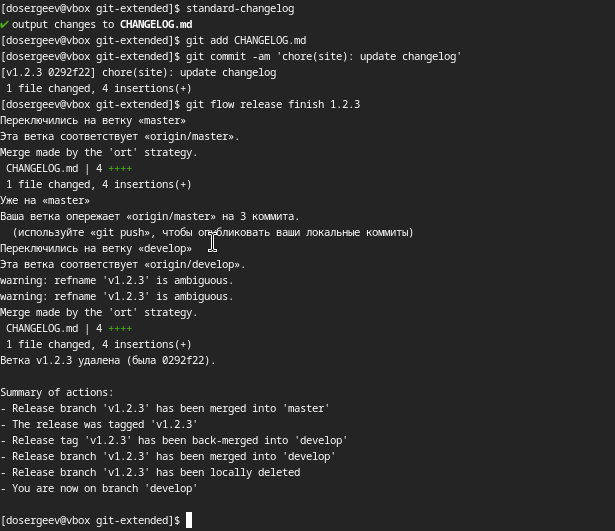{#fig:032 width=45%}

## Работа с репозиторием git

Отправим данные на github.

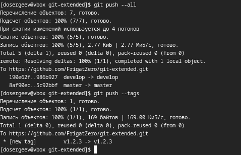{#fig:033 width=60%}

## Работа с репозиторием git

Создадим релиз на github с комментарием из журнала изменений.

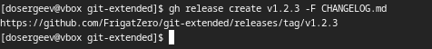{#fig:034 width=70%}

## Работа с репозиторием git

{#fig:035 width=70%}

# Вывод

В результате выполнения лабораторной работы я получил навыки и умения качественной работы с репозиториями git и с github.
