---
## Front matter
title: "Лабораторная работа №4"
subtitle: "Отчёт"
author: "Сергеев Даниил Олегович"

## Generic otions
lang: ru-RU
toc-title: "Содержание"

## Bibliography
bibliography: bib/cite.bib
csl: pandoc/csl/gost-r-7-0-5-2008-numeric.csl

## Pdf output format
toc: true # Table of contents
toc-depth: 2
lof: true # List of figures
lot: true # List of tables
fontsize: 12pt
linestretch: 1.5
papersize: a4
documentclass: scrreprt
## I18n polyglossia
polyglossia-lang:
  name: russian
  options:
	- spelling=modern
	- babelshorthands=true
polyglossia-otherlangs:
  name: english
## I18n babel
babel-lang: russian
babel-otherlangs: english
## Fonts
mainfont: IBM Plex Serif
romanfont: IBM Plex Serif
sansfont: IBM Plex Sans
monofont: IBM Plex Mono
mathfont: STIX Two Math
mainfontoptions: Ligatures=Common,Ligatures=TeX,Scale=0.94
romanfontoptions: Ligatures=Common,Ligatures=TeX,Scale=0.94
sansfontoptions: Ligatures=Common,Ligatures=TeX,Scale=MatchLowercase,Scale=0.94
monofontoptions: Scale=MatchLowercase,Scale=0.94,FakeStretch=0.9
mathfontoptions:
## Biblatex
biblatex: true
biblio-style: "gost-numeric"
biblatexoptions:
  - parentracker=true
  - backend=biber
  - hyperref=auto
  - language=auto
  - autolang=other*
  - citestyle=gost-numeric
## Pandoc-crossref LaTeX customization
figureTitle: "Рис."
tableTitle: "Таблица"
listingTitle: "Листинг"
lofTitle: "Список иллюстраций"
lotTitle: "Список таблиц"
lolTitle: "Листинги"
## Misc options
indent: true
header-includes:
  - \usepackage{indentfirst}
  - \usepackage{float} # keep figures where there are in the text
  - \floatplacement{figure}{H} # keep figures where there are in the text
---

# Цель работы

Получение навыков правильной работы с репозиториями git. [@tuis]

# Задание

- Выполнить работу для тестового репозитория.
- Преобразовать рабочий репозиторий в репозиторий с git-flow и conventional commits.

# Ход выполнения лабораторной работы

## Установка необходимого ПО

Для начала поставим git-flow. Включим репозиторий copr и установим необходимую библиотеку. (рис. [-@fig:002])

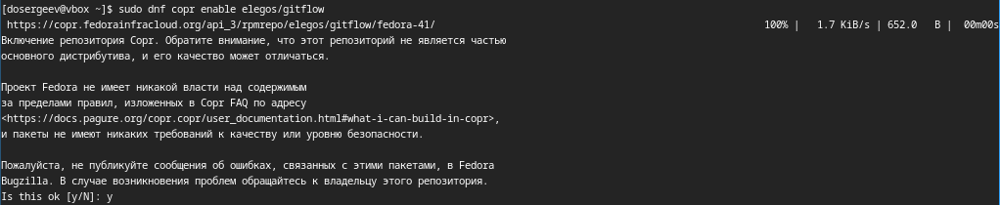{#fig:001 width=70%}

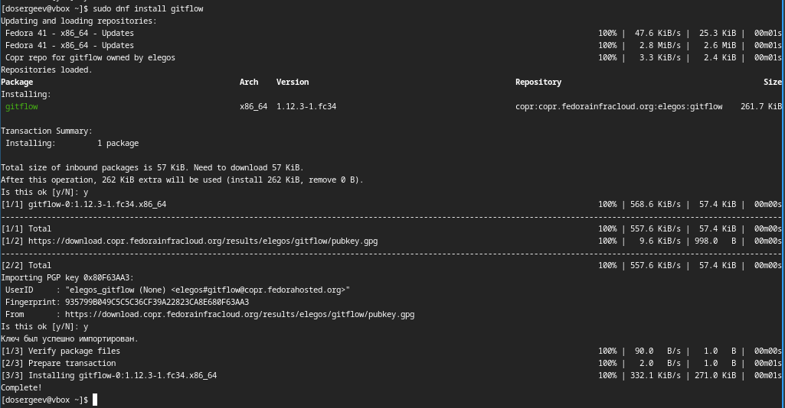{#fig:002 width=70%}

Теперь установим ПО для семантического версионирования и общепринятых коммитов. Поставим Node.js и pnpm.

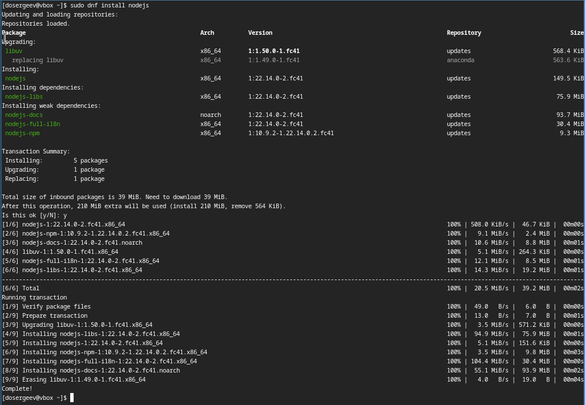{#fig:003 width=70%}

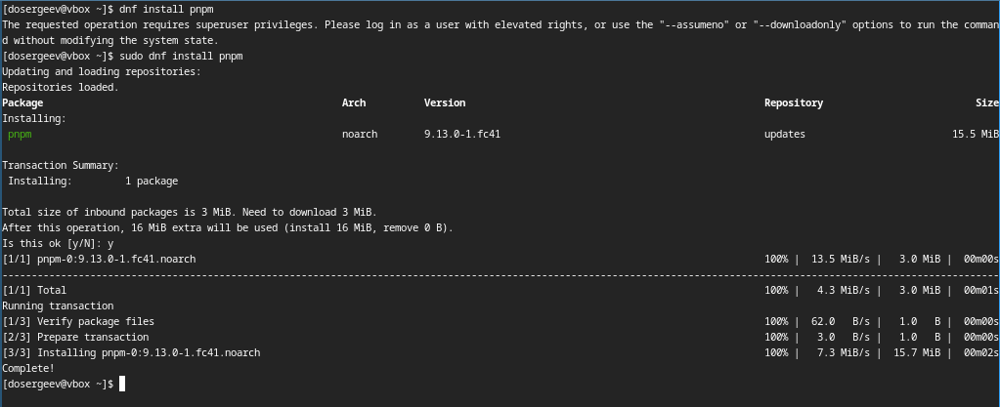{#fig:004 width=70%}

Запустим pnpm setup. В результате выходит ошибка (рис. [-@fig:005]): нет требуемой библиотеки sqlite3, установим её. 

{#fig:005 width=70%}

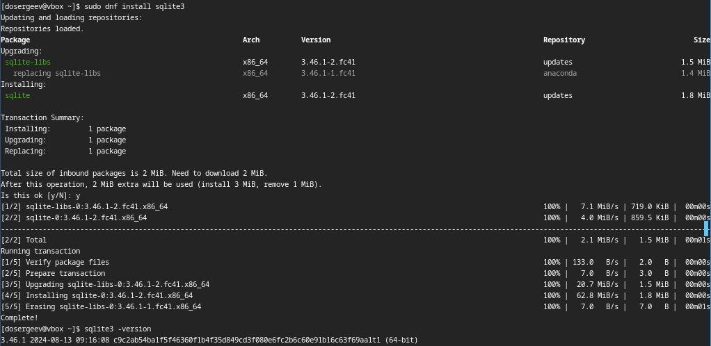{#fig:006 width=70%}

Теперь повторим запуск pnpm и выполним команду source ~/.bashrc для начала использования pnpm.

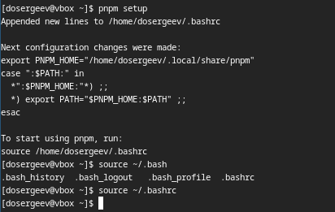{#fig:007 width=70%}

##Настройка общепринятых коммитов

Установим программу commitizen и скрипт git-cz для коммитов.

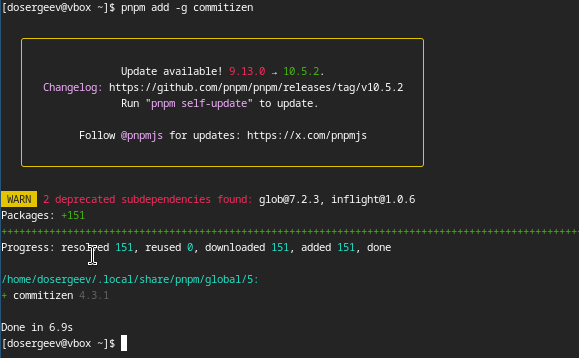{#fig:008 width=70%}

Также установим standard-changelog для помощи в создании логов.

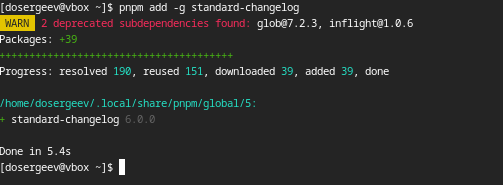{#fig:009 width=70%}

## Практическое использование git

Для получения опыта практического использования git выполним несколько действий. Первым делом создадим репозиторий git с именем git-extended. (рис. [-@fig:011])

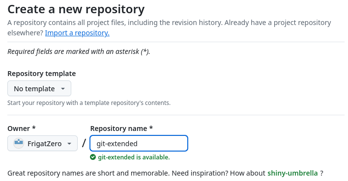{#fig:010 width=70%}

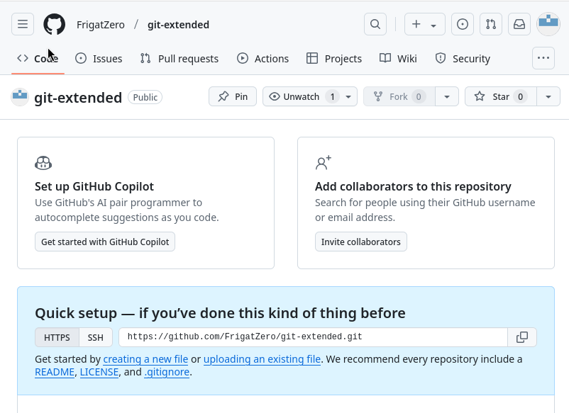{#fig:011 width=70%}

Чтобы подключить локальный репозиторий с сервером, создаем каталог git-extended и инициализируем в нем пустой git репозиторий. Создадим в нем файл test.txt и что-нибудь в него запишем. После добавим его в индекс, коммитим, и подключаем наш локальный репозиторий к серверному с помощью ссылки и команды git remote add origin. Выкладываем изменения на github.

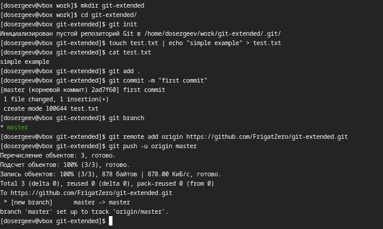{#fig:012 width=70%}

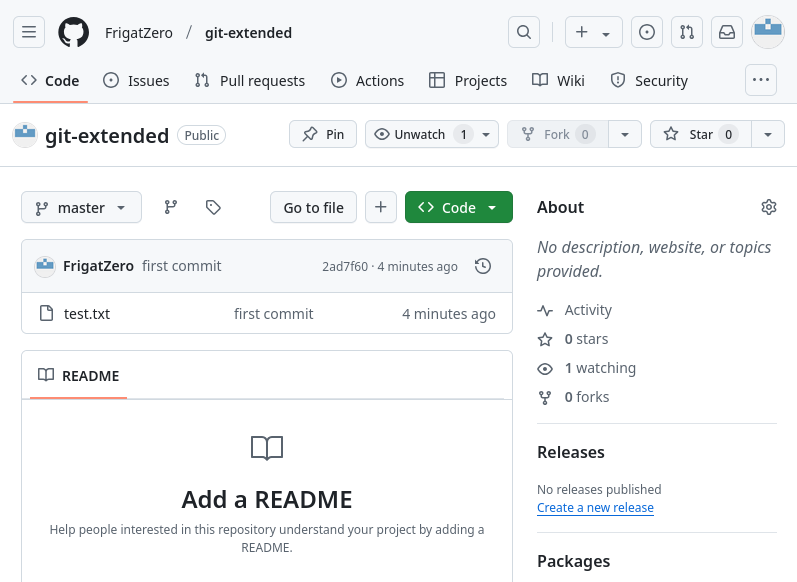{#fig:013 width=70%}

Настроим общепринятые коммиты. Инициализируем конфигурацию для пакетов Node.js. Заполняем её рекомендованными параметрами:
- Лицензия CC-BY-4.0
- Меняем формат коммитов

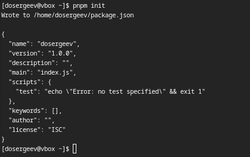{#fig:014 width=70%}

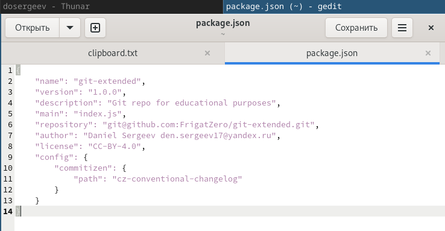{#fig:015 width=70%}

Добавим новый файл для отправки на github (рис. [-@fig:016]). Назовем его anotherone.txt.

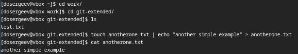{#fig:016 width=70%}

Проиндексируем все изменения и выполним коммит командой git cz: теперь можно настроить коммит в редакторе. Завершаем коммит и отправляем изменения на github.

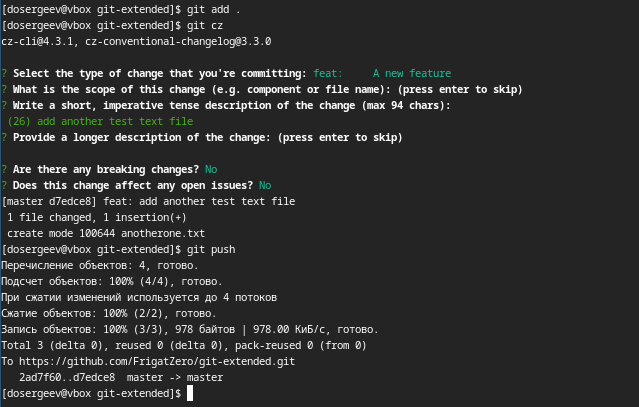{#fig:017 width=70%}

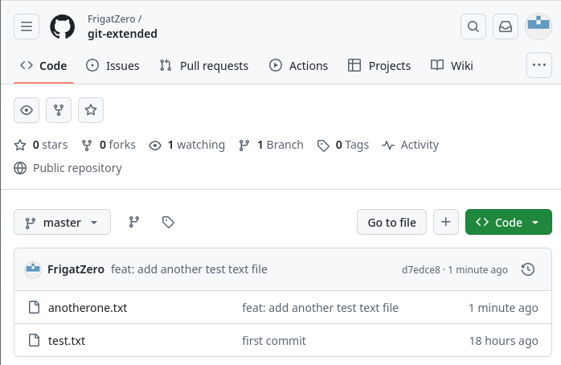{#fig:018 width=70%}

## Конфигурация git-flow

Инициализируем git-flow. Для каждого ярлыка установим префикс v.

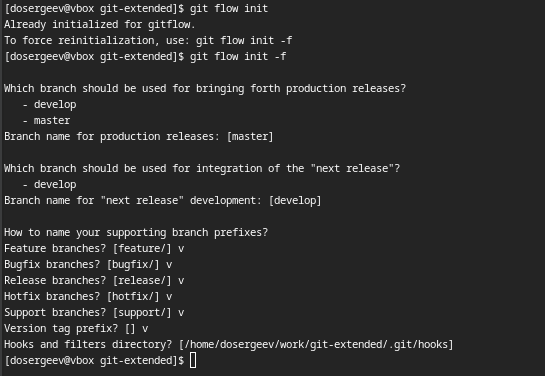{#fig:019 width=70%}

Проверим текущую ветку. Мы находимся на develop, тогда загрузим весь репозиторий в хранилище.

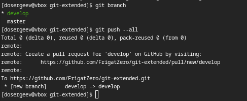{#fig:020 width=70%}

Установим внешнюю ветку как вышестоящую для ветки develop.

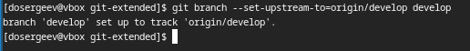{#fig:021 width=70%}

Создадим первый релиз с версией 1.0.0.

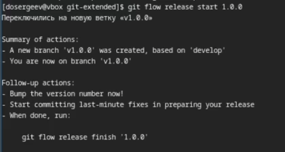{#fig:022 width=70%}

Создадим журнал изменений.

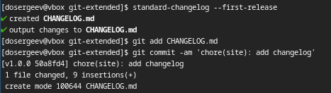{#fig:023 width=70%}

Проиндексируем журнал изменений и проведем коммит.

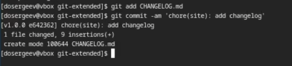{#fig:024 width=70%}

Зальём релизную ветку в основную ветку и отправим данные на github.

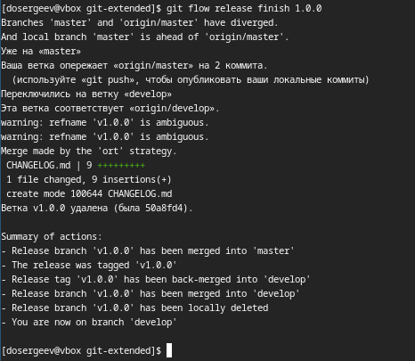{#fig:025 width=70%}

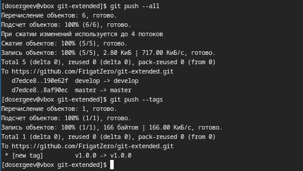{#fig:026 width=70%}

Создадим релиз на github с помощью утилиты работы с github: gh.

{#fig:027 width=70%}

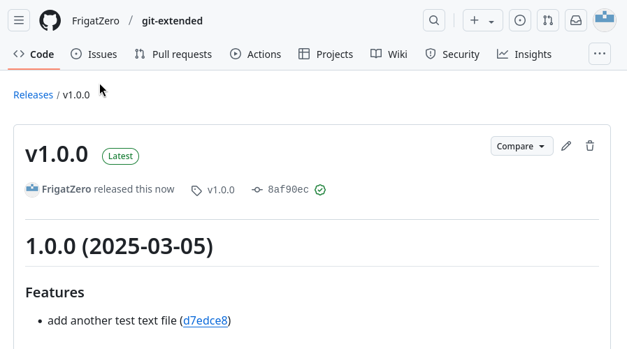{#fig:028 width=70%}

## Работа с репозиторием git

Создадим ветку для новой функциональности и в ней добавим новый файл. Следующим шагом объединяем ветку feature_branch с develop.

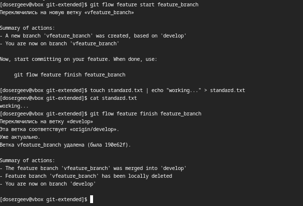{#fig:029 width=70%}

Создадим релиз с версией 1.2.3. Поменяем номер версии в файле package.json.

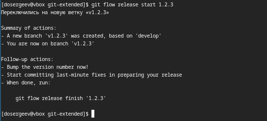{#fig:030 width=70%}

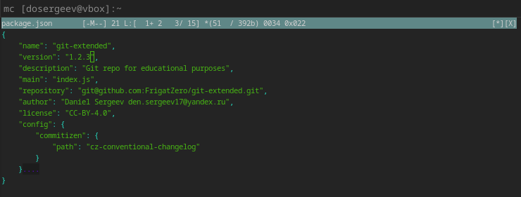{#fig:031 width=70%}

Создадим журнал изменений, добавим его в индекс и зальём релизную ветку в основную (рис. [-@fig:032]).

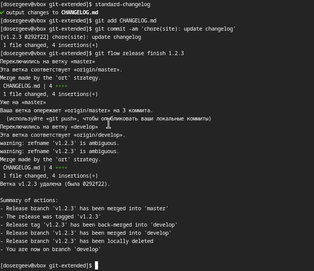{#fig:032 width=70%}

Отправим данные на github.

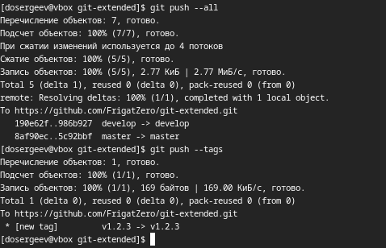{#fig:033 width=70%}

Создадим релиз на github с комментарием из журнала изменений.

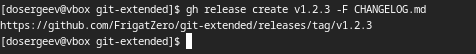{#fig:034 width=70%}

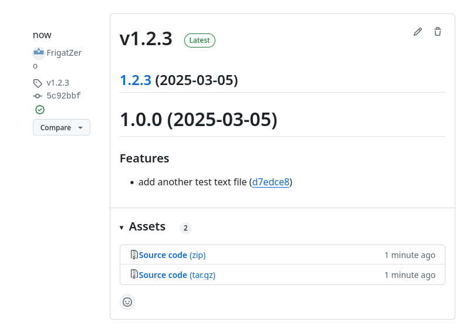{#fig:035 width=70%}

# Вывод

В результате выполнения лабораторной работы я получил навыки и умения качественной работы с репозиториями git и с github.

# Список литературы{.unnumbered}

::: {#refs}
:::
