---
## Front matter
lang: ru-RU
title: Лабораторная работа №5
subtitle: Отчёт
author:
  - Сергеев Д. О.
institute:
  - Российский университет дружбы народов, Москва, Россия
date: 15 марта 2025

## i18n babel
babel-lang: russian
babel-otherlangs: english

## Formatting pdf
toc: false
toc-title: Содержание
slide_level: 2
aspectratio: 169
section-titles: true
theme: metropolis
header-includes:
 - \metroset{progressbar=frametitle,sectionpage=progressbar,numbering=fraction}
---

# Информация

## Докладчик

:::::::::::::: {.columns align=center}
::: {.column width="70%"}

  * Сергеев Даниил Олегович
  * Студент
  * Направление: Прикладная информатика
  * Российский университет дружбы народов
  * [1132246837@pfur.ru](mailto:1132246837@pfur.ru)

:::
::::::::::::::

# Цель работы

Настроить рабочую среду виртуальной машины с установленной системой fedora sway.

# Задание

- Установить и настроить менеджер паролей pass.
- Установить дополнительно программное обеспечение.
- Создать собственный репозиторий с помощью утилит.
- Воспользоваться утилитой chezmoi на двух виртуальных машинах.

# Ход выполнения лабораторной работы

## Установка менеджера паролей pass

Для начала установим pass, pass-otp и gopass.

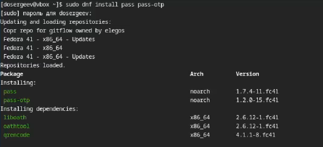{#fig:001 width=70%}

## Установка менеджера паролей pass

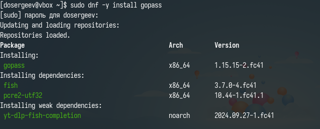{#fig:002 width=70%}

## Настройка менеджера pass

Просмотрим список скрытых ключей gpg и на основе актуального ключа инициализируем хранилище pass.

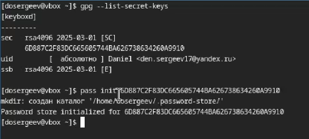{#fig:003 width=70%}

## Настройка менеджера pass

Создадим структуру git на машине и на хостинге.

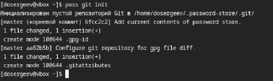{#fig:004 width=70%}

## Настройка менеджера pass

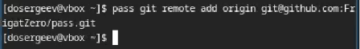{#fig:005 width=70%}

## Настройка менеджера pass

Перейдем в созданный каталог и синхронизируем его с сервером. Создадим главную ветку и отправим туда файлы.

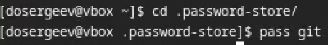{#fig:006 width=70%}

## Настройка менеджера pass

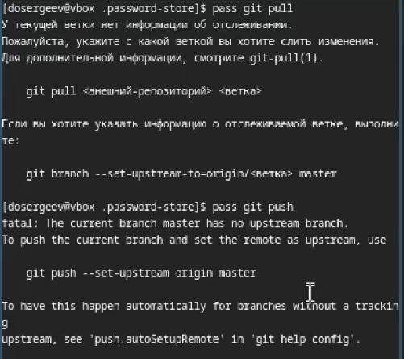{#fig:007 width=55%}

## Настройка менеджера pass

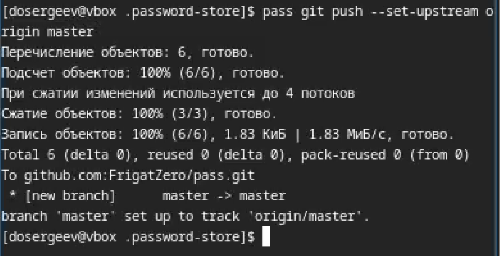{#fig:008 width=70%}

## Настройка менеджера pass

Проверим статус синхронизации с помощью pass git status.

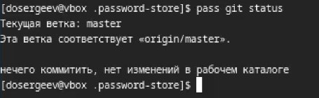{#fig:009 width=70%}

## Настройка интерфейса с броузером

Подключим расширение browserpass в браузере с каталога расширений.

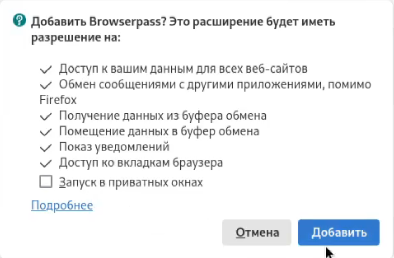{#fig:010 width=60%}

## Настройка интерфейса с броузером

Также установим интерфейс для взаимодействия с броузером (native messaging).

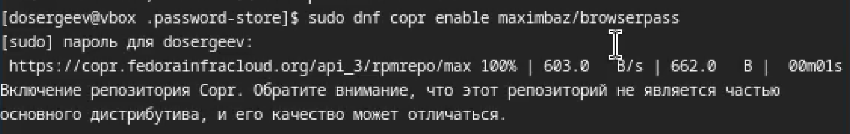{#fig:011 width=70%}

## Настройка интерфейса с броузером

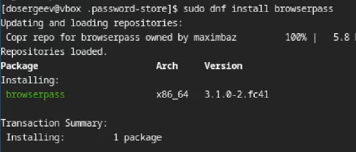{#fig:012 width=70%}

## Сохранение пароля

Создадим файл text.txt и запишем в него какую-нибудь информацию. После добавим новый пароль командой pass insert <ФАЙЛ>. Отобразим пароль для проверки и заменим его другим (сгенерированным).

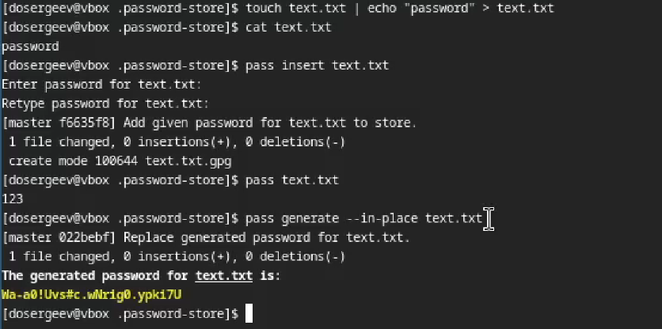{#fig:013 width=70%}

## Управление файлами конфигурации

Установим дополнительное программное обеспечение. Также скачаем шрифты семейства iosevka.

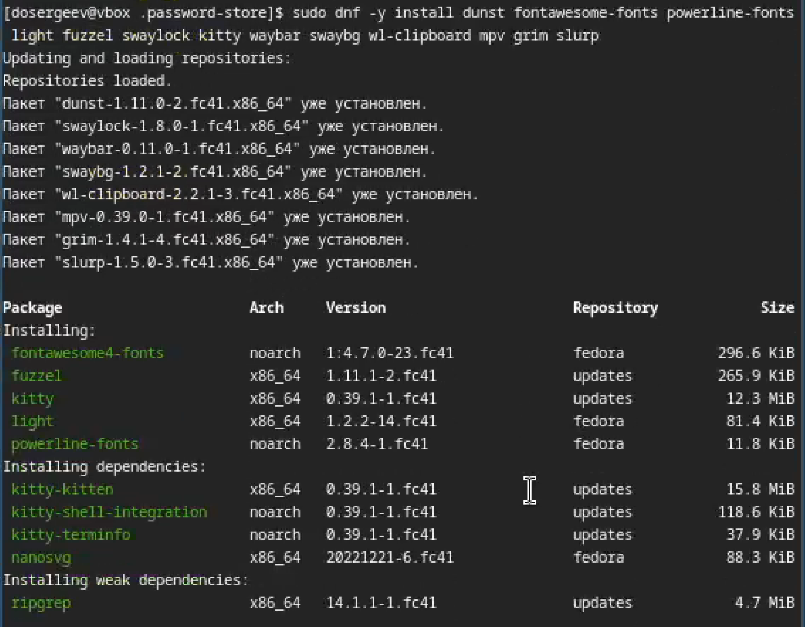{#fig:014 width=50%}

## Управление файлами конфигурации

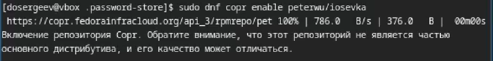{#fig:015 width=70%}

## Управление файлами конфигурации

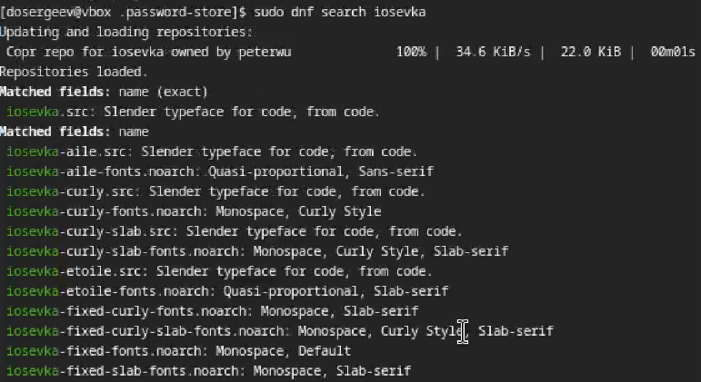{#fig:016 width=70%}

## Управление файлами конфигурации

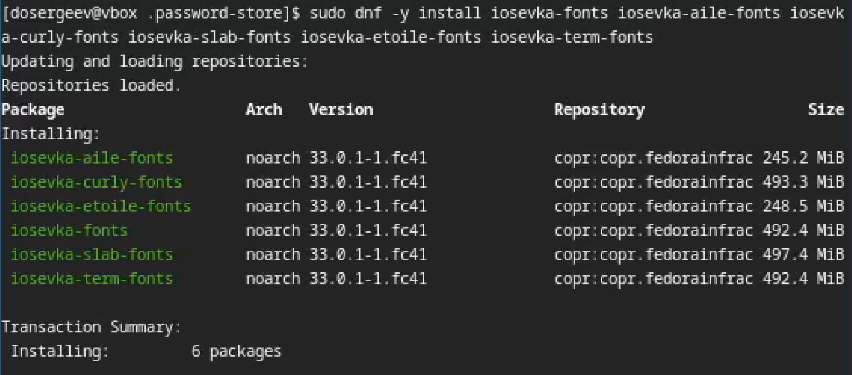{#fig:017 width=70%}

## Управление файлами конфигурации

Теперь поставим chezmoi - конфигуратор пользовательских настроек между машинами.

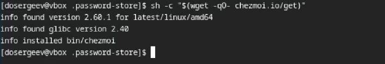{#fig:018 width=70%}

## Управление файлами конфигурации

Создадим свой репозиторий dotfiles для конфигурационных файлов на основе шаблона с помощью chezmoi.

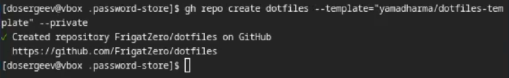{#fig:019 width=70%}

## Управление файлами конфигурации

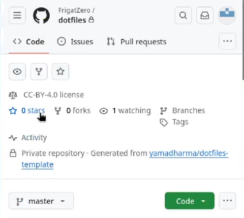{#fig:020 width=60%}

## Управление файлами конфигурации

Инициализируем chezmoi с репозиторием dotfiles, используя ключ SSH.

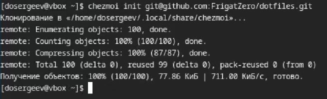{#fig:021 width=70%}

## Управление файлами конфигурации

С помощью команды chezmoi diff проверим изменения, которые внесёт chezmoi в домашний каталог. Изменения нас устраивают, поэтому подтвердим их.

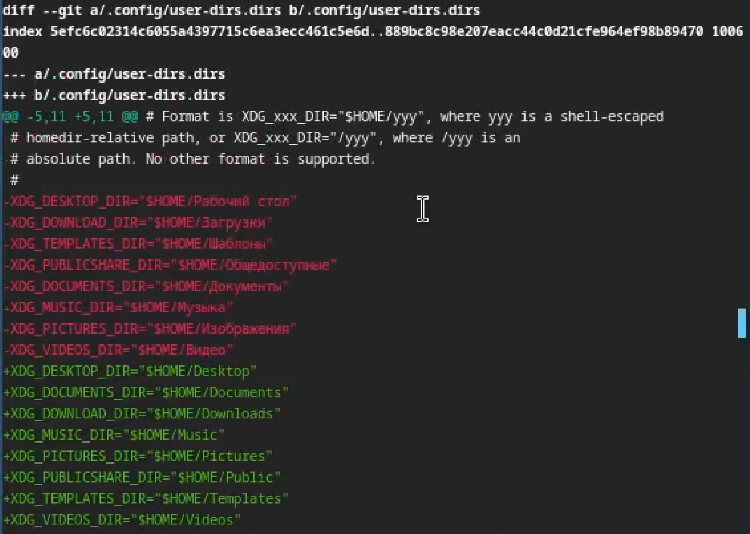{#fig:022 width=55%}

## Использование chezmoi на нескольких машинах

На второй машине инициализируем chezmoi с репозиторием dotfiles (предварительно войдя в свой github с устройства). Проверим внесённые изменения в домашний каталог, подтвердим изменения и пропишем chezmoi update -v.

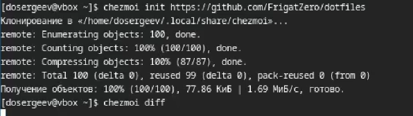{#fig:023 width=70%}

## Использование chezmoi на нескольких машинах

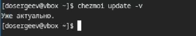{#fig:024 width=70%}

## Использование chezmoi на нескольких машинах

Также попробуем установить свои dotfile на новый компьютер. Для этого напишем команду chezmoi init с ключем --apply.

## Использование chezmoi на нескольких машинах

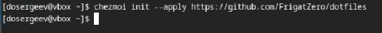{#fig:025 width=70%}

## Ежедневные операции c chezmoi

Извлечём последние изменения из репозитория и применим их командой chezmoi update.

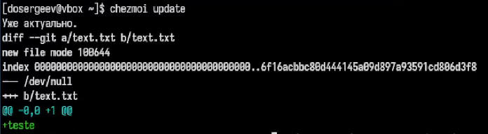{#fig:026 width=70%}

## Ежедневные операции c chezmoi

Извлечём последние изменения из своего репозитория и посмотрим, что изменится, командой chezmoi git pull.

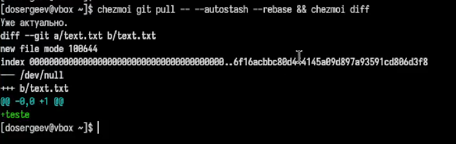{#fig:027 width=70%}

## Ежедневные операции c chezmoi

Подтвердим изменения с помомощью chezmoi apply.

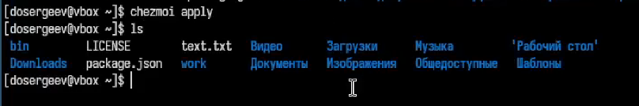{#fig:028 width=70%}

## Ежедневные операции c chezmoi

Перейдем в файл конфигурации  ~/.config/chezmoi/chezmoi.toml и включим автоматическую фиксацию и отправку изменений в исходном каталоге.

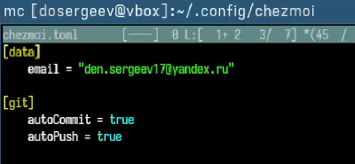{#fig:029 width=70%}

# Вывод

В результате выполнения лабораторной работы я научился настраивать рабочую среду виртуальной машины, использовать pass для хранения паролей и chezmoi для удаленного хранения файлов конфигурации системы на сервисе github.
