---
## Front matter
title: "Лабораторная работа №5. Настройка рабочей среды."
subtitle: "Отчёт"
author: "Сергеев Даниил Олегович"

## Generic otions
lang: ru-RU
toc-title: "Содержание"

## Bibliography
bibliography: bib/cite.bib
csl: pandoc/csl/gost-r-7-0-5-2008-numeric.csl

## Pdf output format
toc: true # Table of contents
toc-depth: 2
lof: true # List of figures
lot: true # List of tables
fontsize: 12pt
linestretch: 1.5
papersize: a4
documentclass: scrreprt
## I18n polyglossia
polyglossia-lang:
  name: russian
  options:
	- spelling=modern
	- babelshorthands=true
polyglossia-otherlangs:
  name: english
## I18n babel
babel-lang: russian
babel-otherlangs: english
## Fonts
mainfont: IBM Plex Serif
romanfont: IBM Plex Serif
sansfont: IBM Plex Sans
monofont: IBM Plex Mono
mathfont: STIX Two Math
mainfontoptions: Ligatures=Common,Ligatures=TeX,Scale=0.94
romanfontoptions: Ligatures=Common,Ligatures=TeX,Scale=0.94
sansfontoptions: Ligatures=Common,Ligatures=TeX,Scale=MatchLowercase,Scale=0.94
monofontoptions: Scale=MatchLowercase,Scale=0.94,FakeStretch=0.9
mathfontoptions:
## Biblatex
biblatex: true
biblio-style: "gost-numeric"
biblatexoptions:
  - parentracker=true
  - backend=biber
  - hyperref=auto
  - language=auto
  - autolang=other*
  - citestyle=gost-numeric
## Pandoc-crossref LaTeX customization
figureTitle: "Рис."
tableTitle: "Таблица"
listingTitle: "Листинг"
lofTitle: "Список иллюстраций"
lotTitle: "Список таблиц"
lolTitle: "Листинги"
## Misc options
indent: true
header-includes:
  - \usepackage{indentfirst}
  - \usepackage{float} # keep figures where there are in the text
  - \floatplacement{figure}{H} # keep figures where there are in the text
---

# Цель работы

Настроить рабочую среду виртуальной машины с установленной системой fedora sway. [@tuis]

# Задание

- Установить и настроить менеджер паролей pass.
- Установить дополнительно программное обеспечение.
- Создать собственный репозиторий с помощью утилит.
- Воспользоваться утилитой chezmoi на двух виртуальных машинах.

# Ход выполнения лабораторной работы

## Установка менеджера паролей pass

Для начала установим pass, pass-otp и gopass (рис. [-@fig:001]).

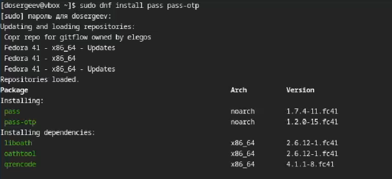{#fig:001 width=70%}

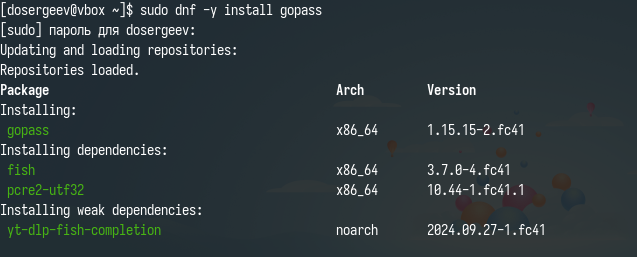{#fig:002 width=70%}

## Настройка менеджера pass

Просмотрим список скрытых ключей gpg и на основе актуального ключа инициализируем хранилище pass.

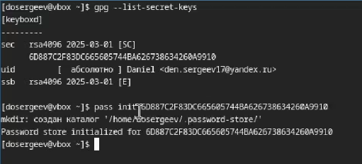{#fig:003 width=70%}

Создадим структуру git на машине и на хостинге (рис. [-@fig:004]).

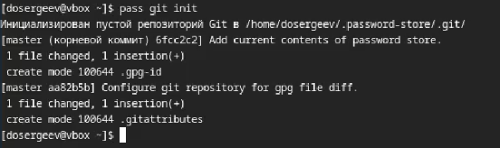{#fig:004 width=70%}

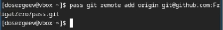{#fig:005 width=70%}

Перейдем в созданный каталог и синхронизируем его с сервером. Создадим главную ветку и отправим туда файлы (рис. [-@fig:008]).

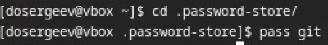{#fig:006 width=70%}

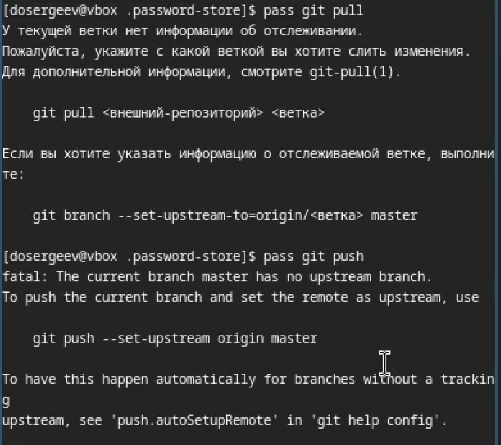{#fig:007 width=70%}

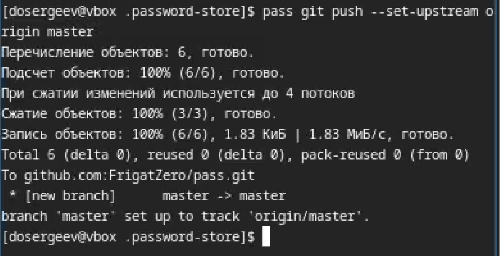{#fig:008 width=70%}

Проверим статус синхронизации с помощью pass git status.

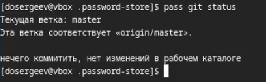{#fig:009 width=70%}

## Настройка интерфейса с броузером

Подключим расширение browserpass в браузере с каталога расширений.

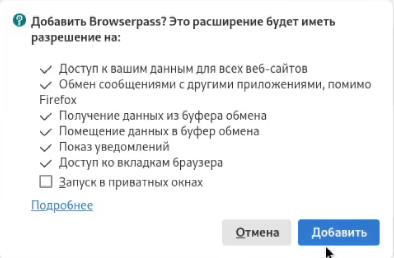{#fig:010 width=70%}

Также установим интерфейс для взаимодействия с броузером (native messaging).

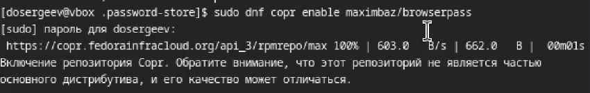{#fig:011 width=70%}

{#fig:012 width=70%}

## Сохранение пароля

Создадим файл text.txt и запишем в него какую-нибудь информацию. После добавим новый пароль командой pass insert <ФАЙЛ>. Отобразим пароль для проверки и заменим его другим (сгенерированным) (рис. [-@fig:013]).

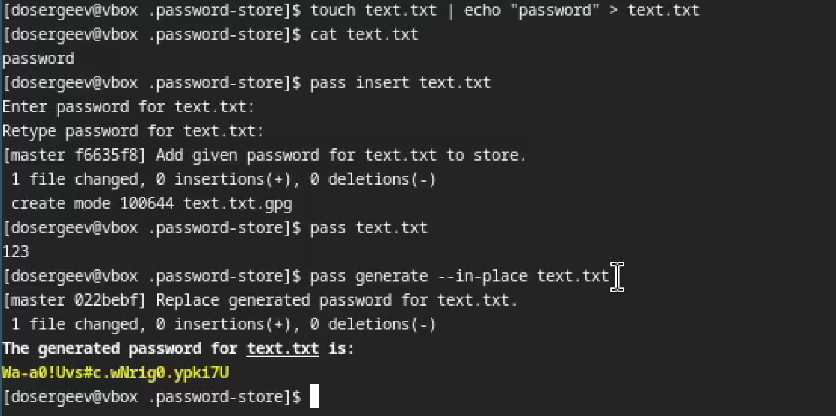{#fig:013 width=70%}

## Управление файлами конфигурации

Установим дополнительное программное обеспечение. Также скачаем шрифты семейства iosevka.

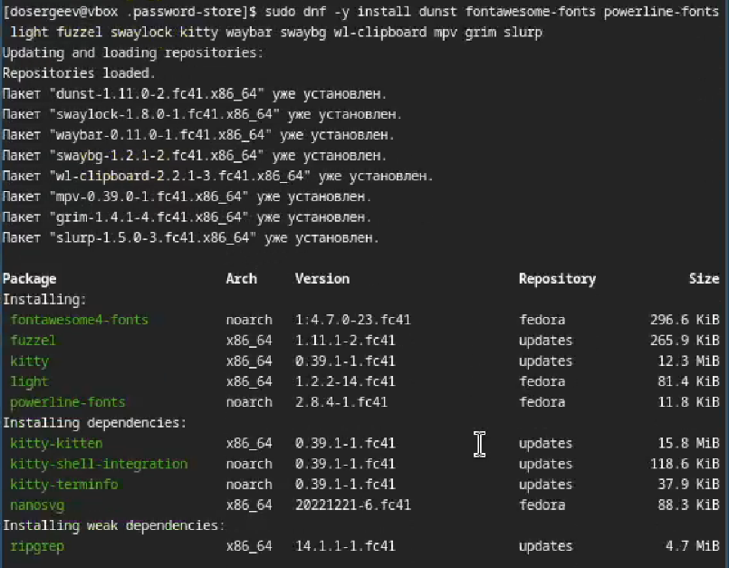{#fig:014 width=70%}

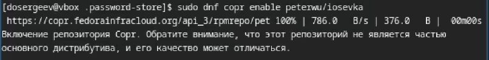{#fig:015 width=70%}

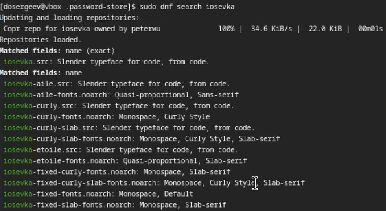{#fig:016 width=70%}

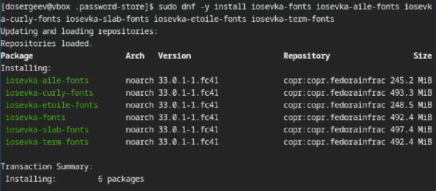{#fig:017 width=70%}

Теперь поставим chezmoi - конфигуратор пользовательских настроек между машинами [@chezmoi].

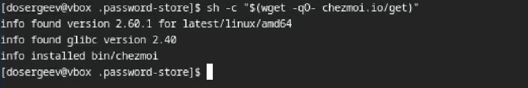{#fig:018 width=70%}

Создадим свой репозиторий dotfiles для конфигурационных файлов на основе шаблона с помощью chezmoi.

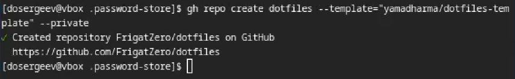{#fig:019 width=70%}

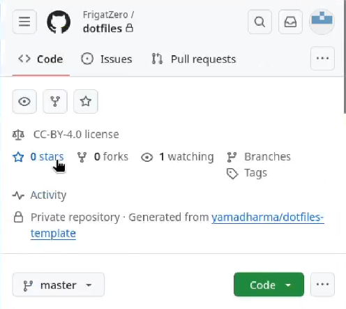{#fig:020 width=70%}

Инициализируем chezmoi с репозиторием dotfiles, используя ключ SSH.

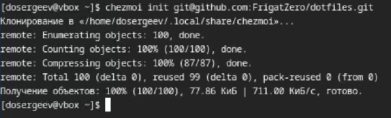{#fig:021 width=70%}

С помощью команды chezmoi diff проверим изменения, которые внесёт chezmoi в домашний каталог. Изменения нас устраивают, поэтому подтвердим их.

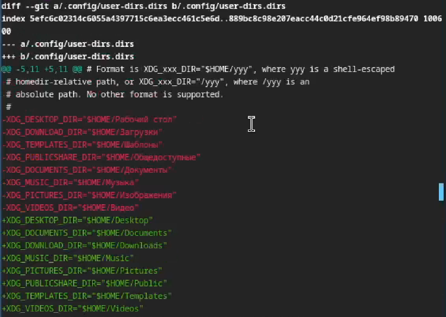{#fig:022 width=70%}

## Использование chezmoi на нескольких машинах

На второй машине инициализируем chezmoi с репозиторием dotfiles (предварительно войдя в свой github с устройства). Проверим внесённые изменения в домашний каталог, подтвердим изменения и пропишем chezmoi update -v.

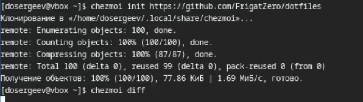{#fig:023 width=70%}

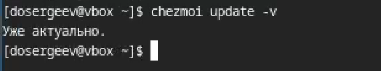{#fig:024 width=70%}

Также попробуем установить свои dotfile на новый компьютер. Для этого напишем команду chezmoi init с ключем --apply.

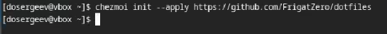{#fig:025 width=70%}

## Ежедневные операции c chezmoi

Извлечём последние изменения из репозитория и применим их командой chezmoi update.

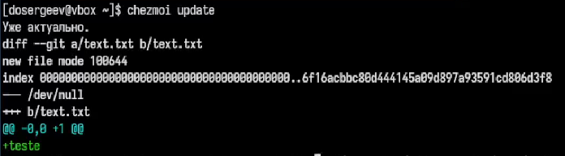{#fig:026 width=70%}

Извлечём последние изменения из своего репозитория и посмотрим, что изменится, командой chezmoi git pull.

{#fig:027 width=70%}

Подтвердим изменения с помомощью chezmoi apply.

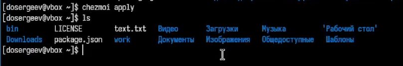{#fig:028 width=70%}

Перейдем в файл конфигурации  ~/.config/chezmoi/chezmoi.toml и включим автоматическую фиксацию и отправку изменений в исходном каталоге (рис. [-@fig:029]).

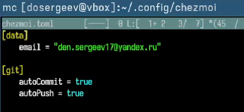{#fig:029 width=70%}

# Вывод

В результате выполнения лабораторной работы я научился настраивать рабочую среду виртуальной машины, использовать pass для хранения паролей и chezmoi для удаленного хранения файлов конфигурации системы на сервисе github.

# Список литературы{.unnumbered}

::: {#refs}
:::
