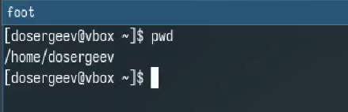
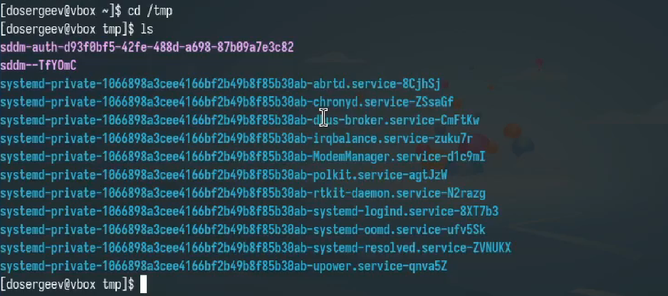
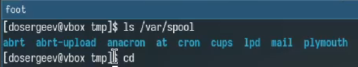
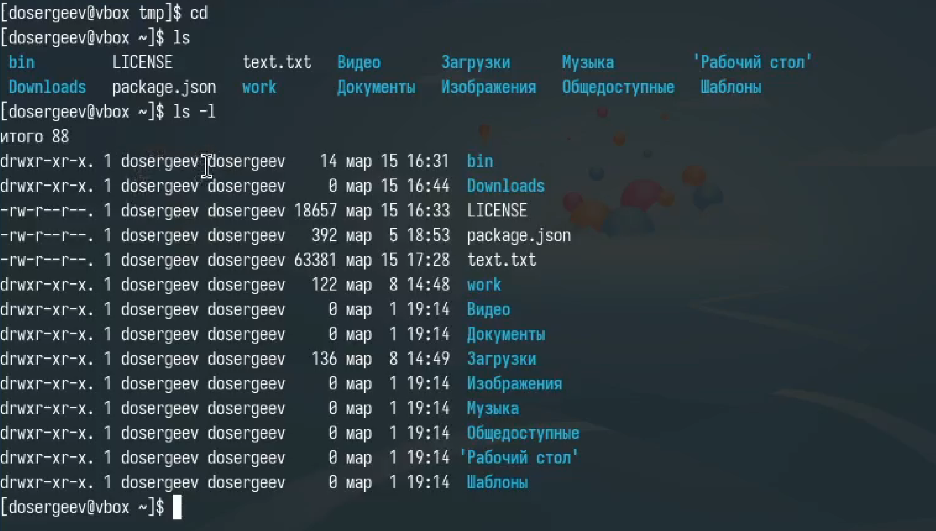
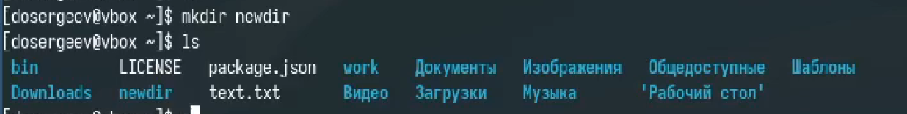
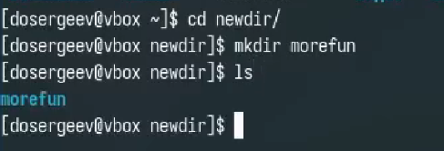
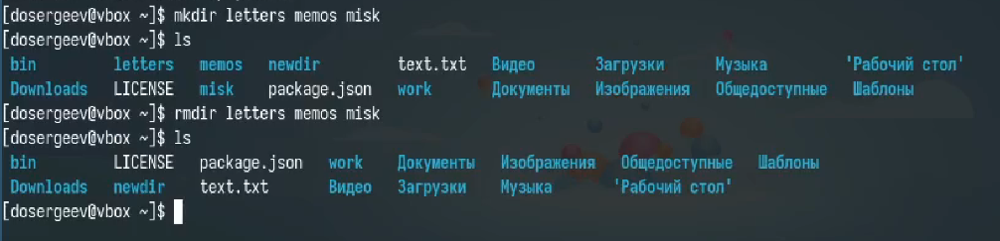
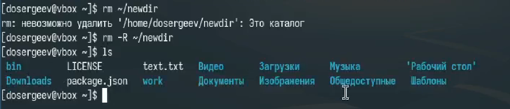
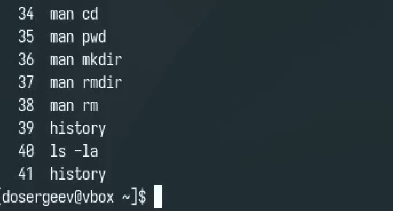
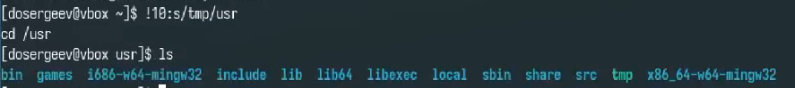

---
## Front matter
lang: ru-RU
title: Лабораторная работа № 4. Основы интерфейса взаимодействия пользователя с системой Unix на уровне командной строки
subtitle: Отчёт
author:
  - Сергеев Д. О.
institute:
  - Российский университет дружбы народов, Москва, Россия
date: 22 марта 2025

## i18n babel
babel-lang: russian
babel-otherlangs: english

## Formatting pdf
toc: false
toc-title: Содержание
slide_level: 2
aspectratio: 169
section-titles: true
theme: metropolis
header-includes:
 - \metroset{progressbar=frametitle,sectionpage=progressbar,numbering=fraction}
---

# Информация

## Докладчик

:::::::::::::: {.columns align=center}
::: {.column width="70%"}

  * Сергеев Даниил Олегович
  * Студент
  * Направление: Прикладная информатика
  * Российский университет дружбы народов
  * [1132246837@pfur.ru](mailto:1132246837@pfur.ru)

:::
::::::::::::::

# Цель работы

Приобретение практических навыков взаимодействия пользователя с системой по-средством командной строки [@tuis]

# Задание

1. Определить полное имя вашего домашнего каталога.
2. Перейдти в /tmp, поработать с командой ls
3. Выполнить указанные действия
4. Использовать команду man
5. Поработать с командой history

# Ход выполнения лабораторной работы

## Определение полного имени домашнего каталога

Определим полное имя домашнего каталога с помощью команды pwd. В результате получим имя: dosergeev.

{#fig:001 width=70%}

## Работа с командой ls 

Перейдем в каталог /tmp и узнаем его содержимое с помощью ls с опцией -l и без. Разница заключается в отображении полноты выводимой информации. Команда -l даёт подробное описание, например: размер файла, дата последнего изменения.

{#fig:002 width=70%}

## Работа с командой ls 

{#fig:003 width=70%}

## Работа с командой ls 

Определим с помощью ls, есть ли в каталоге /var/spool подкаталог с именем cron. В результате работы программы узнаем, что есть.

{#fig:004 width=70%}

## Работа с командой ls 

Перейдем в домашний каталог и узнаем его содержимое вместе с владельцем файлов и подкаталогов: владелец dosergeev.

{#fig:005 width=70%}

## Создание и удаление пробных каталогов

В домашнем каталоге создадим папку newdir и в нем создадим новый каталог с именем morefun.

{#fig:006 width=70%}

## Создание и удаление пробных каталогов

{#fig:007 width=70%}

## Создание и удаление пробных каталогов

Теперь создадим одной командой три новых каталога с именами letters, memos, misk. Затем удалим их также одной командой.

{#fig:008 width=70%}

## Создание и удаление пробных каталогов

Попробуем удалить каталог ~/newdir командой rm, у нас не получается, так как rm без опций не удаляет каталоги. Добавляем опцию -R и удаляем ~/newdir вместе с morefun

{#fig:009 width=70%}

## Создание и удаление пробных каталогов

С помощью команды man определим, какую опцию команды ls нужно использовать для просмотра содержимое нетолько указанного каталога,но и подкаталогов, входящих в него - это опция -R.

{#fig:010 width=60%}

## Создание и удаление пробных каталогов

Спомощью команды man определим набор опций команды ls,позволяющий отсортировать по времени последнего изменения выводимый список содержимого каталога с развёрнутым описанием файлов. 

{#fig:011 width=55%}

## Создание и удаление пробных каталогов2

Используем команду man чтобы узнать основные опции команд cd, pwd, mkdir, rmdir, rm.

## Команда history

Используя информацию из команды history выполним модификацию и исполнение команды cd/tmp на cd/usr

{#fig:012 width=70%}

## Команда history

{#fig:013 width=70%}

# Вывод

В результате выполнения лабораторной работы я приобрел практические навыки взаимодействия с системой по-средством командной строки.
