---
## Front matter
title: "Лабораторная работа № 4. Основы интерфейса взаимодействия пользователя с системой Unix на уровне командной строки"
subtitle: "Отчёт"
author: "Сергеев Даниил Олегович"

## Generic otions
lang: ru-RU
toc-title: "Содержание"

## Bibliography
bibliography: bib/cite.bib
csl: pandoc/csl/gost-r-7-0-5-2008-numeric.csl

## Pdf output format
toc: true # Table of contents
toc-depth: 2
lof: true # List of figures
lot: true # List of tables
fontsize: 12pt
linestretch: 1.5
papersize: a4
documentclass: scrreprt
## I18n polyglossia
polyglossia-lang:
  name: russian
  options:
	- spelling=modern
	- babelshorthands=true
polyglossia-otherlangs:
  name: english
## I18n babel
babel-lang: russian
babel-otherlangs: english
## Fonts
mainfont: IBM Plex Serif
romanfont: IBM Plex Serif
sansfont: IBM Plex Sans
monofont: IBM Plex Mono
mathfont: STIX Two Math
mainfontoptions: Ligatures=Common,Ligatures=TeX,Scale=0.94
romanfontoptions: Ligatures=Common,Ligatures=TeX,Scale=0.94
sansfontoptions: Ligatures=Common,Ligatures=TeX,Scale=MatchLowercase,Scale=0.94
monofontoptions: Scale=MatchLowercase,Scale=0.94,FakeStretch=0.9
mathfontoptions:
## Biblatex
biblatex: true
biblio-style: "gost-numeric"
biblatexoptions:
  - parentracker=true
  - backend=biber
  - hyperref=auto
  - language=auto
  - autolang=other*
  - citestyle=gost-numeric
## Pandoc-crossref LaTeX customization
figureTitle: "Рис."
tableTitle: "Таблица"
listingTitle: "Листинг"
lofTitle: "Список иллюстраций"
lotTitle: "Список таблиц"
lolTitle: "Листинги"
## Misc options
indent: true
header-includes:
  - \usepackage{indentfirst}
  - \usepackage{float} # keep figures where there are in the text
  - \floatplacement{figure}{H} # keep figures where there are in the text
---

# Цель работы

Приобретение практических навыков взаимодействия пользователя с системой по-средством командной строки [@tuis]

# Задание

1. Определить полное имя вашего домашнего каталога.
2. Перейдти в /tmp, поработать с командой ls
3. Выполнить указанные действия
4. Использовать команду man
5. Поработать с командой history

# Ход выполнения лабораторной работы

## Определение полного имени домашнего каталога

Определим полное имя домашнего каталога с помощью команды pwd. В результате получим имя: dosergeev.

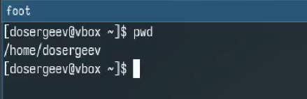{#fig:001 width=70%}

## Работа с командой ls 

Перейдем в каталог /tmp и узнаем его содержимое с помощью ls с опцией -l и без. Разница заключается в отображении полноты выводимой информации. Команда -l даёт подробное описание, например: размер файла, дата последнего изменения.

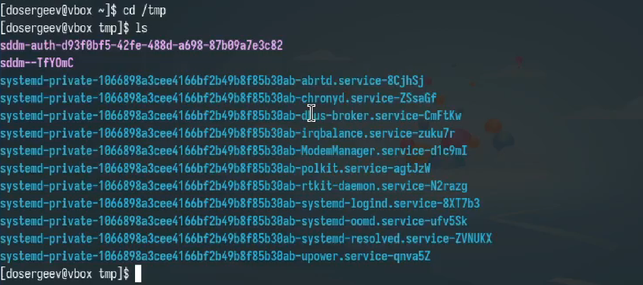{#fig:002 width=70%}

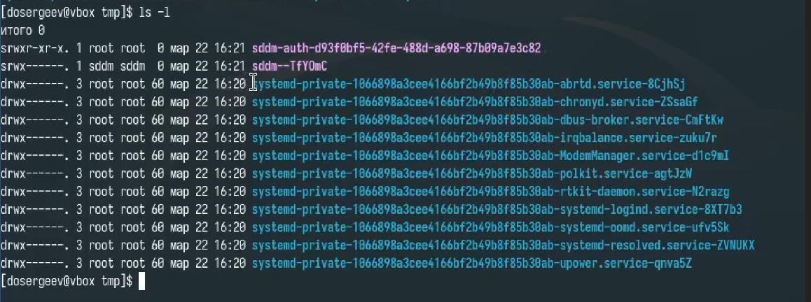{#fig:003 width=70%}

Определим с помощью ls, есть ли в каталоге /var/spool подкаталог с именем cron. В результате работы программы узнаем, что есть.

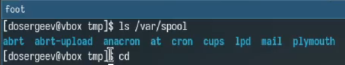{#fig:004 width=70%}

Перейдем в домашний каталог и узнаем его содержимое вместе с владельцем файлов и подкаталогов: владелец dosergeev.

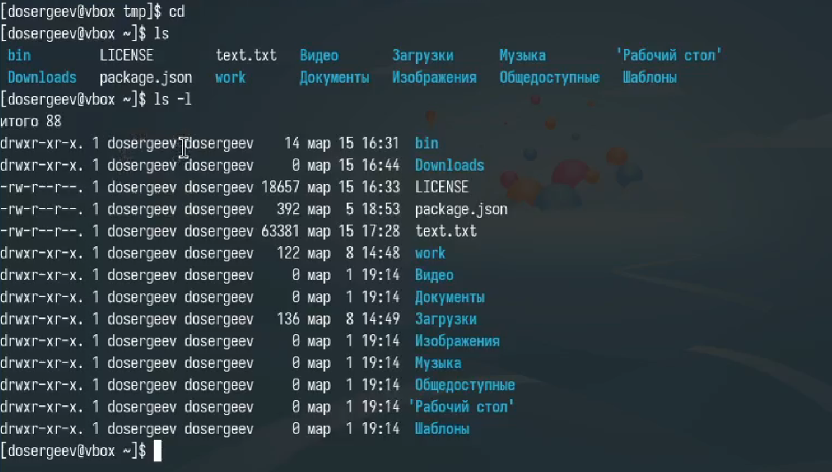{#fig:005 width=70%}

## Создание и удаление пробных каталогов

В домашнем каталоге создадим папку newdir и в нем создадим новый каталог с именем morefun.

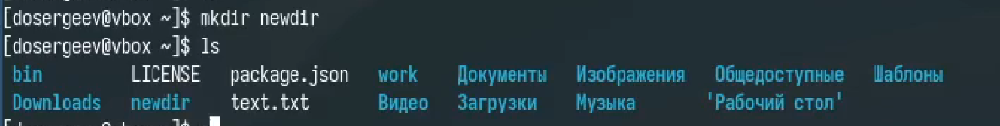{#fig:006 width=70%}

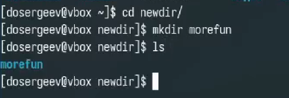{#fig:007 width=70%}

Теперь создадим одной командой три новых каталога с именами letters, memos, misk. Затем удалим их также одной командой.

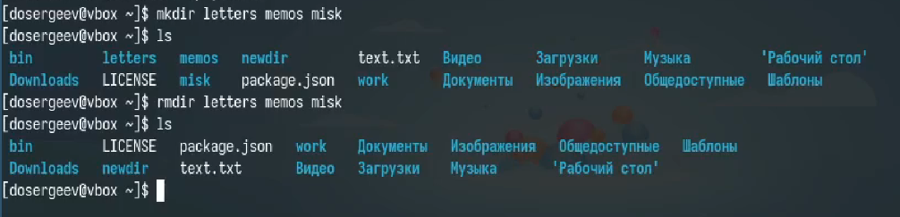{#fig:008 width=70%}

Попробуем удалить каталог ~/newdir командой rm, у нас не получается, так как rm без опций не удаляет каталоги. Добавляем опцию -R и удаляем ~/newdir вместе с morefun

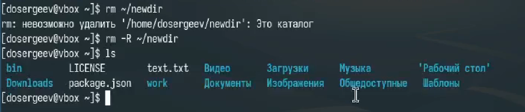{#fig:009 width=70%}

С помощью команды man определим, какую опцию команды ls нужно использовать для просмотра содержимое нетолько указанного каталога,но и подкаталогов, входящих в него - это опция -R.

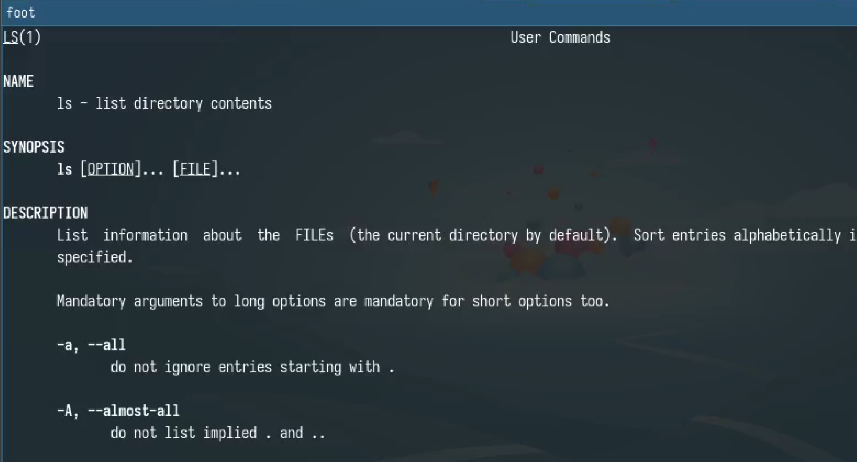{#fig:010 width=70%}

Спомощью команды man определим набор опций команды ls,позволяющий отсортировать по времени последнего изменения выводимый список содержимого каталога с развёрнутым описанием файлов. 

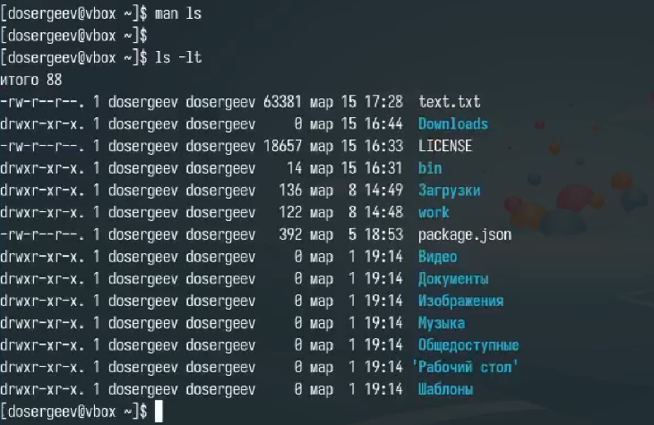{#fig:011 width=70%}

Используем команду man чтобы узнать основные опции команд cd, pwd, mkdir, rmdir, rm.

## Команда history

Используя информацию из команды history выполним модификацию и исполнение команды cd/tmp на cd/usr

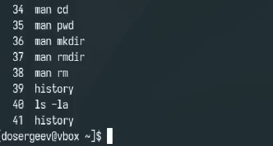{#fig:012 width=70%}

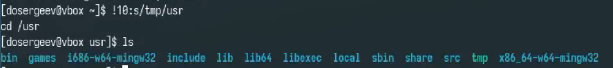{#fig:013 width=70%}

## Ответы на контрольные вопросы.

1. Командная строка — это текстовый интерфейс для взаимодействия пользователя с операционной системой

2. Абсолютный путь текущего каталога можно определить командой pwd. Пример (рис. [-@fig:001])

3. Тип файлов и их имена в текущем каталоге можно определить командой -l. Пример (рис. [-@fig:003])

4. Скрытые файлы можно отобразить командой ls -a. Пример (рис. [-@fig:010])

5. Удалить файл можно командой rm. Удалить каталог rmdir. Да, можно одной командой rm -R. Пример (рис. [-@fig:008])

6. История команд выводится командой history.

7. Чтобы воспользоваться историей команд для их модифицированного выполнения нужно написать в командную строку: !(номер строки history):s/(то что меняем)/(то на что меняем). Пример (рис. [-@fig:013])

8. Пример: cd ~ && mkdir test - переходит в домашний каталог и создает в нем файл директорию test.

9. Символ экранирования \ — экранирует специальные символы т.е. отделяет специальные символы для игнорирования программой. Пример: echo "Это \"кавычки\"".

10. Отображает подробную информацию о файлах: права доступа, количество ссылок, владелец, группа, размер, дата изменения и имя.

11. Относительный путь — путь относительно/из текущего каталога. Пример: ./folder/file.txt - относительный, /home/user/folder/file.txt - абсолютный.

12. Использовать man перед командой

13. Клавиша Tab.

# Вывод

В результате выполнения лабораторной работы я приобрел практические навыки взаимодействия с системой по-средством командной строки.

# Список литературы{.unnumbered}

::: {#refs}
:::
