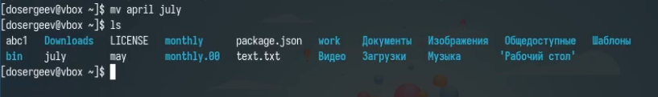
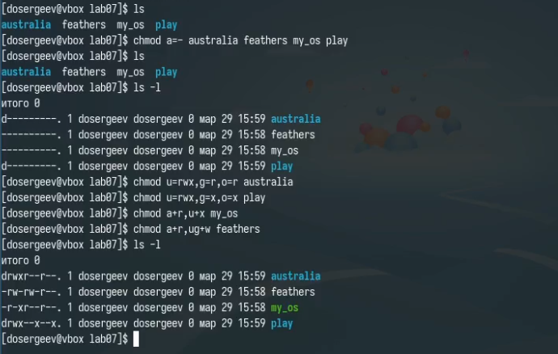

---
## Front matter
title: "Лабораторная работа № 7. Анализ файловой системы Linux. Команды для работы с файлами и каталогами"
subtitle: "Отчёт"
author: "Сергеев Даниил Олегович"

## Generic otions
lang: ru-RU
toc-title: "Содержание"

## Bibliography
bibliography: bib/cite.bib
csl: pandoc/csl/gost-r-7-0-5-2008-numeric.csl

## Pdf output format
toc: true # Table of contents
toc-depth: 2
lof: true # List of figures
lot: true # List of tables
fontsize: 12pt
linestretch: 1.5
papersize: a4
documentclass: scrreprt
## I18n polyglossia
polyglossia-lang:
  name: russian
  options:
	- spelling=modern
	- babelshorthands=true
polyglossia-otherlangs:
  name: english
## I18n babel
babel-lang: russian
babel-otherlangs: english
## Fonts
mainfont: IBM Plex Serif
romanfont: IBM Plex Serif
sansfont: IBM Plex Sans
monofont: IBM Plex Mono
mathfont: STIX Two Math
mainfontoptions: Ligatures=Common,Ligatures=TeX,Scale=0.94
romanfontoptions: Ligatures=Common,Ligatures=TeX,Scale=0.94
sansfontoptions: Ligatures=Common,Ligatures=TeX,Scale=MatchLowercase,Scale=0.94
monofontoptions: Scale=MatchLowercase,Scale=0.94,FakeStretch=0.9
mathfontoptions:
## Biblatex
biblatex: true
biblio-style: "gost-numeric"
biblatexoptions:
  - parentracker=true
  - backend=biber
  - hyperref=auto
  - language=auto
  - autolang=other*
  - citestyle=gost-numeric
## Pandoc-crossref LaTeX customization
figureTitle: "Рис."
tableTitle: "Таблица"
listingTitle: "Листинг"
lofTitle: "Список иллюстраций"
lotTitle: "Список таблиц"
lolTitle: "Листинги"
## Misc options
indent: true
header-includes:
  - \usepackage{indentfirst}
  - \usepackage{float} # keep figures where there are in the text
  - \floatplacement{figure}{H} # keep figures where there are in the text
---

# Цель работы

Ознакомление с файловой системой Linux, её структурой, именами и содержанием каталогов. Приобретение практических навыков по применению команд для работы с файлами и каталогами, по управлению процессами (и работами), по проверке использования диска и обслуживанию файловой системы. [@tuis]

# Задание

1. Выполнить все примеры, приведённые в первой части описания лабораторной работы.
2. Выполнить задания по перемещению и переименовыванию файлов и каталогов.
3. Выполнить задания по изменению прав доступа.
4. Проделать упражнения с описанием выполняемых команд.
5. Узнать про команды для анализа файловых систем.

# Ход выполнения лабораторной работы

## Выполнение примеров из описания лабораторной работы

Согласно первому заданию лабораторной работы полседовательно выполним команды из примеров описания. Приступим с примера по перемещению, копированию и переименовыванию файлов. (рис. [-@fig:001]-[-@fig:007])

{#fig:001 width=70%}

{#fig:002 width=70%}

{#fig:003 width=70%}

{#fig:004 width=70%}

{#fig:005 width=70%}

{#fig:006 width=70%}

{#fig:007 width=70%}

Теперь поработаем с изменением прав доступа к файлам. (рис. [-@fig:008]-[-@fig:011])

{#fig:008 width=70%}

{#fig:009 width=70%}

{#fig:010 width=70%}

{#fig:011 width=70%}

Из блока про анализ файловых систем введем команду fsck для проверки и исправления.

{#fig:012 width=70%}

## Выполнение заданных команд

Скопируем файл /usr/include/sys/io.h в домашний каталог и назовем его equipment. Создадим директорию ski.plases и переместим туда equipment с именем equiplist.

{#fig:013 width=70%}

Создадим в домашнем каталоге файл abc1 и скопируем его в ski.plases с именем equiplist2. Создадим каталог equipment и закинем в него ранее созданные файлы. Создадим и переместим каталог newdir в ski.plases и назовем его plans.

{#fig:014 width=70%}

Создадим каталог lab07 и в нем создадим подкаталоги play и australia, файлы feathers и my_os. Определим опции команды chmod, необходимые для выделения указаных прав доступа:
1. chmod u=rwx,g=r,o=r australia
2. chmod u=rwx,g=x,o=x play
3. chmod a+r,u+x my_os
4. chmod a+r,ug+w feathers

{#fig:015 width=70%}

## Выполнение упражнений

Просмотрим содержимое файла /etc/password.

{#fig:016 width=70%}

Скопируем файл feathers в ~/file.old. Переместим file.old в каталог play. Скопируем play в fun. Переместим fun в play с именем games.

{#fig:017 width=70%}

Лишим владельца feathers права на чтение. Попытаемся просмотреть и скопировать файл. В результате выходит ошибка: Отказано в доступе. Это происходит так как право на чтение разрешает копирование и открытие (чтение) файлов. Вернем себе право на чтение feathers.

{#fig:018 width=70%}

Сделаем то же самое, но на этот раз с каталогом play. Снимем право на выполнение с владельца. Попробуем перейти в каталог - выходит ошибка доступа. Вернем право на выполнение.

{#fig:019 width=70%}

Прочитаем с помощью man про команды mount, fsck, mkfs, kill. Кратко охарактеризуем их и приведем примеры.
- mount: Монтирует файловую систему в указанную точку монтирования. Например: команда mount /dev/sr0 /media/vbtools подключит файловую систему гостевого образа VirtualBox в месте /media/vbtools.
- fsck: Проверяет и устраняет ошибки в файловой системе. Например: fsck /dev/sda1 запустит процесс проверки целостности системы /dev/sda1.
- mkfs: Создает файловые системы указанного типа. Например: sudo mkfs -t ext4 /dev/sdb1 создаст файловую систему ext4 по точке монтирования /dev/sdb1.
- kill: Завершает или устраняет процесс по его номеру. Например: для номера процесса терминала 3304, команда kill -KILL 3304 устранит терминал и закроет его.

## Ответы на контрольные вопросы.

1. Файловые системы на устройстве: ext4, btrfs, vfat.
- ext4: основная файловая система, используемая в ОС с ядром Linux. Её особенностью является журналирование, то есть сохранение списка изменений.
- btrfs: молодая файловая система Linux, основанная на структурах B-деревьев и работающая по принципу copy-on-write.
- fat: классическая и устаревшая архитектура файловой системы компьютера и семейство стандартных файловых систем. Является хорошо подходящим форматом для обмена данными между компьютерами и устройствами почти любого типа.
2. Общая структура: / (корень), /bin (основные бинарные файлы), /etc (конфиги), /home (пользователи), /var (изменяемые данные), /tmp (временные файлы).
3. Чтобы содержимое некоторой файловой системы было доступно операционной системе необходимо выполнить операцию монтирования mount.
4. Основные причины нарушения целостности: ошибки диска, некорректное завершение работы. Исправляется командой fsck.
5. Файловая система создаётся командой mkfs.
6. Команды для просмотра текстовых файлов
- cat: вывод всего файла в терминал.
- less: просмотр файлов постранично.
- head [-n]: вывод первых 10 или n строк.
- tail [-n]: вывод последних 10 или n строк.
7. Копирование файлов, рекурсивное копирование, с сохранением атрибутов или без.
8. Перемещение файлов, переименование, перезапись.
9. Права доступа — это разрешения на чтение, запись и выполнение для владельца, группы и остальных. Изменяются командой chmod.

# Вывод

В результате выполнения лабораторной работы я ознакомился с файловой системой Linux, приобрел практические навыки по применению команд для работы с файлами и каталогами, по управлению процессами, по проверке использования диска и обслуживанию файловой системы.

# Список литературы{.unnumbered}

::: {#refs}
:::
