---
## Front matter
lang: ru-RU
title: Лабораторная работа № 8. Поиск файлов. Перенаправление ввода-вывода. Просмотр запущенных процессов
subtitle: Отчёт
author:
  - Сергеев Д. О.
institute:
  - Российский университет дружбы народов, Москва, Россия
date: 05 апреля 2025

## i18n babel
babel-lang: russian
babel-otherlangs: english

## Formatting pdf
toc: false
toc-title: Содержание
slide_level: 2
aspectratio: 169
section-titles: true
theme: metropolis
header-includes:
 - \metroset{progressbar=frametitle,sectionpage=progressbar,numbering=fraction}
---

# Информация

## Докладчик

:::::::::::::: {.columns align=center}
::: {.column width="70%"}

  * Сергеев Даниил Олегович
  * Студент
  * Направление: Прикладная информатика
  * Российский университет дружбы народов
  * [1132246837@pfur.ru](mailto:1132246837@pfur.ru)

:::
::::::::::::::

# Цель работы

Ознакомление с инструментами поиска файлов и фильтрации текстовых данных. Приобретение практических навыков: по управлению процессами (и заданиями), по проверке использования диска и обслуживанию файловых систем.

# Задание

1. Управление потоком вывода и его запись в файлы
2. Выполнить задания, использующие фильтр grep и команду поиска find
3. Выполнить задания, связанные с фоновыми процессами.
4. Использовать команды df и du.
5. Поработать с командой find для поиска директорий

# Ход выполнения лабораторной работы

## Выполнение примеров из описания лабораторной работы

Запишем в файл file.txt названия файлов из каталога /etc. Для этого используем команду ls и операцию перенаправления вывода (>).

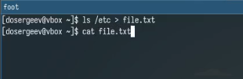{#fig:001 width=70%}

## Выполнение примеров из описания лабораторной работы

Теперь дополнительно запишем в этот файл названия файлов, содержащихся в домашнем каталоге. Для этого используем перенаправление вывода с функцией добавления в конец файла (>>).

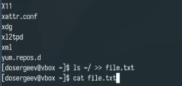{#fig:002 width=70%}

## Выполнение примеров из описания лабораторной работы

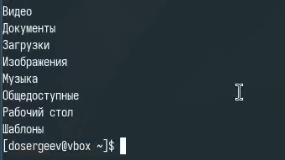{#fig:003 width=70%}

## Выполнение примеров из описания лабораторной работы

Выведем имена всех файлов из file.txt, имеющих расширение .conf и запишем их в новый файл conf.txt. Для этого пропишем команду cat file.txt | grep "\.conf$" > conf.txt. Символ $ нам нужен для поиска в конце имен, а символ \ для указания того, что . - не системный символ. 

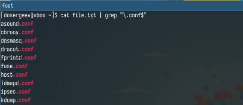{#fig:004 width=70%}

## Выполнение примеров из описания лабораторной работы

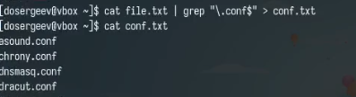{#fig:005 width=70%}

## Выполнение примеров из описания лабораторной работы

Определим, какие файлы в домашнем каталоге имеют имена, начинающиеся с символа c. Для этого используем два варианта:

1. ls -R ~ | grep "^c" 
2. find ~ -name "c*" -print 

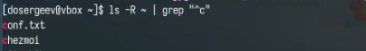{#fig:006 width=70%}

## Выполнение примеров из описания лабораторной работы

{#fig:007 width=70%}

## Выполнение примеров из описания лабораторной работы

Выведем на экран по странично имена файлов из /etc, начинающиеся с символа h. Для вывода по странично используем конвейер и команду more.

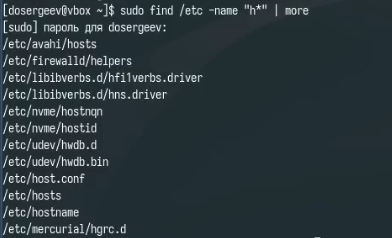{#fig:008 width=70%}

## Выполнение примеров из описания лабораторной работы

Запустим в фоновом режиме процесс, который будет записывать в файл ~/logfile файлы, имена которых начинаются с log. Удалим созданный файл.

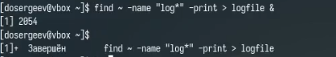{#fig:009 width=70%}

## Выполнение примеров из описания лабораторной работы

Запустим из консоли в фоновом режиме редактор gedit с помощью команды gedit &. Определим его идентификатор, используя ps, конвейер и фильтр grep.

1. ps | grep "gedit"
2. ps aux | grep "gedit" | grep -v grep

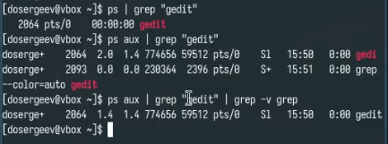{#fig:010 width=70%}

## Выполнение примеров из описания лабораторной работы

Завершим процесс командой kill, предварительно прочитав её описание

{#fig:011 width=70%}

## Выполнение примеров из описания лабораторной работы

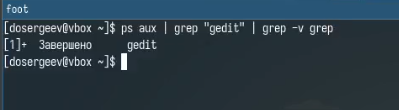{#fig:012 width=70%}

## Выполнение примеров из описания лабораторной работы

Выполним команды df и du, предварительно получив более подробную информацию из man. Используем df и du с ключем -h для вывода размера файлов и файловых систем в понятном для человека формате. К du добавим ключ -a для вывода размера файлов включительно.

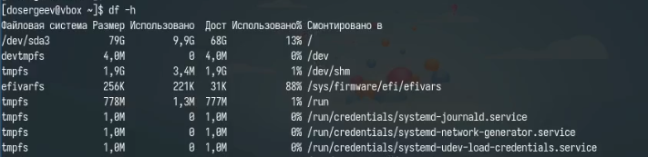{#fig:013 width=70%}

## Выполнение примеров из описания лабораторной работы

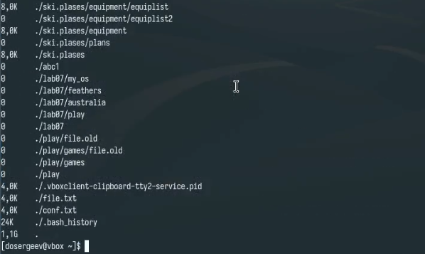{#fig:014 width=70%}

## Выполнение примеров из описания лабораторной работы

Воспользовавшись справкой команды find, выведем имена всех директорий, имеющихся в домашнем каталоге. Для этого используем find ~ -type d -print, где -type - ключ для выбора типа искомого объекта.

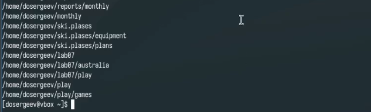{#fig:015 width=70%}

## Ответы на контрольные вопросы.

1. 
- stdin — поток ввода, по умолчанию: клавиатура, имеет сигнал 0;
- stdout — поток вывода, по умолчанию: консоль, имеет сигнал 1;
- stderr — поток вывода сообщений об ошибках, по умолчанию: консоль, имеет сигнал 2;
2.
- '>' – перенаправление вывода с перезаписью файла.
- '>>' – перенаправление вывода с дописыванием в конец файла.

## Выполнение примеров из описания лабораторной работы

3. Конвейер (|) – это символ для передачи вывода одной команды на вход другой.
4. Программа – исполняемый файл на диске. Процесс – экземпляр запущенной программы в памяти, имеющий собственный номер, свои ресурсы и состояние.
5. PID (Process ID) – уникальный идентификатор процесса. GID (Group ID) – идентификатор группы процессов.
6. Задачи - процессы, запущенные в текущей сессии терминала. kill %номер задачи - позволяет завершить процесс по номеру.
7. top – утилита мониторинга процессов в реальном времени. htop – улучшенная версия top с цветным интерфейсом и удобной навигацией.

## Выполнение примеров из описания лабораторной работы

8. find - рекурсивный поиск файлов по имени, размеру, дате и другим критериям. Примеры:
- find %каталог -type d -print - выведет все директории и под-директории в указанном каталоге.
- find %каталог -name %имя -print - выведет все файлы с указанным именем в текущем и под-каталогах.
9. Можно, с помощью команды grep. Синтаксис: grep "текст" /путь/.
10. С помощью команды df.
11. С помощью команды du.
12. Найти его номер PID с помощью команды ps, grep и удалить командой kill -KILL PID. 

# Вывод

В результате выполнения лабораторной работы я ознакомился с инструментами поиска файлов и фильтрации текстовых данных, приобрел практические навыков по управлению процессами и по проверке использования диска.
