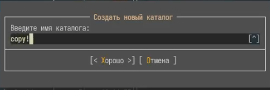
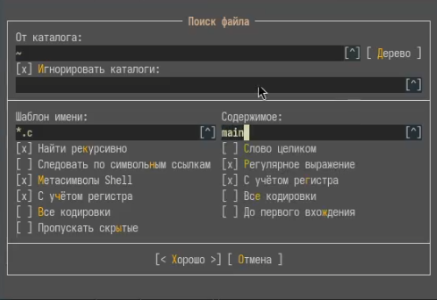
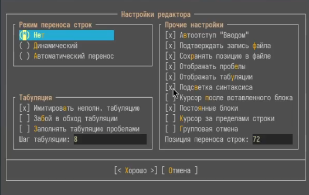

---
## Front matter
title: "Лабораторная работа № 9. Командная оболочка Midnight Commander"
subtitle: "Отчёт"
author: "Сергеев Даниил Олегович"

## Generic otions
lang: ru-RU
toc-title: "Содержание"

## Bibliography
bibliography: bib/cite.bib
csl: pandoc/csl/gost-r-7-0-5-2008-numeric.csl

## Pdf output format
toc: true # Table of contents
toc-depth: 2
lof: true # List of figures
lot: true # List of tables
fontsize: 12pt
linestretch: 1.5
papersize: a4
documentclass: scrreprt
## I18n polyglossia
polyglossia-lang:
  name: russian
  options:
	- spelling=modern
	- babelshorthands=true
polyglossia-otherlangs:
  name: english
## I18n babel
babel-lang: russian
babel-otherlangs: english
## Fonts
mainfont: IBM Plex Serif
romanfont: IBM Plex Serif
sansfont: IBM Plex Sans
monofont: IBM Plex Mono
mathfont: STIX Two Math
mainfontoptions: Ligatures=Common,Ligatures=TeX,Scale=0.94
romanfontoptions: Ligatures=Common,Ligatures=TeX,Scale=0.94
sansfontoptions: Ligatures=Common,Ligatures=TeX,Scale=MatchLowercase,Scale=0.94
monofontoptions: Scale=MatchLowercase,Scale=0.94,FakeStretch=0.9
mathfontoptions:
## Biblatex
biblatex: true
biblio-style: "gost-numeric"
biblatexoptions:
  - parentracker=true
  - backend=biber
  - hyperref=auto
  - language=auto
  - autolang=other*
  - citestyle=gost-numeric
## Pandoc-crossref LaTeX customization
figureTitle: "Рис."
tableTitle: "Таблица"
listingTitle: "Листинг"
lofTitle: "Список иллюстраций"
lotTitle: "Список таблиц"
lolTitle: "Листинги"
## Misc options
indent: true
header-includes:
  - \usepackage{indentfirst}
  - \usepackage{float} # keep figures where there are in the text
  - \floatplacement{figure}{H} # keep figures where there are in the text
---

# Цель работы

Освоение основных возможностей командной оболочки Midnight Commander. Приобретение навыков практической работы по просмотру каталогов и файлов; манипуляций с ними. [@tuis]

# Задание

1. Выполнить операции в меню mc.
2. Поработать с встроенным редактором mc.

# Ход выполнения лабораторной работы

## Задание с mc

Для начала изучим информацию о mc, вызвав команду man mc.

{#fig:001 width=70%}

Откроем оболочку Midnight Commander.

{#fig:002 width=70%}

Выполним несколько операций в mc,используя управляющие клавиши.

- С помощью Tab переключимся между левой и правой панелью.
- Зажав Shift выделим и отменим выделение у нескольких файлов. (рис. [-@fig:003])
- С помощью клавиш F5, F6 скопируем и переместим выделенные файлы. (рис. [-@fig:004]-[-@fig:005])
- Нажав в подменю правой панели на кнопку Информация получим меню информации о размере, правах доступа и т.д. файла или каталога. (рис. [-@fig:006])

{#fig:003 width=70%}

{#fig:004 width=70%}

{#fig:005 width=70%}

{#fig:006 width=70%}

Выпроним основные команды меню правой панели.

- Список файлов - стоит по умолчанию в левой и правой панели и показывает файлы в текущем каталоге.
- Быстрый просмотр - позволит нам без открытия редактора просматривать содержимое файлов. (рис. [-@fig:007])
- Информация - выведет общие сведения о файле. Меню выводит достаточные и более подробные сведения о файлах, чем ls с ключем -l.
- Дерево - покажет структуру файловой системы в виде дерева. (рис. [-@fig:008])

{#fig:007 width=70%}

{#fig:008 width=70%}

Используя возможности подменю Файл, выполним некоторые действия.

- Просмотрим содержимое текстового файла.
- Откроем некоторый текстовый файл через редактор и выйдем без сохранения изменений. (рис. [-@fig:009])
- Создадим каталог, назовем его copy! (рис. [-@fig:010])
- Скопируем некоторые файлы в созданный каталог.

{#fig:009 width=70%}

{#fig:010 width=70%}

С помощью средств подменю Команда осуществим операции:

- Найдем в системе файл с заданными условиями: с расширением .c, содержащий строку main. (рис. [-@fig:011])
- Проведем несколько команд в редакторе и выберем из истории команд одну из предыдущих. (рис. [-@fig:012])
- Перейдем в домашний каталог через меню каталогов быстрого доступа. (рис. [-@fig:013])
- Проведем анализ файла меню и расширений (рис. [-@fig:014]-[-@fig:015])

{#fig:011 width=70%}

{#fig:012 width=70%}

{#fig:013 width=70%}

{#fig:014 width=70%}

{#fig:015 width=70%}

Вызовем меню Настройки и просмотрим что в нем можно сделать.

## Задание по встроенному редактору mc

Создадим текстовой файл text.txt. Откроем его с помощью F4 в встроенном редакторе и вставим небольшой фрагмент текста из интернета (рис. [-@fig:016]). Далее:

- Удалим некоторую строку из текста, нажав F8.
- Выделим фрагмент текста, нажав F3 и выделив нужный фрагмент, после ещё раз нажав F3, чтобы отменить выделение.
- Скопируем фрагмент клавишей F5 и перенесем его на новую строку с помощью F6.
- Сохраним файл клавишей F2.
- Отменим последние действия (вплоть до переноса строки) сочетанием клавиш ctrl + u.
- Перейдем в конец файла сочетанием ctrl + page down
- Перейдем в начало файла сочетанием ctrl + page up
- Сохраним и закроем файл с помощью F2.

{#fig:016 width=70%}

Найдем и откроем файл с исходным текстом на языке C и используя меню редактора, выключим подсветку синтаксиса. Для этого откроем файл для редактирования и перейдем в настройки->общее.

{#fig:017 width=70%}

{#fig:018 width=70%}

## Ответы на контрольные вопросы.

1. Основные режимы — это просмотр файлов, редактирование, копирование/перемещение и настройки.
2. Копирование (F5), переименование (F6), удаление (F8), просмотр (F3). Напимер их можно выполнить с помощью команд cp, mv, rm, ls.
3. Состоит из окна с выбранной опцией (Список файлов, дерево, быстрый просмотр). Характеристика команд:

- Список файлов – отображение в разных форматах (полный, краткий).
- Информация – свойства файла/диска.
- Дерево каталогов – навигация по структуре папок.
- Быстрый просмотр – информация о выделенном файле.

4. Состоит из возможных операций с файлами и способов получения информации о них.

- Просмотр – просмотр файла.
- Права доступа – изменение chmod/chown.
- Жёская/Символьная Ссылка – создание символьных/жестких ссылок.
- Переименовывание
- Создание каталога
- Удалить – удаляет файл или каталог

5. Состоит из операций с поиском файлов, с панелями, с историей команд.

- Поиск файла – рекурсивный поиск по маске.
- История команд – список выполненных действий (в терминале в нижней части mc).
- Перествить панели - переставить левую и правую панель.
- Каталоги быстрого доступа - меню создания быстрых переходов к заданному каталогу.

6. Состоит из операций с изменением настроек и внешнего вида mc.

- Конфигурация – параметры интерфейса и поведения.
- Оформление – темы, тени.
- Параметры панелей – настройка левой-правой панели.

7. 

- F1 — вызов помощи.
- F2 — сохранение изменений.
- F3 — просмотр файла.
- F4 — редактирование файла.
- F5 — копирование файла.
- F6 — перемещение или переименование файла.
- F8 — удаление файла.

8. 

- F4. Вызывает функцию поиска с заменой.
- F3. Переводит в режим выделения, затем при помощи клавиш со стрелками выделяет необходимый участок текста. Завершив выделение, нужно повторно нажать F3, чтобы выйти из режима.
- F5. Копирует выделенную строку.
- F6. Перемещает выделенную строку.

9. Средства mc, которые позволяют создавать меню дают возможность создавать и поддерживать списки команд для выполнения часто повторяемых операций.
10. Средства mc,которые позволяют выполнять действия над текущем файлом:

- Меню Файл. Содержит основные действия над файлами.
- Привязки действий к функциональным клавишам.
- Файлы меню. Содержат списки команд для выполнения часто повторяемых пользователем операций.
- Возможность выбора формата вывода списка файлов.

# Вывод

В результате выполнения лабораторной работы я освоил основные возможности командной оболочки Midnight Commander и его встроенного редактора.

# Список литературы{.unnumbered}

::: {#refs}
:::
