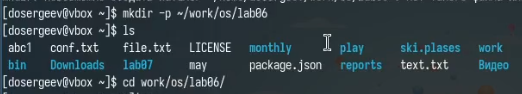
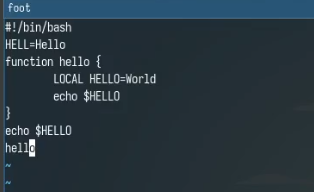
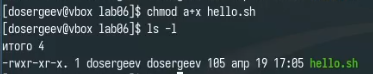
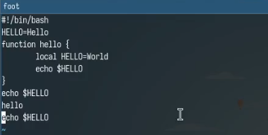
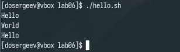
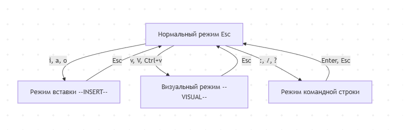

---
## Front matter
lang: ru-RU
title: Лабораторная работа № 10. Текстовой редактор vi
subtitle: Отчёт
author:
  - Сергеев Д. О.
institute:
  - Российский университет дружбы народов, Москва, Россия
date: 19 апреля 2025

## i18n babel
babel-lang: russian
babel-otherlangs: english

## Formatting pdf
toc: false
toc-title: Содержание
slide_level: 2
aspectratio: 169
section-titles: true
theme: metropolis
header-includes:
 - \metroset{progressbar=frametitle,sectionpage=progressbar,numbering=fraction}
---

# Информация

## Докладчик

:::::::::::::: {.columns align=center}
::: {.column width="70%"}

  * Сергеев Даниил Олегович
  * Студент
  * Направление: Прикладная информатика
  * Российский университет дружбы народов
  * [1132246837@pfur.ru](mailto:1132246837@pfur.ru)

:::
::::::::::::::

# Цель работы

Познакомиться с операционной системой Linux. Получить практические навыки работы с редактором vi, установленным по умолчанию практически во всех дистрибутивах.

# Задание

1. Ознакомиться с теоретическим материалом.
2. Ознакомиться с редактором vi.
3. Выполнитьупражнения,используя команды vi..

# Ход выполнения лабораторной работы

## Задание 1. Создание нового файла с использованием vi

Создадим каталог ~/work/os/lab06 и перейдем в него.

{#fig:001 width=70%}

## Задание 1. Создание нового файла с использованием vi

Вызовем редактор vi и создадим новый файл hello.sh командой vi hello.sh. В открытом окне нажмем клавишу i для перехода в режим вставки и введем заданный текст. Закончив редактирование, нажмем клавишу Esc для перехода в командный режим и введем команду :wq для сохранения и завершения работы.

{#fig:002 width=50%}

## Задание 1. Создание нового файла с использованием vi

Сделаем файл исполняемый с помощью команды chmod.

{#fig:003 width=70%}

## Задание 2. Редактирование существующего файла

Снова вызовем редактор vi по полному пути командой vi ~/work/os/lab06/hello.sh. Выполним ряд необходимых упражнений:

1. Заменим слово HELL во второй строке на HELLO. Для этого установим стрелкми курсор в конец второй строки, потом введем комбинацию клавиш cw (w обязательно с маленькой буквы, так как нам нужно удалить слово до символа =) для замены указанного слова и введем HELLO.
2. Заменим слово LOCAL в четвертой строке на local. Установим курсор на четвертую строку и введем dw для удаления слова. После этого перейдем в режим вставки командой i и введем local.

## Задание 2. Редактирование существующего файла

3. Вставим в конец файла строку echo $HELLO, после чего удалим её и отменим действие. Установим курсор на 7 строку с echo $HELLO. После этого введем команду Y, чтобы скопировать её. Теперь переместим курсор на последнюю строку и введем команду o чтобы вставить скопированную строку. Не убирая курсора, удалим последнюю строку командой d и отменим изменения командой u.

## Задание 2. Редактирование существующего файла

После выполнения упражнений введем символы :wq и запишем изменения. Выполним файл для проверки его работы.

{#fig:004 width=70%}

## Задание 2. Редактирование существующего файла

{#fig:005 width=70%}

## Ответы на контрольные вопросы.

1. Режим:

- Командный — используется для ввода команды редактора и просмотра редактируемого файла
- Вставка — используется для ввода изменений редактируемого файла.
- Последняя строка — используется для сохранения изменений файла и выхода из редактора.

## Ответы на контрольные вопросы.

2. Чтобы выйти из редактора, не сохраняя изменения, нужно ввести команду :q!

3.

- 0 (ноль) — переход в начало строки.
- $ — переход в конец строки.
- G — переход в конец файла.
- nG — переход на строку с номером n.

## Ответы на контрольные вопросы.

4. Для редактора vi слово — это любая последовательность символов заключенная между пробелом, знаком табуляции или возвратом каретки. Однако в некоторых командах строчной буквы, например w, разделителем также могут считаться знаки препинания.

5. Перейти в начало (конец) файла можно командами:

- G — в конец файла
- 1G, gg — в начало файла

## Ответы на контрольные вопросы.

6. Основные группы команд редактирования:

- Вставка текста — команды для вставки текста после или перед курсором, в конец или начало строки, n раз перед курсором.
- Вставка строки — команды для вставки строк под или над курсором
- Удаление текста — команды для удаления символов, строк или слов в буфер. От курсора до конца строки, от начала до курсора, удаление n строк.
- Отмена и повтор произведённых изменений — команды для отмены и повтора последнего изменения.

## Ответы на контрольные вопросы.

- Копирование текста в буфер — команды для копирования строки или n строк, слова в буфер.
- Вставка текста из буфера — команды для вставки текста перед или после курсора.
- Замена текста — команды для замены слова или n слов, текста от курсора и до конца строки, текста.
- Поиск текста — команды для поиска вперед или назад по тексту определенного набора символов

## Ответы на контрольные вопросы.

7. Для заполнения строки символами $: 
- 0, с$, ESC — для удаления всех символов строки.
- ni, $, ESC — для записи n символов $ в строку.

8. Чтобы отменить некорректное действие, можно выйти из режима вставки и ввести команду u для отмены последнего действия или перейти в режим последней строки и ввести команду :e! для отмены всех изменений с момента последней записи.

## Ответы на контрольные вопросы.

9. Основные группы команд редактирования в режиме командной строки:

- Копирование и перемещение текста — команды для удаления группы строк, их перемещения и копирования в дргую строку, записи отдельных строк в другой файл с заданныи именем.
- Запись в файл и выход из редактора — команды для записи изменений в этот или другой файл, выхода из редактора с записью или без, отмены изменений со времени последней записи.

10. Определить позицию конца строки, не перемещая курсора, можно с помощью команды $ в командном режиме.

## Ответы на контрольные вопросы.

11. Опций редактора vi достаточно много. Чтобы узнать о них, можно прописать команду :set all. Некоторые из них:

- :set nu — выводит номера строк в файле
- :set list — выводит невидимые символы
- :set ic — не учитывает разницу между прописными или строчными символами во время поиска

12. Как узнать режим работы редактора vi:

- Командный — Снизу редактора пустая строка
- Вставка — Снизу редатора написано -- INSERT --
- Последняя строка — Снизу редактора только символ :

## Ответы на контрольные вопросы.

13. Граф взаимосвязи режмов работы vi.

{#fig:006 width=70%}

# Вывод

В результате выполнения лабораторной работы я получить практические навыки работы с редактором vi и освоил команды для его удобного использования.
