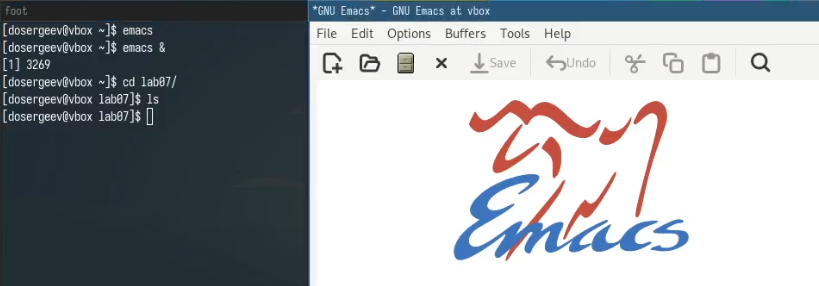
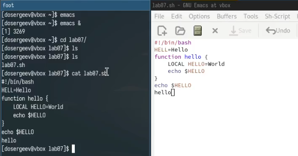
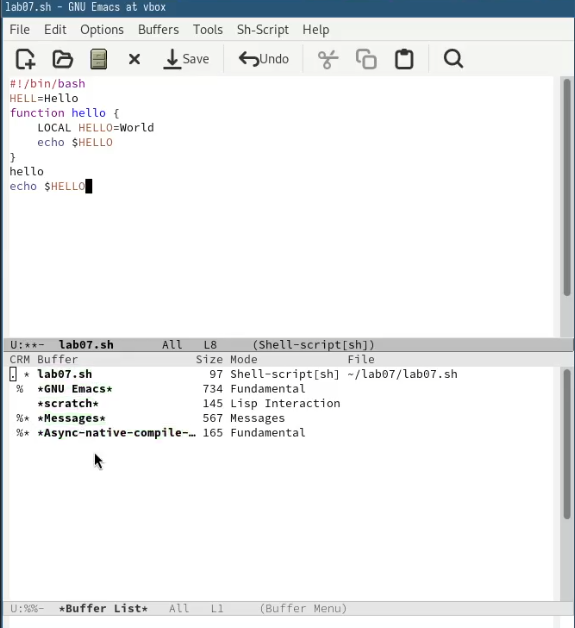
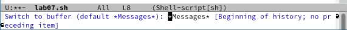
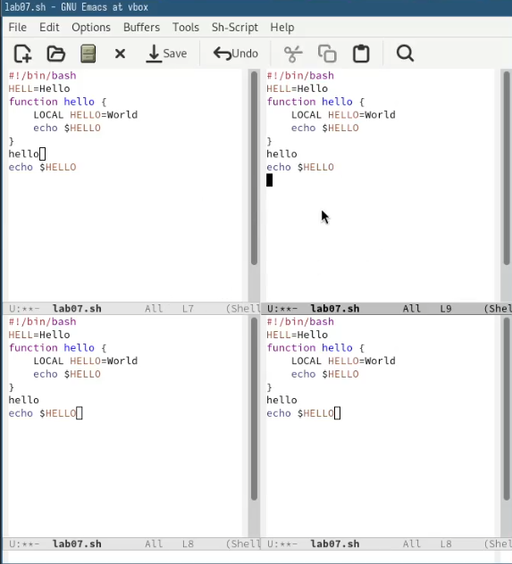
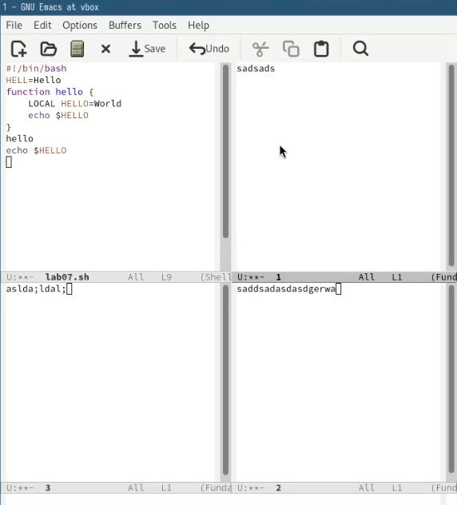
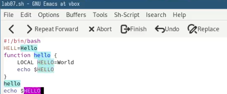
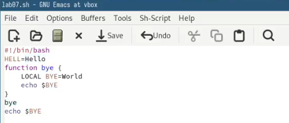
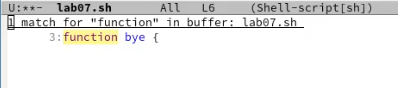
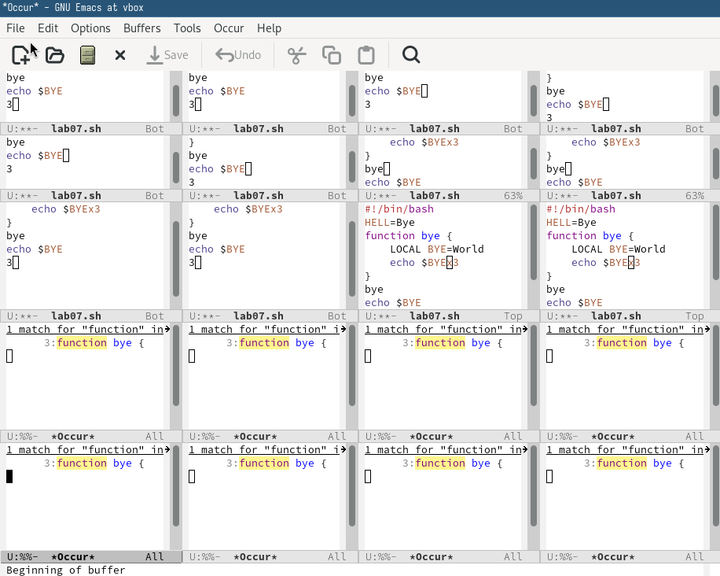

---
## Front matter
lang: ru-RU
title: Лабораторная работа № 11. Текстовой редактор emacs
subtitle: Отчёт
author:
  - Сергеев Д. О.
institute:
  - Российский университет дружбы народов, Москва, Россия
date: 26 апреля 2025

## i18n babel
babel-lang: russian
babel-otherlangs: english

## Formatting pdf
toc: false
toc-title: Содержание
slide_level: 2
aspectratio: 169
section-titles: true
theme: metropolis
header-includes:
 - \metroset{progressbar=frametitle,sectionpage=progressbar,numbering=fraction}
---

# Информация

## Докладчик

:::::::::::::: {.columns align=center}
::: {.column width="70%"}

  * Сергеев Даниил Олегович
  * Студент
  * Направление: Прикладная информатика
  * Российский университет дружбы народов
  * [1132246837@pfur.ru](mailto:1132246837@pfur.ru)

:::
::::::::::::::

# Цель работы

Познакомиться с операционной системой Linux. Получить практические навыки работы с редактором Emacs.

# Задание

1. Ознакомиться с теоретическим материалом.
2. Ознакомиться с редактором emacs.
3. Выполнить упражнения.
4. Ответить на контрольные вопросы.

# Ход выполнения лабораторной работы

## Выполнение упражнений с основными командами emacs

Откроем emacs в фоновом режиме. Перейдем в каталог lab07 и создадим файл lab07.sh с помощью комбинации C-x C-f в самом emacs.

{#fig:001 width=70%}

## Выполнение упражнений с основными командами emacs

Наберем в файле указанный текст и сохраним его с помощью комбинации клавиш C-x C-s.

{#fig:002 width=70%}

## Выполнение упражнений с основными командами emacs

Проделаем с текстом несколько примеров. Стандартные операции редактирования с помощью комбинаций клавиш:

1. Вырежем 7 строку (echo $HELLO) командой С-k.
2. Вставим её в конец файла с помощью C-y.
3. Выделим в область слово hello в 7 строке, предварительно перейдя в режим выделения командой C-space.
4. Скопируем его в буффер с помощью RAlt(M)-w.
5. Вставим выделенную область в конец файла.
6. Вновь выделим слово hello и вырежем его командой C-w.
7. Отменим последнее действие с помощью C-/.

## Выполнение упражнений с основными командами emacs

Далее используем команды по перемещению курсора. Переместим курсор в:

1. начало строки с помощью C-a.
2. конец строки с помощью C-e.
3. начало буфера (файла) с помощью M-<.
4. конец буфера (файла) с помощью M->.

## Выполнение упражнений с основными командами emacs

Теперь попробуем управлять буферами и окнами:

1. Выведем список активных буферов на экран командами C-x C-b.
2. Переместимся в открытое окно командой C-x o. Переключимся на другой буфер, нажав сочетание клавиш C-x b и выбрав окно Messages.
3. Закроем окно списка активных буферов с помощью C-x 0.
4. Переключимся из буфера файла lab07.sh на любой другой файл командой C-x b.
5. Поделим рабочую область на 4 части: сначала пополам по вертикали (C-x 3), а потом по горизонтали, выбрав каждое окно по отдельности (C-x 2).
6. Перейдем в каждое окно командой C-x o, откроем или создадим новые файлы с помощью C-x C-f и введем в них текст.

## Выполнение упражнений с основными командами emacs

{#fig:003 width=45%}

## Выполнение упражнений с основными командами emacs

{#fig:004 width=70%}

## Выполнение упражнений с основными командами emacs

:::::::::::::: {.columns align=center}
::: {.column width="50%"}

{#fig:005 width=70%}

:::
::: {.column width="50%"}

{#fig:006 width=70%}

:::
::::::::::::::

## Выполнение упражнений с основными командами emacs

Поработаем с режимом поиска. Переключимся в него с помощью команды C-s. Попробуем найти слово hello, с помощью той же команды переключимся между результатами поиска (выделено розовым цветом). Выйдем из режима с помощью комбинации C-g.

{#fig:007 width=70%}

## Выполнение упражнений с основными командами emacs

Перейдем в режим поиска и замены. Заменим слова hello на bye. Для этого используем команду M-%, напишем hello и нажмем Enter, затем введем bye. После этого пропишем ! для подтверждения замены.

{#fig:008 width=70%}

## Выполнение упражнений с основными командами emacs

Наконец испробуем другой режим поиска, нажав M-s o. В отличие от обычного режима, открывается отдельное окно со списком всех строк файла, содержащих указанное слово.

{#fig:009 width=70%}

## Ответы на контрольные вопросы.

1. Emacs - экранный редактор текста, написанный на языке высокого уровня Elisp.

2. Нестандартные комбинации клавиш и остутствие управляющих визуальных кнопок могут сделать его сложным для освоения новичком.

3. 

- Буфер - это часть окна, в которой представлено изменение текста открытого файла (временный объект, а не сам файл).
- Окно - это область программы, содржащая один или несколько буферов.

## Ответы на контрольные вопросы.

4. Да, можно.

{#fig:010 width=50%}

## Ответы на контрольные вопросы.

5. По умолчанию при запуске emacs открывается окно scratch.

6.

- С-с |   : Ctrl+c Shift+\
- C-c C-| : Ctrl+c Ctrl+Shift+\

7. Чтобы поделить текущее окно на две части нужно нажать сочетание клавиш:

- по вертикали C-x 3
- по горизонтали C-x 2

## Ответы на контрольные вопросы.

8. Файлы настроек emacs хранятся в каталоге ~/.emacs.d/.

9. Клавиша Backspace выполняет функцию удаления символов в буфере. Её можно переназначить, добавив в файл конфигурации ~/.emacs.d/init.el строку:

- к примеру, для глобального переназначения: (global-set-key (kbd "\<backspace\>") 'функция), стандартная функция для backspace - delete-char.

10. На первый взгляд Vim, в отличие от Emacs, более удобный. Он имеет более привычные комбинации, быстрый и понятный. Emacs в свою очередь тяжелее для освоения и требует натройки для удобного использования.

# Вывод

В результате выполнения лабораторной работы я получил практические навыки работы с редактором Emacs и освоил комбинации клавиш для его удобного использования.
