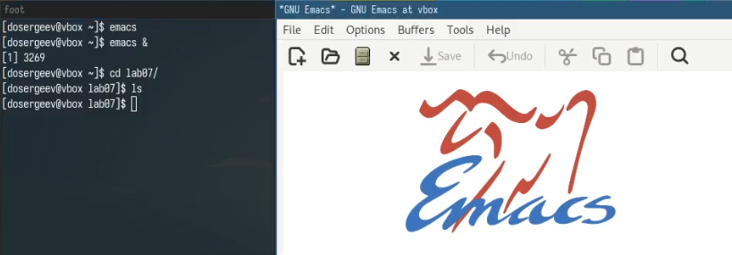
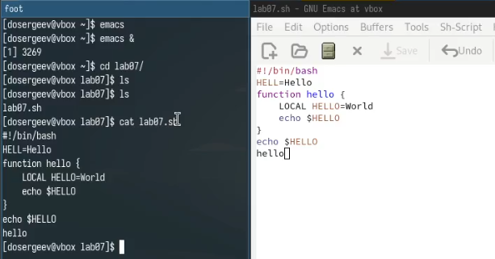
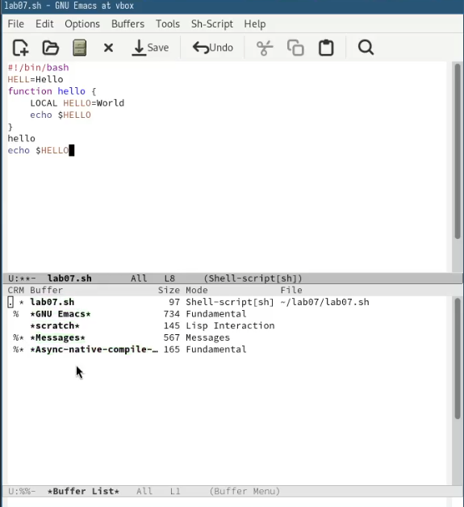
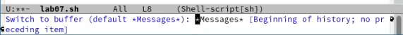
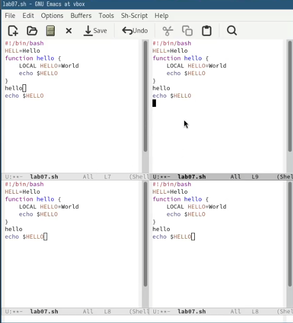
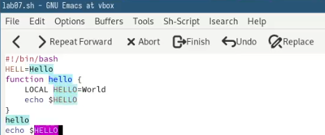
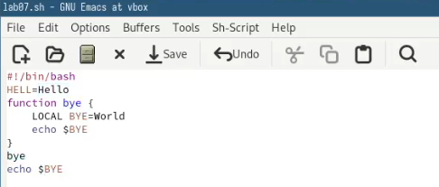
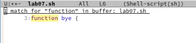
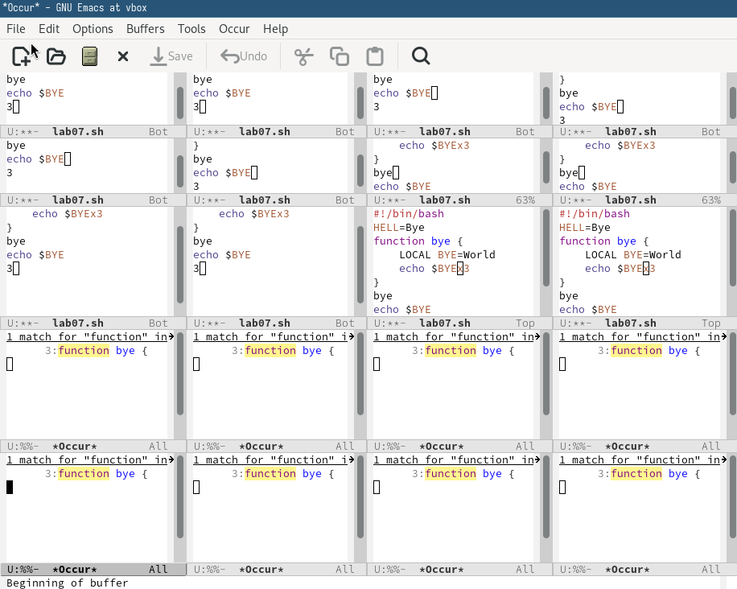

---
## Front matter
title: "Лабораторная работа № 11. Текстовой редактор emacs"
subtitle: "Отчёт"
author: "Сергеев Даниил Олегович"

## Generic otions
lang: ru-RU
toc-title: "Содержание"

## Bibliography
bibliography: bib/cite.bib
csl: pandoc/csl/gost-r-7-0-5-2008-numeric.csl

## Pdf output format
toc: true # Table of contents
toc-depth: 2
lof: true # List of figures
lot: true # List of tables
fontsize: 12pt
linestretch: 1.5
papersize: a4
documentclass: scrreprt
## I18n polyglossia
polyglossia-lang:
  name: russian
  options:
	- spelling=modern
	- babelshorthands=true
polyglossia-otherlangs:
  name: english
## I18n babel
babel-lang: russian
babel-otherlangs: english
## Fonts
mainfont: IBM Plex Serif
romanfont: IBM Plex Serif
sansfont: IBM Plex Sans
monofont: IBM Plex Mono
mathfont: STIX Two Math
mainfontoptions: Ligatures=Common,Ligatures=TeX,Scale=0.94
romanfontoptions: Ligatures=Common,Ligatures=TeX,Scale=0.94
sansfontoptions: Ligatures=Common,Ligatures=TeX,Scale=MatchLowercase,Scale=0.94
monofontoptions: Scale=MatchLowercase,Scale=0.94,FakeStretch=0.9
mathfontoptions:
## Biblatex
biblatex: true
biblio-style: "gost-numeric"
biblatexoptions:
  - parentracker=true
  - backend=biber
  - hyperref=auto
  - language=auto
  - autolang=other*
  - citestyle=gost-numeric
## Pandoc-crossref LaTeX customization
figureTitle: "Рис."
tableTitle: "Таблица"
listingTitle: "Листинг"
lofTitle: "Список иллюстраций"
lotTitle: "Список таблиц"
lolTitle: "Листинги"
## Misc options
indent: true
header-includes:
  - \usepackage{indentfirst}
  - \usepackage{float} # keep figures where there are in the text
  - \floatplacement{figure}{H} # keep figures where there are in the text
---

# Цель работы

Познакомиться с операционной системой Linux. Получить практические навыки работы с редактором Emacs. [@tuis]

# Задание

1. Ознакомиться с теоретическим материалом.
2. Ознакомиться с редактором emacs.
3. Выполнить упражнения.
4. Ответить на контрольные вопросы.

# Ход выполнения лабораторной работы

## Выполнение упражнений с основными командами emacs

Откроем emacs в фоновом режиме. Перейдем в каталог lab07 и создадим файл lab07.sh с помощью комбинации C-x C-f в самом emacs.

{#fig:001 width=70%}

Наберем в файле указанный текст и сохраним его с помощью комбинации клавиш C-x C-s.

{#fig:002 width=70%}

Проделаем с текстом несколько примеров. Стандартные операции редактирования с помощью комбинаций клавиш:

1. Вырежем 7 строку (echo $HELLO) командой С-k.
2. Вставим её в конец файла с помощью C-y.
3. Выделим в область слово hello в 7 строке, предварительно перейдя в режим выделения командой C-space.
4. Скопируем его в буффер с помощью RAlt(M)-w.
5. Вставим выделенную область в конец файла.
6. Вновь выделим слово hello и вырежем его командой C-w.
7. Отменим последнее действие с помощью C-/.

Далее используем команды по перемещению курсора. Переместим курсор в:

1. начало строки с помощью C-a.
2. конец строки с помощью C-e.
3. начало буфера (файла) с помощью M-<.
4. конец буфера (файла) с помощью M->.

Теперь попробуем управлять буферами и окнами:

1. Выведем список активных буферов на экран командами C-x C-b. (рис. [-@fig:003])
2. Переместимся в открытое окно командой C-x o. Переключимся на другой буфер, нажав сочетание клавиш C-x b (рис. [-@fig:004]) и выбрав окно Messages.
3. Закроем окно списка активных буферов с помощью C-x 0.
4. Переключимся из буфера файла lab07.sh на любой другой файл командой C-x b.
5. Поделим рабочую область на 4 части: сначала пополам по вертикали (C-x 3), а потом по горизонтали, выбрав каждое окно по отдельности (C-x 2). (рис. [-@fig:005])
6. Перейдем в каждое окно командой C-x o, откроем или создадим новые файлы с помощью C-x C-f и введем в них текст. (рис. [-@fig:006])

{#fig:003 width=70%}

{#fig:004 width=70%}

{#fig:005 width=70%}

{#fig:006 width=70%}

Поработаем с режимом поиска. Переключимся в него с помощью команды C-s. Попробуем найти слово hello, с помощью той же команды переключимся между результатами поиска (выделено розовым цветом). Выйдем из режима с помощью комбинации C-g.

{#fig:007 width=70%}

Перейдем в режим поиска и замены. Заменим слова hello на bye. Для этого используем команду M-%, напишем hello и нажмем Enter, затем введем bye. После этого пропишем ! для подтверждения замены.

{#fig:008 width=70%}

Наконец испробуем другой режим поиска, нажав M-s o. В отличие от обычного режима, открывается отдельное окно со списком всех строк файла, содержащих указанное слово.

{#fig:009 width=70%}

## Ответы на контрольные вопросы.

1. Emacs - экранный редактор текста, написанный на языке высокого уровня Elisp.

2. Нестандартные комбинации клавиш и остутствие управляющих визуальных кнопок могут сделать его сложным для освоения новичком.

3. 

- Буфер - это часть окна, в которой представлено изменение текста открытого файла (временный объект, а не сам файл).
- Окно - это область программы, содржащая один или несколько буферов.

4. Да, можно. (рис. [-@fig:010])

{#fig:010 width=70%}

5. По умолчанию при запуске emacs открывается окно scratch.

6.

- С-с |   : Ctrl+c Shift+\
- C-c C-| : Ctrl+c Ctrl+Shift+\

7. Чтобы поделить текущее окно на две части нужно нажать сочетание клавиш:

- по вертикали C-x 3
- по горизонтали C-x 2

8. Файлы настроек emacs хранятся в каталоге ~/.emacs.d/.

9. Клавиша Backspace выполняет функцию удаления символов в буфере. Её можно переназначить, добавив в файл конфигурации ~/.emacs.d/init.el строку:

- к примеру, для глобального переназначения: (global-set-key (kbd "\<backspace\>") 'функция), стандартная функция для backspace - delete-char.

10. На первый взгляд Vim, в отличие от Emacs, более удобный. Он имеет более привычные комбинации, быстрый и понятный. Emacs в свою очередь тяжелее для освоения и требует натройки для удобного использования.

# Вывод

В результате выполнения лабораторной работы я получил практические навыки работы с редактором Emacs и освоил комбинации клавиш для его удобного использования.

# Список литературы{.unnumbered}

::: {#refs}
:::
