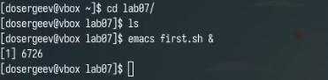
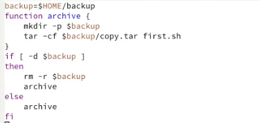
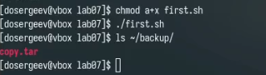
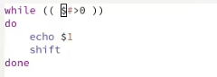
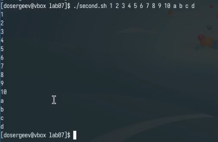
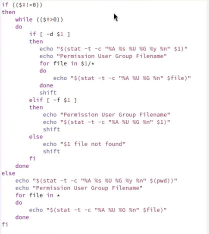
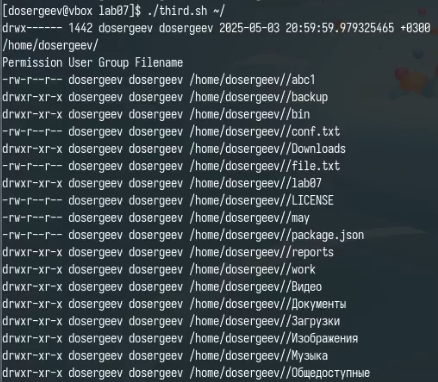
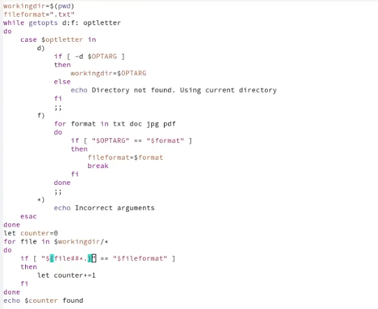
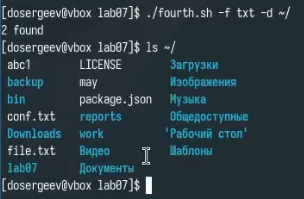

---
## Front matter
title: "Лабораторная работа № 12. Программирование в командном процессоре ОС UNIX. Командные файлы"
subtitle: "Отчёт"
author: "Сергеев Даниил Олегович"

## Generic otions
lang: ru-RU
toc-title: "Содержание"

## Bibliography
bibliography: bib/cite.bib
csl: pandoc/csl/gost-r-7-0-5-2008-numeric.csl

## Pdf output format
toc: true # Table of contents
toc-depth: 2
lof: true # List of figures
lot: true # List of tables
fontsize: 12pt
linestretch: 1.5
papersize: a4
documentclass: scrreprt
## I18n polyglossia
polyglossia-lang:
  name: russian
  options:
	- spelling=modern
	- babelshorthands=true
polyglossia-otherlangs:
  name: english
## I18n babel
babel-lang: russian
babel-otherlangs: english
## Fonts
mainfont: IBM Plex Serif
romanfont: IBM Plex Serif
sansfont: IBM Plex Sans
monofont: IBM Plex Mono
mathfont: STIX Two Math
mainfontoptions: Ligatures=Common,Ligatures=TeX,Scale=0.94
romanfontoptions: Ligatures=Common,Ligatures=TeX,Scale=0.94
sansfontoptions: Ligatures=Common,Ligatures=TeX,Scale=MatchLowercase,Scale=0.94
monofontoptions: Scale=MatchLowercase,Scale=0.94,FakeStretch=0.9
mathfontoptions:
## Biblatex
biblatex: true
biblio-style: "gost-numeric"
biblatexoptions:
  - parentracker=true
  - backend=biber
  - hyperref=auto
  - language=auto
  - autolang=other*
  - citestyle=gost-numeric
## Pandoc-crossref LaTeX customization
figureTitle: "Рис."
tableTitle: "Таблица"
listingTitle: "Листинг"
lofTitle: "Список иллюстраций"
lotTitle: "Список таблиц"
lolTitle: "Листинги"
## Misc options
indent: true
header-includes:
  - \usepackage{indentfirst}
  - \usepackage{float} # keep figures where there are in the text
  - \floatplacement{figure}{H} # keep figures where there are in the text
---

# Цель работы

Изучить основы программирования в оболочке ОС UNIX/Linux. Научиться писать небольшие командные файлы. [@tuis]

# Задание

Написать скрипты для задач лабораторной работы

# Ход выполнения лабораторной работы

## Выполнение упражнений

Перейдем в каталог lab07 и создадим файл first.sh, открыв emacs в фоновом режиме. 

{#fig:001 width=70%}

Напишем код для первого скрипта. Он будет создавать резервную копию самого себя в каталоге ~/backup. Созданный файл будеть архивироваться с помощью tar. (рис. [-@fig:002])

{#fig:002 width=70%}

Проверим работу командного файл.

{#fig:003 width=70%}

Теперь напишем командный файл для распечатывания значений всех переданных ему аргументов. (рис. [-@fig:004])

{#fig:004 width=70%}

Проверим его работу, обязательно на 11 и более аргументах.

{#fig:005 width=70%}

Следующий скрипт станет аналогом ls - он будет выдавать информацию о нужном каталоге и выводить информацию о возможностях доступа к его файлам. (рис. [-@fig:006])

{#fig:006 width=70%}

Проверим его работу на домашнем каталоге. Укажем путь к нему в качестве аргумента.

{#fig:007 width=70%}

Последний скрипт будет выводить все файлы указанного формата (.txt, .doc, .jpg, .pdf) в заданной директории. Для этого попробуем использовать команду getopts. Будем принимать директорию и формат файла в качестве аргумента ключей -d и -f. (рис. [-@fig:008])

{#fig:008 width=70%}

Проверим его работу на домашнем каталоге. Укажем путь ~/ и формат .txt

{#fig:009 width=70%}

## Ответы на контрольные вопросы

1. Командная оболочка - это программа, позволяющая пользователю взаимодействовать с операционной системой. Примеры: 
   - Bourne shell (sh)
   - C shell (csh)
   - Korn shell (ksh)
   - BASH (Bourne Again Shell)
   Основные отличия: синтаксис, функциональность, совместимость с POSIX.

2. POSIX (Portable Operating System Interface) - набор стандартов, описывающих интерфейсы взаимодействия ОС и прикладных программ для обеспечения совместимости UNIX-подобных систем.

3. В bash:
   - Переменные: `name=value`
   - Массивы: `set -A array_name value1 value2 "value 3"` или `array_name[index]=value`

4. Операторы:
   - `let` - вычисление арифметических выражений
   - `read` - чтение значений переменных со стандартного ввода

5. Можно применять данные арифметические операции в bash:
   `+` (сложение), `-` (вычитание), `*` (умножение), `/` (деление), `%` (остаток от деления), битовые операции и операции сравнения.

6. Операция `(( ))` используется для вычисления арифметических выражений и возвращает статус 0 (истина), если результат не нулевой.

7. Стандартные переменные:
   - `PATH` - пути поиска команд
   - `PS1`, `PS2` - промптеры
   - `HOME` - домашний каталог
   - `IFS` - разделители полей
   - `MAIL` - файл почты
   - `TERM` - тип терминала
   - `LOGNAME` - имя пользователя

8. Метасимволы - символы с особым значением в командной оболочке: `' < > * ? | \ " &` и другие.

9. Экранирование метасимволов:
   - Перед символом: `\*`
   - Группа в одинарных кавычках: `'*\|*'`
   - В двойных кавычках (кроме `$`, `'`, `\`, `"`)

10.

    - Создать текстовый файл с командами
    - Дать права на выполнение: `chmod +x filename`
    - Запустить: `./filename` или `bash filename`

11. Функции определяются так:
    ```bash
    function name {
      команды
    }
    ```
    Удаление: `unset -f name`

12. Проверить тип файла можно командой `test`:
    - `test -f file` - обычный файл
    - `test -d file` - каталог
    Или: `[ -f file ]`, `[ -d file ]`

13. Назначение команд:
    - `set` - установка параметров оболочки/вывод переменных
    - `typeset` (или `declare`) - задание типа переменной
    - `unset` - удаление переменной/функции

14. Параметры в командные файлы передаются как аргументы при вызове и доступны через `$1`, `$2`, ..., `$9`, `$0` - имя скрипта.

15. Специальные переменные bash:
    - `$*`, `$@` - все параметры
    - `$#` - количество параметров
    - `$?` - код завершения последней команды
    - `$$` - PID текущего процесса
    - `$!` - PID последнего фонового процесса
    - `$-` - флаги оболочки
    - `${#*}` - количество слов в `$*`
    - `${#name}` - длина строки переменной

# Вывод

В результате выполнения лабораторной работы я изучил основы программирования в оболочке ОС UNIX/Linux и научился писать небольшие командные файлы.

# Список литературы{.unnumbered}

::: {#refs}
:::
