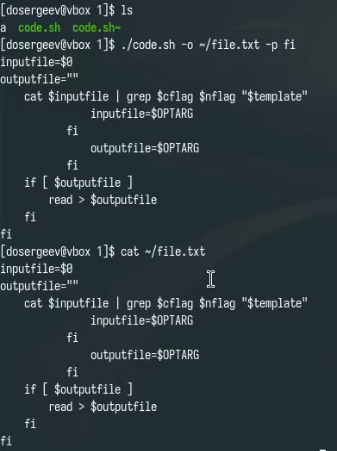
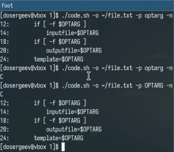
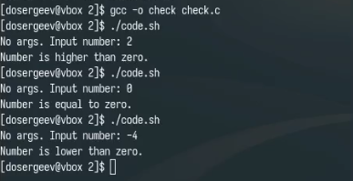
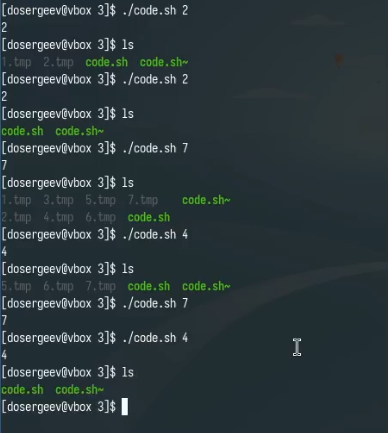
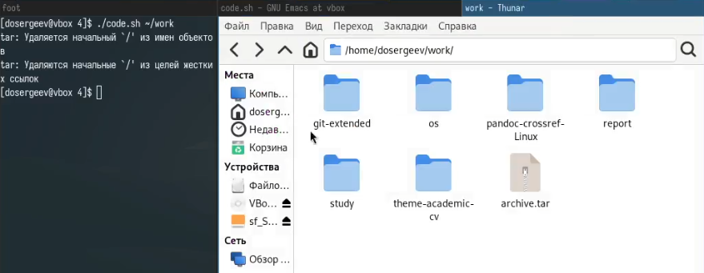

---
## Front matter
lang: ru-RU
title: Лабораторная работа № 13. Программирование в командном процессоре ОС UNIX. Ветвления и циклы
subtitle: Отчёт
author:
  - Сергеев Д. О.
institute:
  - Российский университет дружбы народов, Москва, Россия
date: 7 мая 2025

## i18n babel
babel-lang: russian
babel-otherlangs: english

## Formatting pdf
toc: false
toc-title: Содержание
slide_level: 2
aspectratio: 169
section-titles: true
theme: metropolis
header-includes:
 - \metroset{progressbar=frametitle,sectionpage=progressbar,numbering=fraction}
---

# Информация

## Докладчик

:::::::::::::: {.columns align=center}
::: {.column width="70%"}

  * Сергеев Даниил Олегович
  * Студент
  * Направление: Прикладная информатика
  * Российский университет дружбы народов
  * [1132246837@pfur.ru](mailto:1132246837@pfur.ru)

:::
::::::::::::::

# Цель работы и задание

Изучить основы программирования в оболочке ОС UNIX. Научиться писать более сложные командные файлы с использованием логических управляющих конструкций и циклов.

Написать командные файлы для задач лабораторной работы.

# Ход выполнения лабораторной работы

## Выполнение упражнений

Создадим каталог lab13 с дополнительными директориями для каждого задания. Приступим к выполнению первой задачи.

Используя команды getopts и grep, напишем командный файл, который анализирует командную строку с ключами, а затем ищет в указанном файле нужные строки, определяемые ключом.

- -i: inputfile -- прочитать данные из указанного файла;
- -o: outputfile -- вывести данные в указанный файл;
- -p: template -- указать шаблон для поиска;
- -C -- различать большие и малые буквы;
- -n -- выдавать номера строк;

## Выполнение упражнений

:::::::::::::: {.columns align=center}
::: {.column width="50%"}

{#fig:001 width=70%}

:::
::: {.column width="50%"}

{#fig:002 width=70%}

:::
::::::::::::::

## Выполнение упражнений

Теперь напишем на языке Си программу, которая определяет, является ли введенное число меньше, больше нуля или равно нулю. Данная программа должна завершаться с помощью команды exit(n), передавая код завершения n в оболочку. Также необходимо написать командный файл, который будет анализировать результат с помощью команды $?.

{#fig:003 width=60%}

## Выполнение упражнений

Следующий командный файл должен уметь создавать указанное число файлов, пронумерованных от 1 до некоторого N. Число файлов, которые необходимо создать, передаётся в аргументы командной строки. Этот же командный файл должен уметь удалять все созданные им файлы, если они существуют.

## Выполнение упражнений

:::::::::::::: {.columns align=center}
::: {.column width="70%"}

{#fig:004 width=60%}

:::
::::::::::::::

## Выполнение упражнений

Последний командный файл должен с помощью команды tar запаковывать в архив все файлы в указанной директории, которые были изменены менее недели тому назад.

{#fig:005 width=70%}

## Ответы на контрольные вопросы

1. Команда getopts считывает аргументы командной строки в поиске ключей и записывает их в заданную переменную optletter

2. Перед выполнением команды каждый аргумент команды просматривается в поисках метасимволов, например *, ?, и [, которые считаются как шаблон имён файлов и заменяется именами, соответствующими этому шаблону в алфавитном порядке.

3. Операторы управления действиями:

- Операторы условия: if, else, elif;
- Циклы: for, while;
- Управление выполнением: break, exit, continue;
- Логические операторы: &&(И), ||(ИЛИ), !(НЕ);
- Группировки команд: () - Создание подпроцесса для выполнения команд;

## Ответы на контрольные вопросы

4. Для прерывания цикла используются операторы

- break -- для выхода из оператора
- exit -- для выхода из программы
- continue -- для прерывания итерации цикла

5. Операторы false и true нужны для обозначения успешного и неуспешного завершения выполнения команды

## Ответы на контрольные вопросы

6. 'if test -f man\$s/\$i.\$s' -- данная строка проверяет, существует ли объект '\$i.\$s' и является ли он файлом в относительном каталоге 'man\$s/', где '\$i' и '\$s' -- подставленные значения переменных i и s соотвественно.

7.

- while -- цикл с предусловием, пока условие не станет false;
- until -- цикл с постусловием, пока условие не станет true;

# Вывод

В результате выполнения лабораторной работы я изучил основы программирования в оболочке ОС UNIX/Linux и научился писать более сложные командные файлы.
