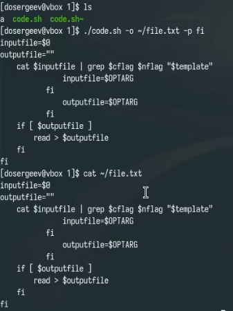
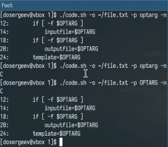
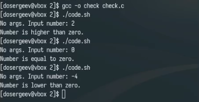
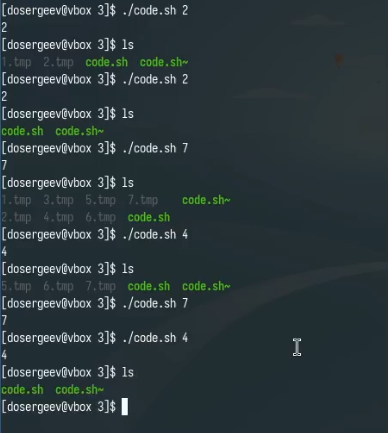
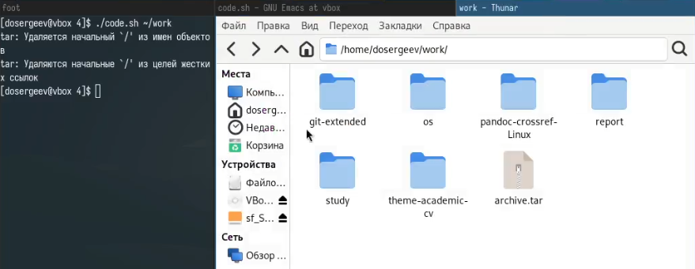

---
## Front matter
title: "Лабораторная работа № 13. Программирование в командном процессоре ОС UNIX. Ветвления и циклы"
subtitle: "Отчёт"
author: "Сергеев Даниил Олегович"

## Generic otions
lang: ru-RU
toc-title: "Содержание"

## Bibliography
bibliography: bib/cite.bib
csl: pandoc/csl/gost-r-7-0-5-2008-numeric.csl

## Pdf output format
toc: true # Table of contents
toc-depth: 2
lof: true # List of figures
lot: true # List of tables
fontsize: 12pt
linestretch: 1.5
papersize: a4
documentclass: scrreprt
## I18n polyglossia
polyglossia-lang:
  name: russian
  options:
	- spelling=modern
	- babelshorthands=true
polyglossia-otherlangs:
  name: english
## I18n babel
babel-lang: russian
babel-otherlangs: english
## Fonts
mainfont: IBM Plex Serif
romanfont: IBM Plex Serif
sansfont: IBM Plex Sans
monofont: IBM Plex Mono
mathfont: STIX Two Math
mainfontoptions: Ligatures=Common,Ligatures=TeX,Scale=0.94
romanfontoptions: Ligatures=Common,Ligatures=TeX,Scale=0.94
sansfontoptions: Ligatures=Common,Ligatures=TeX,Scale=MatchLowercase,Scale=0.94
monofontoptions: Scale=MatchLowercase,Scale=0.94,FakeStretch=0.9
mathfontoptions:
## Biblatex
biblatex: true
biblio-style: "gost-numeric"
biblatexoptions:
  - parentracker=true
  - backend=biber
  - hyperref=auto
  - language=auto
  - autolang=other*
  - citestyle=gost-numeric
## Pandoc-crossref LaTeX customization
figureTitle: "Рис."
tableTitle: "Таблица"
listingTitle: "Листинг"
lofTitle: "Список иллюстраций"
lotTitle: "Список таблиц"
lolTitle: "Листинги"
## Misc options
indent: true
header-includes:
  - \usepackage{indentfirst}
  - \usepackage{float} # keep figures where there are in the text
  - \floatplacement{figure}{H} # keep figures where there are in the text
---

# Цель работы

Изучить основы программирования в оболочке ОС UNIX. Научиться писать более сложные командные файлы с использованием логических управляющих конструкций и циклов. [@tuis]

# Задание

Написать командные файлы для задач лабораторной работы

# Ход выполнения лабораторной работы

## Выполнение упражнений

Создадим каталог lab13 с дополнительными директориями для каждого задания. Приступим к выполнению первой задачи.

Используя команды getopts и grep, напишем командный файл, который анализирует командную строку с ключами, а затем ищет в указанном файле нужные строки, определяемые ключом. (рис. [-@fig:001]-[-@fig:002])

- -i: inputfile -- прочитать данные из указанного файла;
- -o: outputfile -- вывести данные в указанный файл;
- -p: template -- указать шаблон для поиска;
- -C -- различать большие и малые буквы;
- -n -- выдавать номера строк;

**Листинг 3.1. -- код программы командного файла первого задания**
```bash
inputfile=$0
outputfile=""
template=""
cflag="-i"
nflag=""
function read {
    cat $inputfile | grep $cflag $nflag "$template"
}
while getopts i:o:p:Cn optletter
do case $optletter in
       i)
	   if [ -f $OPTARG ]
	   then
	       inputfile=$OPTARG
	   fi
       ;;
       o)
	   if [ -f $OPTARG ]
	   then
	       outputfile=$OPTARG
	   fi
       ;;
       p)
	   template=$OPTARG
       ;;
       C)
	   cflag=""
       ;;
       n)
	   nflag="-n"
       ;;
       *)
	   echo Illegal option $optletter
   esac
done
if [ $template ]
then
    read
    if [ $outputfile ]
    then
	read > $outputfile
    fi
fi
```

{#fig:001 width=70%}

{#fig:002 width=70%}

Теперь напишем на языке Си программу, которая определяет, является ли введенное число меньше, больше нуля или равно нулю. Данная программа должна завершаться с помощью команды exit(n), передавая код завершения n в оболочку. Также необходимо написать командный файл, который будет анализировать результат с помощью команды $?. (рис. [-@fig:003])

**Листинг 3.2. -- код программы на Си второго задания**
```cpp
#include <stdio.h>
#include <stdlib.h>
int main(int argc, const char *argv[]){
	int input;
	if (argc > 1){
		input = atoi(argv[1]);
	} else {
		printf("No args. Input number: ");
		scanf("%d",  &input);
	}
	if (input > 0){
		exit(1);
	} else if (input < 0){
		exit(2);
	} else {
		exit(3);
	}
	exit(0);
}
```

**Листинг 3.3. -- код программы командного файла второго задания**
```bash
./check
case $? in
    1)
	echo Number is higher than zero.
	;;
    2)
	echo Number is lower than zero.
	;;
    3)
	echo Number is equal to zero.
	;;
    *)
	echo Illegal exit code.
esac
```

{#fig:003 width=70%}

Следующий командный файл должен уметь создавать указанное число файлов, пронумерованных от 1 до некоторого N. Число файлов, которые необходимо создать, передаётся в аргументы командной строки. Этот же командный файл должен уметь удалять все созданные им файлы, если они существуют. (рис. [-@fig:004])

**Листинг 3.4. -- код программы командного файла третьего задания**
```bash
let counter=0
if (($#>0))
then
    counter=$1
fi
echo $counter
for ((i=1; i<=$counter; i++))
do
    if [ -f $i.tmp ]
    then
	rm $i.tmp
    else
	touch $i.tmp
    fi
done
```

{#fig:004 width=70%}

Последний командный файл должен с помощью команды tar запаковывать в архив все файлы в указанной директории, которые были изменены менее недели тому назад. (рис. [-@fig:005])

**Листинг 3.5. -- код программы командного файла четвертого задания**
```bash
if (($#!=0))
then
    while (($#>0))
    do
	if [ -d $1 ]
	then
	    tar -cf $1/archive.tar $(find $1/* -mtime -7)
	    shift
	else
	    echo Dir $1 is not found
	    shift
	fi
    done
else
    tar -cf $(pwd)/archive.tar $(find * -mtime -7)
fi
```

{#fig:005 width=70%}

## Ответы на контрольные вопросы

1. Команда getopts считывает аргументы командной строки в поиске ключей и записывает их в заданную переменную optletter

2. Перед выполнением команды каждый аргумент команды просматривается в поисках метасимволов, например *, ?, и [, которые считаются как шаблон имён файлов и заменяется именами, соответствующими этому шаблону в алфавитном порядке.

3. Операторы управления действиями:

- Операторы условия: if, else, elif;
- Циклы: for, while;
- Управление выполнением: break, exit, continue;
- Логические операторы: &&(И), ||(ИЛИ), !(НЕ);
- Группировки команд: () - Создание подпроцесса для выполнения команд;

4. Для прерывания цикла используются операторы

- break -- для выхода из оператора
- exit -- для выхода из программы
- continue -- для прерывания итерации цикла

5. Операторы false и true нужны для обозначения успешного и неуспешного завершения выполнения команды

6. 'if test -f man\$s/\$i.\$s' -- данная строка проверяет, существует ли объект '\$i.\$s' и является ли он файлом в относительном каталоге 'man\$s/', где '\$i' и '\$s' -- подставленные значения переменных i и s соотвественно.

7.

- while -- цикл с предусловием, пока условие не станет false;
- until -- цикл с постусловием, пока условие не станет true;

# Вывод

В результате выполнения лабораторной работы я изучил основы программирования в оболочке ОС UNIX/Linux и научился писать более сложные командные файлы.

# Список литературы{.unnumbered}

::: {#refs}
:::
