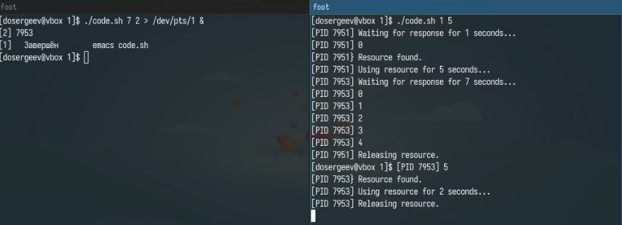
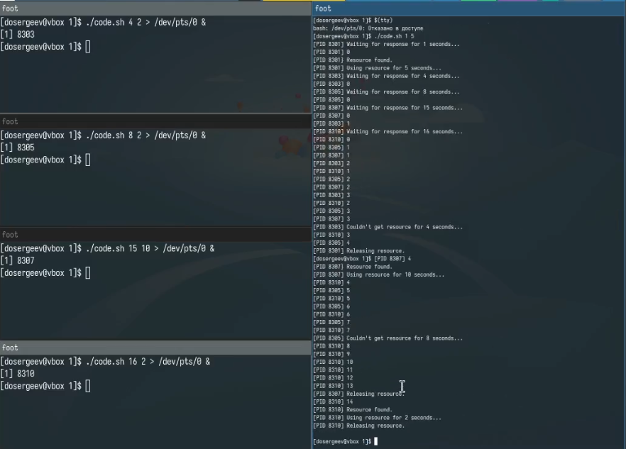
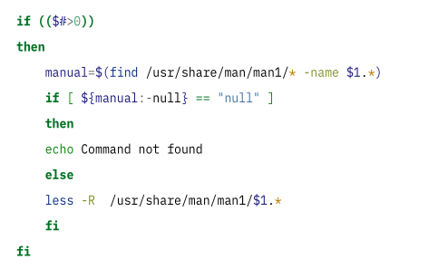
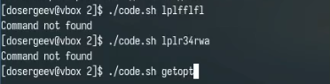
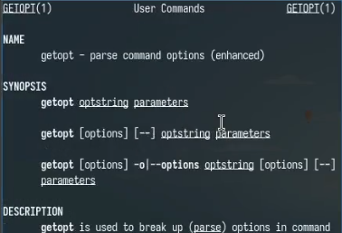
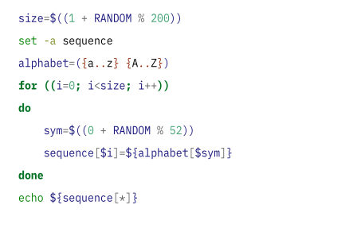
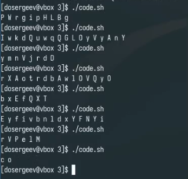

---
## Front matter
lang: ru-RU
title: Лабораторная работа № 14. Программирование в командном процессоре ОС UNIX. Расширенное программирование
subtitle: Отчёт
author:
  - Сергеев Д. О.
institute:
  - Российский университет дружбы народов, Москва, Россия
date: 7 мая 2025

## i18n babel
babel-lang: russian
babel-otherlangs: english

## Formatting pdf
toc: false
toc-title: Содержание
slide_level: 2
aspectratio: 169
section-titles: true
theme: metropolis
header-includes:
 - \metroset{progressbar=frametitle,sectionpage=progressbar,numbering=fraction}
---

# Информация

## Докладчик

:::::::::::::: {.columns align=center}
::: {.column width="70%"}

  * Сергеев Даниил Олегович
  * Студент
  * Направление: Прикладная информатика
  * Российский университет дружбы народов
  * [1132246837@pfur.ru](mailto:1132246837@pfur.ru)

:::
::::::::::::::

# Цель работы

Изучить основы программирования в оболочке ОС UNIX. Научиться писать более сложные командные файлы с использованием логических управляющих конструкций и циклов.

# Задание

Написать командные файлы для задач лабораторной работы

# Ход выполнения лабораторной работы

## Выполнение упражнений

Создадим каталог lab14 с дополнительными директориями для каждого задания. Приступим к выполнению первой задачи.

Напишем командный файл, реализующий упрощённый механизм семафоров. Командный файл должен в течение некоторого времени t1 дожидаться освобождения ресурса, а дождавшись его освобождения использовать его в течение некоторого времени t2<>t1. Каждая смена состояния должна сопровождаться сообщением. Необходимо запустить командный файл в одном виртуальном терминале в фоновом режиме, перенаправив его вывод в другой, в котором также запущен этот файл, только в привилегированном режиме. Доработаем программу для взаимодействия трёх и более процессов.

В качестве ресурса будем использовать файл ./tmp/resource. В него будет записываться номер PID. Этот файл будет создаваться после начала использования некоторым процессом. В случае освобождения ресурса файл будет удаляться. 

## Выполнение упражнений

:::::::::::::: {.columns align=center}
::: {.column width="40%"}

{#fig:001 width=100%}

:::
::: {.column width="60%"}

{#fig:002 width=100%}

:::
::::::::::::::

## Выполнение упражнений

Теперь реализуем команду man с помощью командного файла. Используем команду less для чтения текстовых файлов, лежащих в архивах каталога /usr/share/man/man1. Название команды будет приниматься в качестве аргумента командной строки, а если команды нет, то будет выводиться сообщение об отсутствии справки.

{#fig:003 width=50%}

## Выполнение упражнений

:::::::::::::: {.columns align=center}
::: {.column width="50%"}

{#fig:004 width=70%}

:::
::: {.column width="50%"}

{#fig:005 width=70%}

:::
::::::::::::::

## Выполнение упражнений

Используя встроенную переменную $RANDOM, напишем командный файл, генерирующий случайную последовательность букв латинского алфавита. Создадим массив с всеми 52 буквами латинского алфавита (заглавными и строчными). С помощью переменной \$RANDOM будем генерировать размерность последовательности и номер одной из 52 букв.

## Выполнение упражнений

:::::::::::::: {.columns align=center}
::: {.column width="50%"}

{#fig:006 width=90%}

:::
::: {.column width="50%"}

{#fig:007 width=70%}

:::
::::::::::::::

## Ответы на контрольные вопросы

1. Значения переменной \$1 и строки "exit" написаны слитно с квадратными скобками, из-за чего программа неправильно воспринимает команды.

2. Объединить нескольско строк в одну можно с помощью оператора '+=' или с помощью подстановки переменной \${}.

Например:
```bash
hello="Hello"
world=" World!"
hello+=$world

#ИЛИ

echo "${hello}${world}"
```

## Ответы на контрольные вопросы

3. Утилита seq позволяет генерировать последовательности чисел. Её функционал можно реализовать с помощью фигурных скобок или оператора for.

Например:
```bash
echo {1..10}
for ((i=1; i<=10; i++)); do echo \$i; done
```

4. Вычисление выражения \$((10/3)) даст нам целую часть от деления 10 на 3.

5. Основные отличия командной оболочки Zsh от Bash:

- Существует возможность кастомизации;
- Имеет большое количество плагинов и тем;
- Имеет подсветку синтаксисов и авто-коррекцию;
- Имеет более удобную историю команд;

## Ответы на контрольные вопросы

6. for ((a=1; a <= LIMIT; a++)) -- синтаксис верный.

7. По сравнению с другими языками программирования bash имеет универсальный способ объявления переменных без указания типов данных (аналогично python). Он удобно читается и прост к освоению. В качестве минусов можно выделить нестандартный способ подстановки переменных и высокую чувствительность синтаксиса, как в случае с первым вопросом.

# Вывод

В результате выполнения лабораторной работы я изучил основы программирования в оболочке ОС UNIX/Linux и научился писать более сложные командные файлы.
