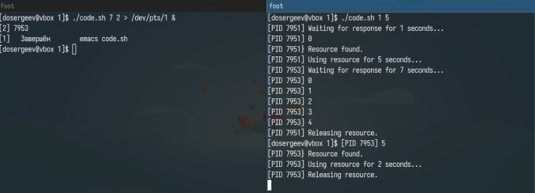
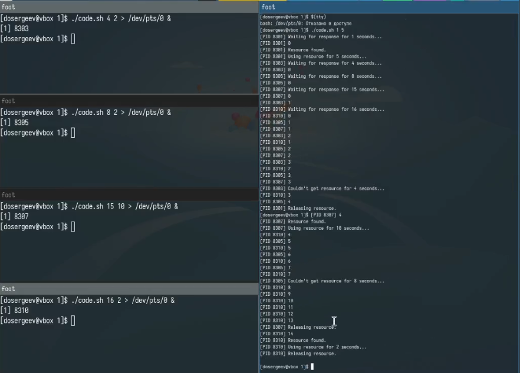
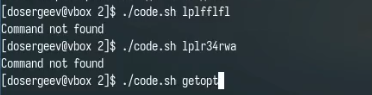
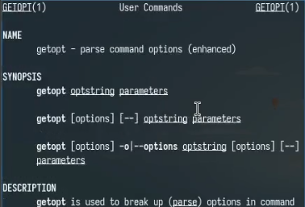
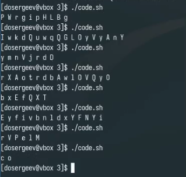

---
## Front matter
title: "Лабораторная работа № 14. Программирование в командном процессоре ОС UNIX. Расширенное программирование"
subtitle: "Отчёт"
author: "Сергеев Даниил Олегович"

## Generic otions
lang: ru-RU
toc-title: "Содержание"

## Bibliography
bibliography: bib/cite.bib
csl: pandoc/csl/gost-r-7-0-5-2008-numeric.csl

## Pdf output format
toc: true # Table of contents
toc-depth: 2
lof: true # List of figures
lot: true # List of tables
fontsize: 12pt
linestretch: 1.5
papersize: a4
documentclass: scrreprt
## I18n polyglossia
polyglossia-lang:
  name: russian
  options:
	- spelling=modern
	- babelshorthands=true
polyglossia-otherlangs:
  name: english
## I18n babel
babel-lang: russian
babel-otherlangs: english
## Fonts
mainfont: IBM Plex Serif
romanfont: IBM Plex Serif
sansfont: IBM Plex Sans
monofont: IBM Plex Mono
mathfont: STIX Two Math
mainfontoptions: Ligatures=Common,Ligatures=TeX,Scale=0.94
romanfontoptions: Ligatures=Common,Ligatures=TeX,Scale=0.94
sansfontoptions: Ligatures=Common,Ligatures=TeX,Scale=MatchLowercase,Scale=0.94
monofontoptions: Scale=MatchLowercase,Scale=0.94,FakeStretch=0.9
mathfontoptions:
## Biblatex
biblatex: true
biblio-style: "gost-numeric"
biblatexoptions:
  - parentracker=true
  - backend=biber
  - hyperref=auto
  - language=auto
  - autolang=other*
  - citestyle=gost-numeric
## Pandoc-crossref LaTeX customization
figureTitle: "Рис."
tableTitle: "Таблица"
listingTitle: "Листинг"
lofTitle: "Список иллюстраций"
lotTitle: "Список таблиц"
lolTitle: "Листинги"
## Misc options
indent: true
header-includes:
  - \usepackage{indentfirst}
  - \usepackage{float} # keep figures where there are in the text
  - \floatplacement{figure}{H} # keep figures where there are in the text
---

# Цель работы

Изучить основы программирования в оболочке ОС UNIX. Научиться писать более сложные командные файлы с использованием логических управляющих конструкций и циклов. [@tuis]

# Задание

Написать командные файлы для задач лабораторной работы

# Ход выполнения лабораторной работы

## Выполнение упражнений с основными командами emacs

Создадим каталог lab14 с дополнительными директориями для каждого задания. Приступим к выполнению первой задачи.

Напишем командный файл, реализующий упрощённый механизм семафоров. Командный файл должен в течение некоторого времени t1 дожидаться освобождения ресурса, а дождавшись его освобождения использовать его в течение некоторого времени t2<>t1. Каждая смена состояния должна сопровождаться сообщением. Необходимо запустить командный файл в одном виртуальном терминале в фоновом режиме, перенаправив его вывод в другой, в котором также запущен этот файл, только в привилегированном режиме. Доработаем программу для взаимодействия трёх и более процессов. (рис. [-@fig:001]-[-@fig:002])

В качестве ресурса будем использовать файл ./tmp/resource. В него будет записываться номер PID. Этот файл будет создаваться после начала использования некоторым процессом. В случае освобождения ресурса файл будет удаляться. 

**Листинг 3.1. -- код программы командного файла первого задания**
```bash
semaphore=./tmp/resource
wait_time="$1"
use_time="$2"
result=0
function wait_for_resource {
    if ((${wait_time:-0}>0))
    then	
	echo [PID $$] Waiting for response for $wait_time seconds...
	let local current_time=0
	while (($current_time<$wait_time))
	do
	    echo [PID $$] $current_time
	    if [ ! -f $semaphore ]
	    then
		echo [PID $$} Resource found.
		echo "$$" > $semaphore
		result=1
		return
	    fi
	    let current_time+=1
	    sleep 1
	done
	echo [PID $$] Couldn\'t get resource for $wait_time seconds...
	return
    fi
    return
}
wait_for_resource
if (($result))
then
    if ((${use_time:-0}>0))
    then
	echo [PID $$] Using resource for $use_time seconds...
	sleep $use_time
    fi
    if [ -f $semaphore ] && [ "$(cat $semaphore)" == "$$" ]
    then
	echo [PID $$] Releasing resource.
	rm $semaphore
    fi
fi
```

{#fig:001 width=70%}

{#fig:002 width=70%}

Теперь реализуем команду man с помощью командного файла. Используем команду less для чтения текстовых файлов, лежащих в архивах каталога /usr/share/man/man1. Название команды будет приниматься в качестве аргумента командной строки, а если команды нет, то будет выводиться сообщение об отсутствии справки. (рис. [-@fig:003]-[-@fig:004])

**Листинг 3.2. -- код программы командного файла второго задания**
```bash
if (($#>0))
then
    manual=$(find /usr/share/man/man1/* -name $1.*)
    if [ ${manual:-null} == "null" ]
    then
	echo Command not found
    else
	less -R  /usr/share/man/man1/$1.*
    fi
fi
```

{#fig:003 width=70%}

{#fig:004 width=70%}

Используя встроенную переменную $RANDOM, напишем командный файл, генерирующий случайную последовательность букв латинского алфавита. Создадим массив с всеми 52 буквами латинского алфавита (заглавными и строчными). С помощью переменной \$RANDOM будем генерировать размерность последовательности и номер одной из 52 букв. (рис. [-@fig:005])

**Листинг 3.3. -- код программы командного файла третьего задания**
```bash
size=$((1 + RANDOM % 200))
set -a sequence
alphabet=({a..z} {A..Z})
for ((i=0; i<size; i++))
do
    sym=$((0 + RANDOM % 52))
    sequence[$i]=${alphabet[$sym]}
done
echo ${sequence[*]}
```

{#fig:005 width=70%}

## Ответы на контрольные вопросы

1. Значения переменной \$1 и строки "exit" написаны слитно с квадратными скобками, из-за чего программа неправильно воспринимает команды.

2. Объединить нескольско строк в одну можно с помощью оператора '+=' или с помощью подстановки переменной \${}.

Например:
```bash
hello="Hello"
world=" World!"
hello+=$world

#ИЛИ

echo "${hello}${world}"
```

3. Утилита seq позволяет генерировать последовательности чисел. Её функционал можно реализовать с помощью фигурных скобок или оператора for.

Например:
```bash
echo {1..10}
for ((i=1; i<=10; i++)); do echo \$i; done
```

4. Вычисление выражения \$((10/3)) даст нам целую часть от деления 10 на 3.

5. Основные отличия командной оболочки Zsh от Bash:

- Существует возможность кастомизации;
- Имеет большое количество плагинов и тем;
- Имеет подсветку синтаксисов и авто-коррекцию;
- Имеет более удобную историю команд;

6. for ((a=1; a <= LIMIT; a++)) -- синтаксис верный.

7. По сравнению с другими языками программирования bash имеет универсальный способ объявления переменных без указания типов данных (аналогично python). Он удобно читается и прост к освоению. В качестве минусов можно выделить нестандартный способ подстановки переменных и высокую чувствительность синтаксиса, как в случае с первым вопросом.

# Вывод

В результате выполнения лабораторной работы я изучил основы программирования в оболочке ОС UNIX/Linux и научился писать более сложные командные файлы.

# Список литературы{.unnumbered}

::: {#refs}
:::
