---
## Front matter
lang: ru-RU
title: Отчёт по индивидуальному проекту
subtitle: Этап №1
author:
  - Сергеев Д. О.
institute:
  - Российский университет дружбы народов, Москва, Россия
date: 08 марта 2025

## i18n babel
babel-lang: russian
babel-otherlangs: english

## Formatting pdf
toc: false
toc-title: Содержание
slide_level: 2
aspectratio: 169
section-titles: true
theme: metropolis
header-includes:
 - \metroset{progressbar=frametitle,sectionpage=progressbar,numbering=fraction}
---

# Информация

## Докладчик

:::::::::::::: {.columns align=center}
::: {.column width="70%"}

  * Сергеев Даниил Олегович
  * Студент
  * Направление: Прикладная информатика
  * Российский университет дружбы народов
  * [1132246837@pfur.ru](mailto:1132246837@pfur.ru)

:::
::::::::::::::

# Задание

В качестве задания лабораторной работы необходимо:

- Установить необходимое программное обеспечение.
- Скачать шаблон темы сайта.
- Разместить его на хостинге git.
- Установить параметр для URLs сайта.
- Разместить заготовку сайта на Github pages.

# Ход выполнения лабораторной работы

## Установка необходимого программного обеспечения

Для начала установим GO, необхоимый для работы генератора статических сайтов hugo.

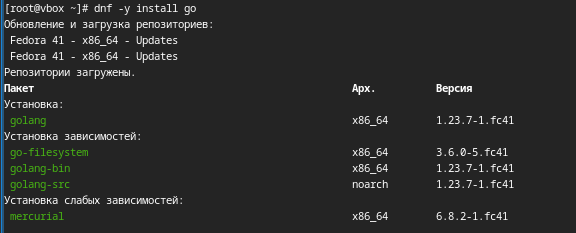{#fig:001 width=70%}

## Установка необходимого программного обеспечения

Теперь перейдем на github репозиторий с генератором и скачаем оттуда необходимый релиз расширенной версии hugo_extended_0.134.1 для linux систем.

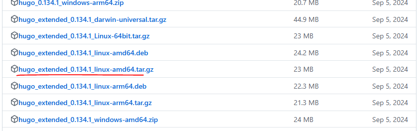{#fig:002 width=70%}

## Установка необходимого программного обеспечения

Распакуем архив в каталог /tmp.

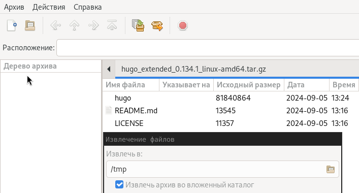{#fig:003 width=70%}

## Установка необходимого программного обеспечения

Создадим локальный репозиторий в рабочем каталоге с шаблона сайта-визитки научного сотрудника.

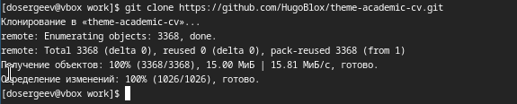{#fig:004 width=70%}

## Установка необходимого программного обеспечения

Перенесем исполнительный файл hugo в созданный локальный репозиторий.

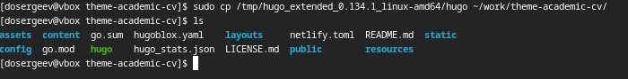{#fig:005 width=70%}

## Работа с сайтом научного сотрудника

Запускаем локальный сервер для проверки работы сайта с помощью команды ./hugo server -D.

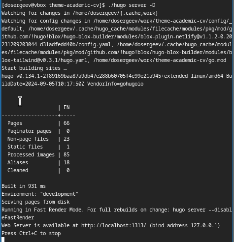{#fig:006 width=35%}

## Работа с сайтом научного сотрудника

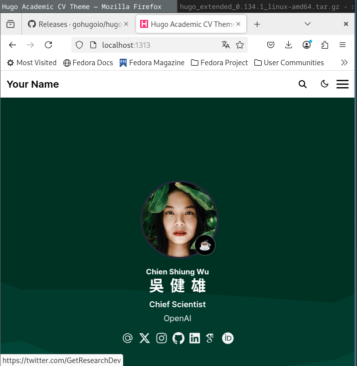{#fig:007 width=45%}

После чего завершаем процесс комбинацией Ctrl+C.

## Размещение заготовки сайта на Github pages.

Приступим к размещению сайта на Github pages. Для начала изменим параметр URL в конфиге сайта.

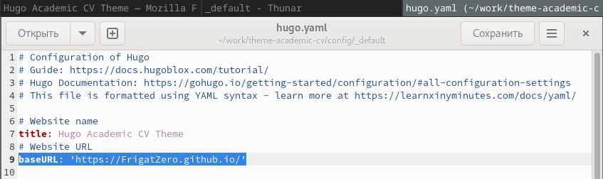{#fig:008 width=70%}

## Размещение заготовки сайта на Github pages.

Теперь создадим новый репозиторий на Github. Назовём его так же, как и будущий URL сайта.

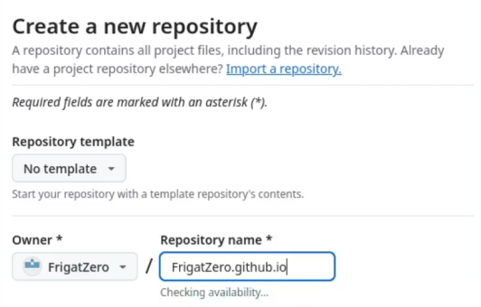{#fig:009 width=60%}

## Размещение заготовки сайта на Github pages.

Скопируем ключ SSH и подключим локальный репозиторий к созданному.

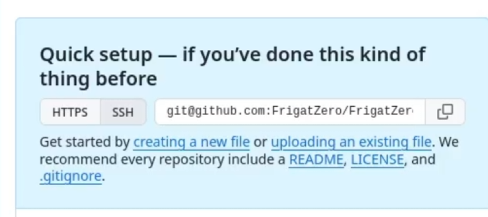{#fig:010 width=70%}

## Размещение заготовки сайта на Github pages.

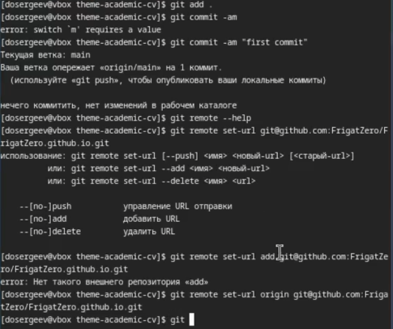{#fig:011 width=55%}

## Размещение заготовки сайта на Github pages.

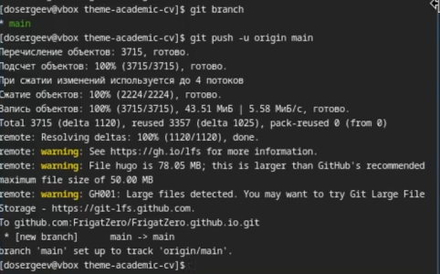{#fig:012 width=70%}

## Размещение заготовки сайта на Github pages.

Запустим процесс по развертыванию сайта на Github pages.

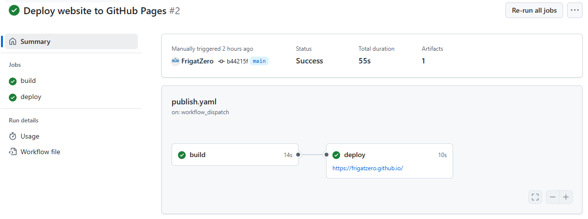{#fig:013 width=70%}

## Размещение заготовки сайта на Github pages.

После окончания процесса, перейдём по созданной ссылке и взглянем на сайт.

{#fig:014 width=50%}

# Вывод

В результате выполнения лабораторной работы я научился создавать сайты на Github pages по шаблону с помощью генератора статических сайтов Hugo.
