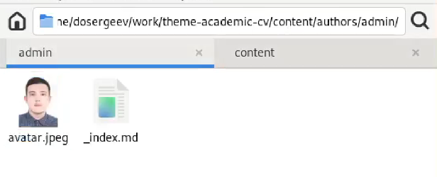
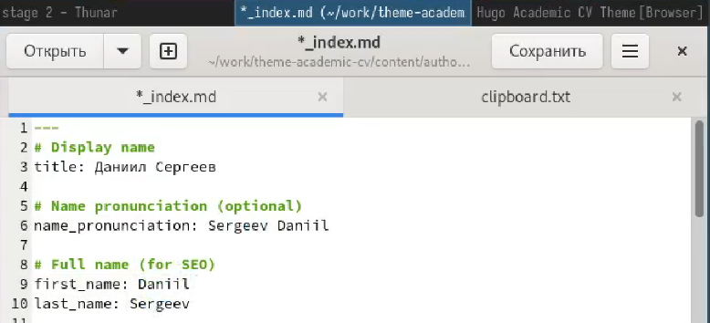
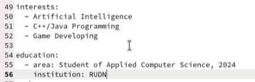
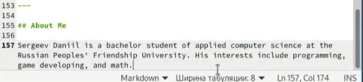
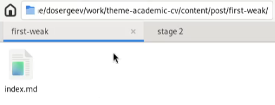
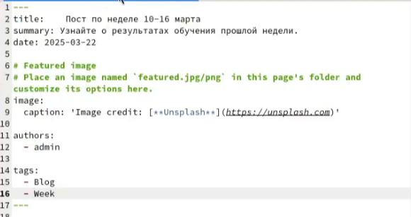
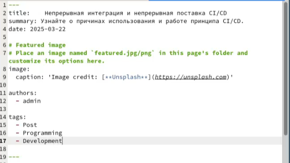
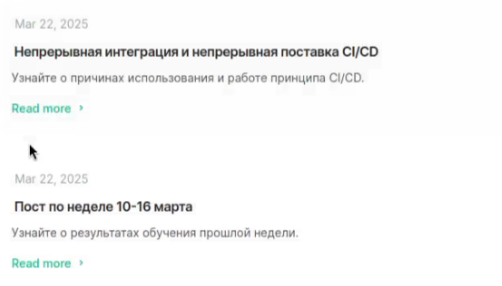

---
## Front matter
lang: ru-RU
title: Отчёт по индивидуальному проекту
subtitle: Этап №2
author:
  - Сергеев Д. О.
institute:
  - Российский университет дружбы народов, Москва, Россия
date: 22 марта 2025

## i18n babel
babel-lang: russian
babel-otherlangs: english

## Formatting pdf
toc: false
toc-title: Содержание
slide_level: 2
aspectratio: 169
section-titles: true
theme: metropolis
header-includes:
 - \metroset{progressbar=frametitle,sectionpage=progressbar,numbering=fraction}
---

# Информация

## Докладчик

:::::::::::::: {.columns align=center}
::: {.column width="70%"}

  * Сергеев Даниил Олегович
  * Студент
  * Направление: Прикладная информатика
  * Российский университет дружбы народов
  * [1132246837@pfur.ru](mailto:1132246837@pfur.ru)

:::
::::::::::::::

# Задание

В качестве задания лабораторной работы необходимо:

- Разместить фотографию владельца сайта.
- Разместить краткое описание владельца сайта (Biography).
- Добавить информацию об интересах (Interests).
- Добавить информацию от образовании (Education).
- Сделать пост по прошедшей неделе.
- Добавить пост на тему по выбору:
  1. Управление версиями. Git.
  2. Непрерывная интеграция и непрерывное развертывание (CI/CD).

# Ход выполнения лабораторной работы

## Размещение на сайт данных о себе

Для начала добавим фотографию владельца сайта. Для этого перейдем в репозиторий сайта и в ./content/authors/admin. В данную директорию добавим фото и назовём его avatar.jpg.

{#fig:001 width=70%}

## Размещение на сайт данных о себе

Теперь приступим к размещению информации. Для этого откроем ./content/authors/admin/_index.md и запишем туда своё имя и фамилию с транскрипцией на английский язык.

{#fig:002 width=70%}

## Размещение на сайт данных о себе

Добавим информацию об интересах и об образовании.

{#fig:003 width=70%}

## Размещение на сайт данных о себе

И завершим редактирование, добавив краткое описание владельца сайта.

{#fig:004 width=70%}

## Создание требуемых постов

Перейдем в директорию ./content/post и создадим в ней каталог first-weak для поста по прошедшей неделе. В нем создаем файл с названием index.md и записываем туда тело поста.

{#fig:005 width=70%}

## Создание требуемых постов

{#fig:006 width=70%}

## Создание требуемых постов

В качестве поста выберем CI/CD. В этой же директории создадим каталог ci-cd для поста по непрерывной интеграции и непрерывному развертыванию.

{#fig:007 width=70%}

## Создание требуемых постов

В результате получим два поста на сайте

{#fig:008 width=70%}

# Вывод

В результате выполнения лабораторной работы я отредактировал личную информацию и научился создавать посты на академическом сайте-визитке, созданном с помощью генератора статических сайтов Hugo.
