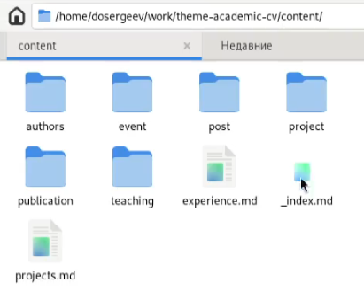

---
## Front matter
lang: ru-RU
title: Отчёт по индивидуальному проекту
subtitle: Этап №3
author:
  - Сергеев Д. О.
institute:
  - Российский университет дружбы народов, Москва, Россия
date: 05 апреля 2025

## i18n babel
babel-lang: russian
babel-otherlangs: english

## Formatting pdf
toc: false
toc-title: Содержание
slide_level: 2
aspectratio: 169
section-titles: true
theme: metropolis
header-includes:
 - \metroset{progressbar=frametitle,sectionpage=progressbar,numbering=fraction}
---

# Информация

## Докладчик

:::::::::::::: {.columns align=center}
::: {.column width="70%"}

  * Сергеев Даниил Олегович
  * Студент
  * Направление: Прикладная информатика
  * Российский университет дружбы народов
  * [1132246837@pfur.ru](mailto:1132246837@pfur.ru)

:::
::::::::::::::

# Задание

В качестве задания лабораторной работы необходимо:

Добавить к сайту достижения.

- Добавить информацию о навыках (Skills).
- Добавить информацию об опыте (Experience).
- Добавить информацию о достижениях (Accomplishments).

Сделать пост по прошедшей неделе.

Добавить пост на тему по выбору:

- Легковесные языки разметки.
- Языки разметки. LaTeX.
- Язык разметки Markdown.

# Ход выполнения лабораторной работы

## Размещение на сайт данных о достижениях

Перейдем в рабочую директорию

{#fig:001 width=50%}

## Размещение на сайт данных о достижениях

Для начала добавим в _index.md по пути content/_index.md блок о навыках (skills).

{#fig:002 width=70%}

## Размещение на сайт данных о достижениях

Изменим файл content/authors/admin/_index.md. Добавим в него личную информацию.

{#fig:003 width=40%}

## Размещение на сайт данных о достижениях

Теперь добавим иконки для навыков и хобби. Для этого в assets/media/icons создадим каталог custom и загрузим туда иконки в формате svg.

{#fig:004 width=55%}

## Размещение на сайт данных о достижениях

{#fig:005 width=60%}

## Размещение на сайт данных о достижениях

Так же добавим блок с опытом (experience).

{#fig:006 width=70%}

## Размещение на сайт данных о достижениях

{#fig:007 width=70%}

## Размещение на сайт данных о достижениях

{#fig:008 width=70%}

## Размещение на сайт данных о достижениях

Добавим информацию о своих наградах (accomplishments).

{#fig:009 width=70%}

## Размещение на сайт данных о достижениях

{#fig:010 width=70%}

## Размещение на сайт данных о достижениях

{#fig:011 width=70%}

## Размещение новых постов

Загрузим заранее подготовленные файлы постов в каталог content/post. Обновим сайт.

{#fig:012 width=50%}

## Размещение новых постов

{#fig:013 width=60%}

# Вывод

В результате выполнения лабораторной работы я отредактировал информацию о своих достижениях и добавил новые посты для моего сайта.
