---
## Front matter
title: "Отчёт по индивидуальному проекту"
subtitle: "Этап №3"
author: "Сергеев Даниил Олегович"

## Generic otions
lang: ru-RU
toc-title: "Содержание"

## Bibliography
bibliography: bib/cite.bib
csl: pandoc/csl/gost-r-7-0-5-2008-numeric.csl

## Pdf output format
toc: true # Table of contents
toc-depth: 2
lof: true # List of figures
lot: true # List of tables
fontsize: 12pt
linestretch: 1.5
papersize: a4
documentclass: scrreprt
## I18n polyglossia
polyglossia-lang:
  name: russian
  options:
	- spelling=modern
	- babelshorthands=true
polyglossia-otherlangs:
  name: english
## I18n babel
babel-lang: russian
babel-otherlangs: english
## Fonts
mainfont: IBM Plex Serif
romanfont: IBM Plex Serif
sansfont: IBM Plex Sans
monofont: IBM Plex Mono
mathfont: STIX Two Math
mainfontoptions: Ligatures=Common,Ligatures=TeX,Scale=0.94
romanfontoptions: Ligatures=Common,Ligatures=TeX,Scale=0.94
sansfontoptions: Ligatures=Common,Ligatures=TeX,Scale=MatchLowercase,Scale=0.94
monofontoptions: Scale=MatchLowercase,Scale=0.94,FakeStretch=0.9
mathfontoptions:
## Biblatex
biblatex: true
biblio-style: "gost-numeric"
biblatexoptions:
  - parentracker=true
  - backend=biber
  - hyperref=auto
  - language=auto
  - autolang=other*
  - citestyle=gost-numeric
## Pandoc-crossref LaTeX customization
figureTitle: "Рис."
tableTitle: "Таблица"
listingTitle: "Листинг"
lofTitle: "Список иллюстраций"
lotTitle: "Список таблиц"
lolTitle: "Листинги"
## Misc options
indent: true
header-includes:
  - \usepackage{indentfirst}
  - \usepackage{float} # keep figures where there are in the text
  - \floatplacement{figure}{H} # keep figures where there are in the text
---

# Задание

В качестве задания лабораторной работы необходимо [@tuis]:

Добавить к сайту достижения.
- Добавить информацию о навыках (Skills).
- Добавить информацию об опыте (Experience).
- Добавить информацию о достижениях (Accomplishments).
Сделать пост по прошедшей неделе.
Добавить пост на тему по выбору:
- Легковесные языки разметки.
- Языки разметки. LaTeX.
- Язык разметки Markdown.

# Ход выполнения лабораторной работы

## Размещение на сайт данных о достижениях

Перейдем в рабочую директорию (рис. [-@fig:001])

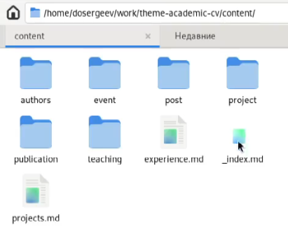{#fig:001 width=70%}

Для начала добавим в _index.md по пути content/_index.md блок о навыках (skills).

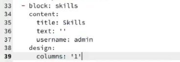{#fig:002 width=70%}

Изменим файл content/authors/admin/_index.md. Добавим в него личную информацию.

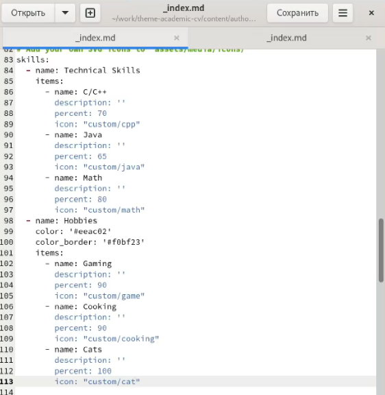{#fig:003 width=70%}

Теперь добавим иконки для навыков и хобби. Для этого в assets/media/icons создадим каталог custom и загрузим туда иконки в формате svg.

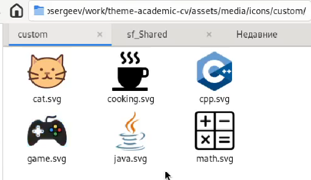{#fig:004 width=70%}

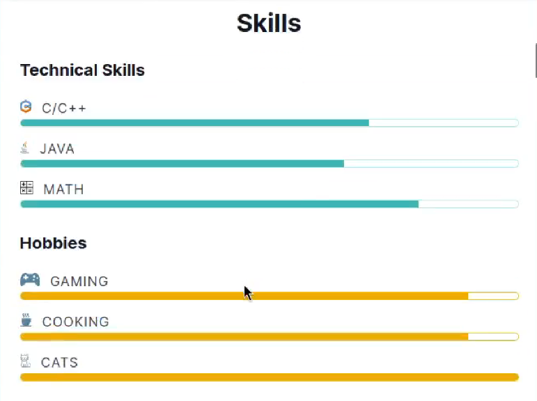{#fig:005 width=70%}

Так же добавим блок с опытом (experience).

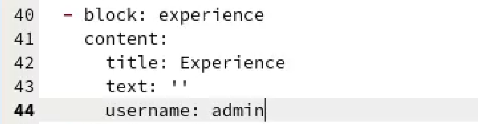{#fig:006 width=70%}

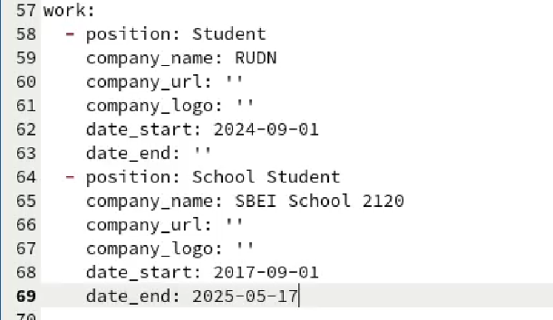{#fig:007 width=70%}

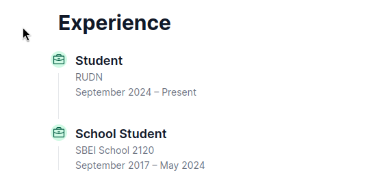{#fig:008 width=70%}

Добавим информацию о своих наградах (accomplishments).

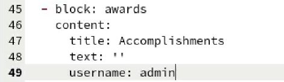{#fig:009 width=70%}

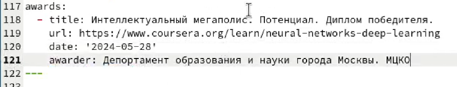{#fig:010 width=70%}

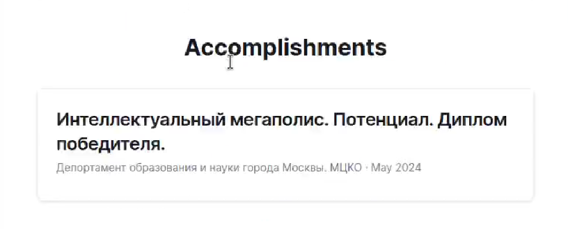{#fig:011 width=70%}

## Размещение новых постов

Загрузим заранее подготовленные файлы постов в каталог content/post. Обновим сайт. (рис. [-@fig:011] - [-@fig:012])

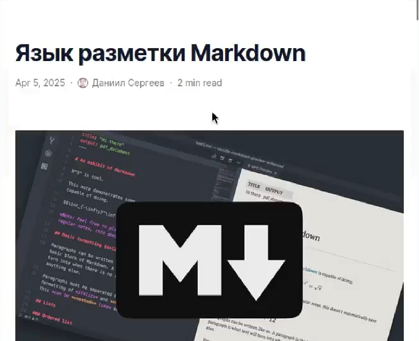{#fig:012 width=70%}

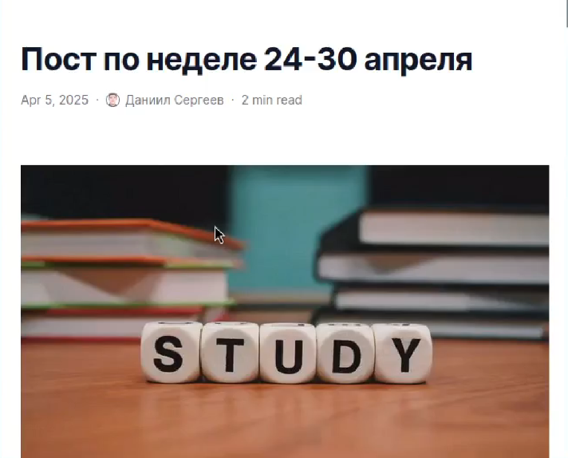{#fig:013 width=70%}

# Вывод

В результате выполнения лабораторной работы я отредактировал информацию о сових достижениях и добавил новые посты для моего сайта.

# Список литературы{.unnumbered}

::: {#refs}
:::
