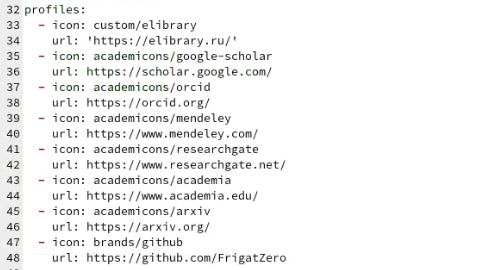
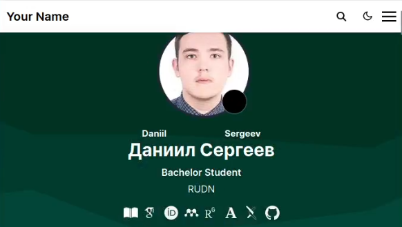
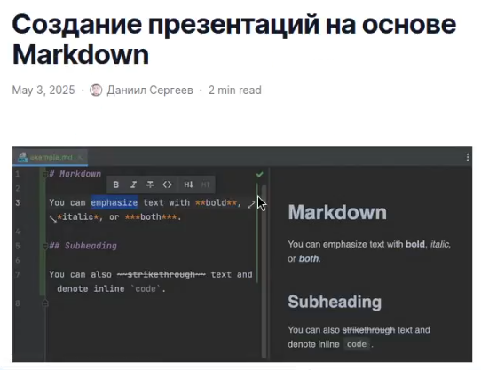
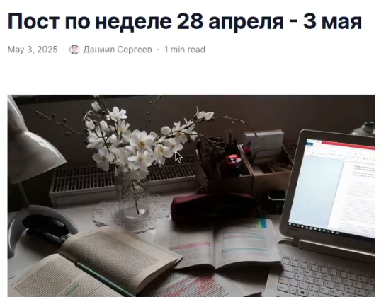
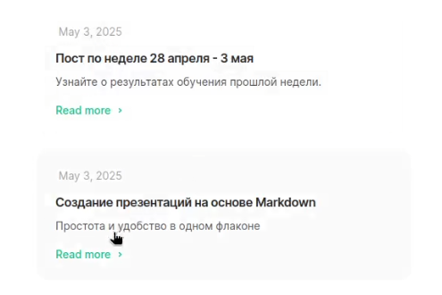

---
## Front matter
lang: ru-RU
title: Отчёт по индивидуальному проекту
subtitle: Этап №4
author:
  - Сергеев Д. О.
institute:
  - Российский университет дружбы народов, Москва, Россия
date: 3 мая 2025

## i18n babel
babel-lang: russian
babel-otherlangs: english

## Formatting pdf
toc: false
toc-title: Содержание
slide_level: 2
aspectratio: 169
section-titles: true
theme: metropolis
header-includes:
 - \metroset{progressbar=frametitle,sectionpage=progressbar,numbering=fraction}
---

# Информация

## Докладчик

:::::::::::::: {.columns align=center}
::: {.column width="70%"}

  * Сергеев Даниил Олегович
  * Студент
  * Направление: Прикладная информатика
  * Российский университет дружбы народов
  * [1132246837@pfur.ru](mailto:1132246837@pfur.ru)

:::
::::::::::::::

# Задание

В качестве задания лабораторной работы необходимо:

Зарегистрироваться на соответствующих ресурсах и разместить на них ссылки на сайте:

- eLibrary : https://elibrary.ru/;
- Google Scholar : https://scholar.google.com/;
- ORCID : https://orcid.org/;
- Mendeley : https://www.mendeley.com/;
- ResearchGate : https://www.researchgate.net/;
- Academia.edu : https://www.academia.edu/;
- arXiv : https://arxiv.org/;
- github : https://github.com/.

## Задание

Сделать пост по прошедшей неделе.

Добавить пост на тему по выбору:

- Оформление отчёта.
- Создание презентаций.
- Работа с библиографией.

# Ход выполнения лабораторной работы

## Размещение на сайт данных о достижениях

Перейдем в рабочую директорию.

{#fig:001 width=50%}

## Размещение на сайт данных о достижениях

Добавим в _index.md по пути content/authors/_index.md ссылки на научные и библиометрические ресурсы. Отредактируем иконки.

{#fig:002 width=70%}

## Размещение на сайт данных о достижениях

Посмотрим как изменились иконки на проверочном локальном сайте.

{#fig:003 width=70%}

## Размещение новых постов

Загрузим заранее подготовленные файлы постов в каталог content/post. Обновим сайт.

:::::::::::::: {.columns align=center}
::: {.column width="50%"}

{#fig:004 width=70%}

:::
::: {.column width="50%"}

{#fig:005 width=70%}

:::
::::::::::::::

## Размещение новых постов

{#fig:006 width=70%}

# Вывод

В результате выполнения лабораторной работы я отредактировал информацию о ссылках на научные и библиометрические ресурсы и добавил новые посты для моего сайта.

