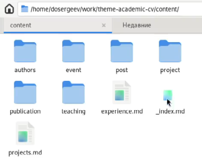
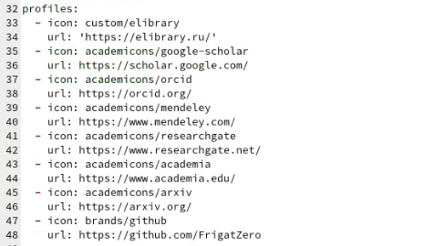
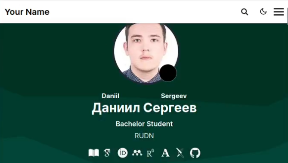
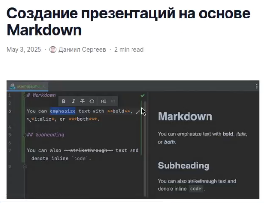
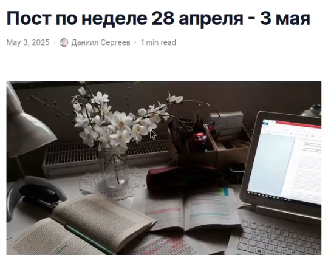
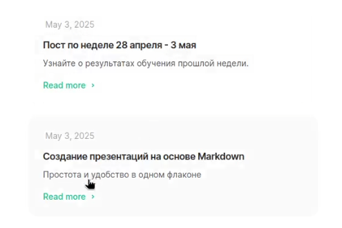

---
## Front matter
title: "Отчёт по индивидуальному проекту"
subtitle: "Этап №4"
author: "Сергеев Даниил Олегович"

## Generic otions
lang: ru-RU
toc-title: "Содержание"

## Bibliography
bibliography: bib/cite.bib
csl: pandoc/csl/gost-r-7-0-5-2008-numeric.csl

## Pdf output format
toc: true # Table of contents
toc-depth: 2
lof: true # List of figures
lot: true # List of tables
fontsize: 12pt
linestretch: 1.5
papersize: a4
documentclass: scrreprt
## I18n polyglossia
polyglossia-lang:
  name: russian
  options:
	- spelling=modern
	- babelshorthands=true
polyglossia-otherlangs:
  name: english
## I18n babel
babel-lang: russian
babel-otherlangs: english
## Fonts
mainfont: IBM Plex Serif
romanfont: IBM Plex Serif
sansfont: IBM Plex Sans
monofont: IBM Plex Mono
mathfont: STIX Two Math
mainfontoptions: Ligatures=Common,Ligatures=TeX,Scale=0.94
romanfontoptions: Ligatures=Common,Ligatures=TeX,Scale=0.94
sansfontoptions: Ligatures=Common,Ligatures=TeX,Scale=MatchLowercase,Scale=0.94
monofontoptions: Scale=MatchLowercase,Scale=0.94,FakeStretch=0.9
mathfontoptions:
## Biblatex
biblatex: true
biblio-style: "gost-numeric"
biblatexoptions:
  - parentracker=true
  - backend=biber
  - hyperref=auto
  - language=auto
  - autolang=other*
  - citestyle=gost-numeric
## Pandoc-crossref LaTeX customization
figureTitle: "Рис."
tableTitle: "Таблица"
listingTitle: "Листинг"
lofTitle: "Список иллюстраций"
lotTitle: "Список таблиц"
lolTitle: "Листинги"
## Misc options
indent: true
header-includes:
  - \usepackage{indentfirst}
  - \usepackage{float} # keep figures where there are in the text
  - \floatplacement{figure}{H} # keep figures where there are in the text
---

# Задание

В качестве задания лабораторной работы необходимо [@tuis]:

Зарегистрироваться на соответствующих ресурсах и разместить на них ссылки на сайте:

- eLibrary : https://elibrary.ru/;
- Google Scholar : https://scholar.google.com/;
- ORCID : https://orcid.org/;
- Mendeley : https://www.mendeley.com/;
- ResearchGate : https://www.researchgate.net/;
- Academia.edu : https://www.academia.edu/;
- arXiv : https://arxiv.org/;
- github : https://github.com/.

Сделать пост по прошедшей неделе.

Добавить пост на тему по выбору:

- Оформление отчёта.
- Создание презентаций.
- Работа с библиографией.

# Ход выполнения лабораторной работы

## Размещение на сайт данных о достижениях

Перейдем в рабочую директорию (рис. [-@fig:001])

{#fig:001 width=70%}

Добавим в _index.md по пути content/authors/_index.md ссылки на научные и библиометрические ресурсы. Отредактируем иконки.

{#fig:002 width=70%}

Посмотрим как изменились иконки на проверочном локальном сайте.

{#fig:003 width=70%}

## Размещение новых постов

Загрузим заранее подготовленные файлы постов в каталог content/post (рис. [-@fig:004]-[-@fig:005]). Обновим сайт (рис. [-@fig:006]).

{#fig:004 width=70%}

{#fig:005 width=70%}

{#fig:006 width=70%}

# Вывод

В результате выполнения лабораторной работы я отредактировал информацию о ссылках на научные и библиометрические ресурсы и добавил новые посты для моего сайта.

# Список литературы{.unnumbered}

::: {#refs}
:::
