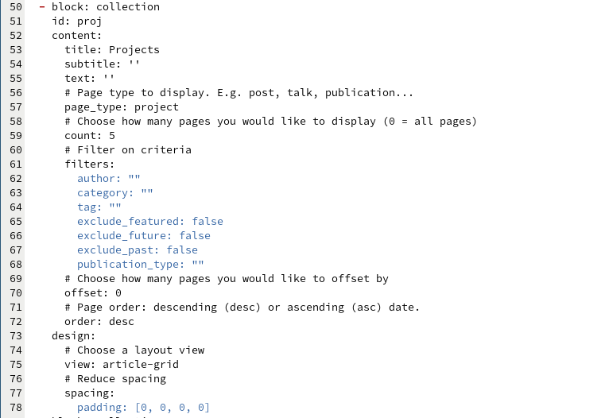
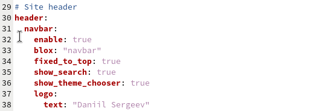
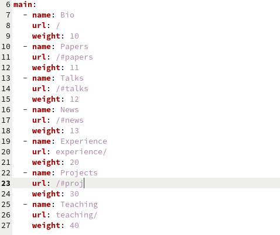
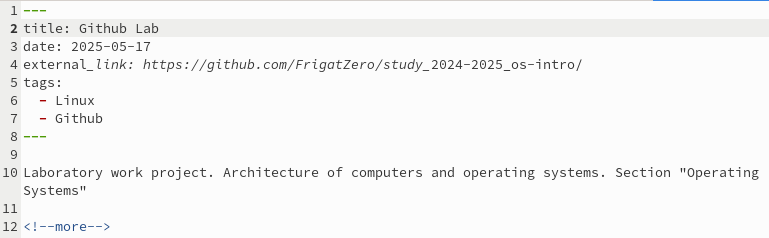
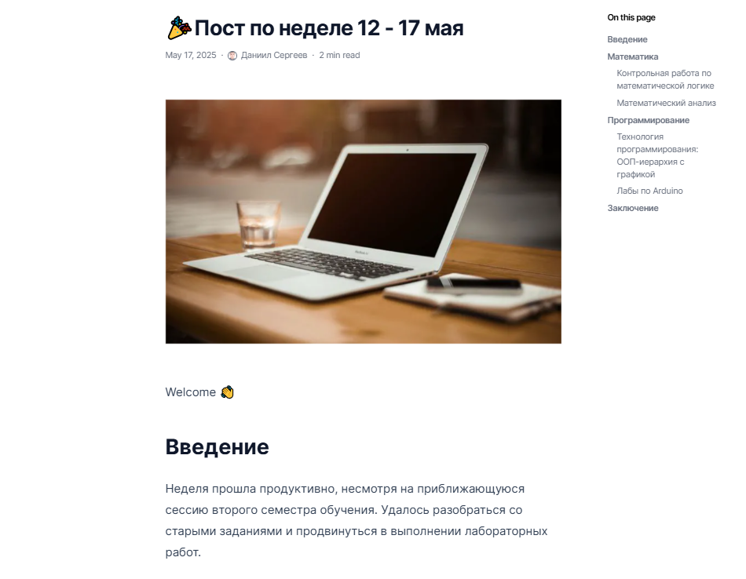
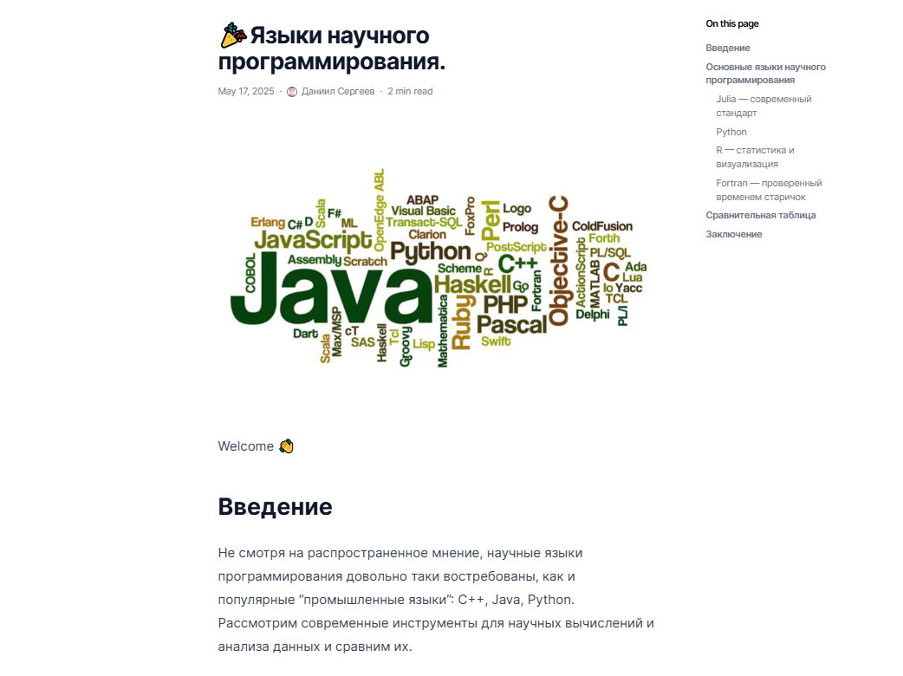
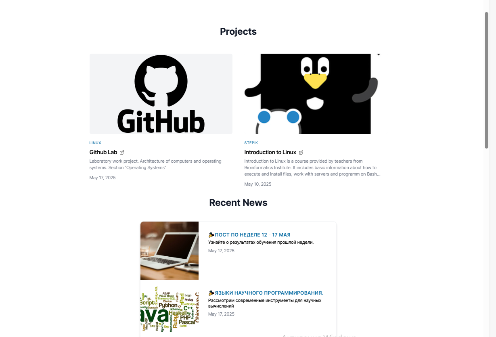

---
## Front matter
lang: ru-RU
title: Отчёт по индивидуальному проекту
subtitle: Этап №5
author:
  - Сергеев Д. О.
institute:
  - Российский университет дружбы народов, Москва, Россия
date: 17 мая 2025

## i18n babel
babel-lang: russian
babel-otherlangs: english

## Formatting pdf
toc: false
toc-title: Содержание
slide_level: 2
aspectratio: 169
section-titles: true
theme: metropolis
header-includes:
 - \metroset{progressbar=frametitle,sectionpage=progressbar,numbering=fraction}
---

# Информация

## Докладчик

:::::::::::::: {.columns align=center}
::: {.column width="70%"}

  * Сергеев Даниил Олегович
  * Студент
  * Направление: Прикладная информатика
  * Российский университет дружбы народов
  * [1132246837@pfur.ru](mailto:1132246837@pfur.ru)

:::
::::::::::::::

# Задание

В качестве задания лабораторной работы необходимо:

- Сделать записи для персональных проектов.
- Сделать пост по прошедшей неделе.
- Добавить пост на тему по выбору:
  - Языки научного программирования.

# Ход выполнения лабораторной работы

## Создание блока для записей проектов

Откроем файл content/_index.md в каталоге проекта. Добавим блок записей для персональных проектов. Укажем id: proj, который пригодится нам далее.

{#fig:001 width=55%}

## Создание блока для записей проектов

В файле конфига config/_default/params.yaml поменяем текст в верхней панели с Your Name на имя и фамилию автора сайта.

{#fig:002 width=70%}

## Создание блока для записей проектов

:::::::::::::: {.columns align=center}
::: {.column width="50%"}

В том же каталоге отредактируем menus.yaml. Укажем в строке url пункта Projects указание на блок, созданный в индексе, с помощью id: proj. Это нужно для того, чтобы при нажатии на кнопку Projects в меню навигации нас перекидывало на необходимый блок с проектами на главном экране.

:::
::: {.column width="50%"}

{#fig:003 width=70%}

:::
::::::::::::::

## Создание блока для записей проектов

Очистим проекты-загатовки в каталоге content/project и добавим свой проект, ведущий на github, и проект прохождения внешнего курса.

{#fig:004 width=70%}

## Размещение новых постов

Загрузим заранее подготовленные файлы постов в каталог content/post. Обновим сайт.

:::::::::::::: {.columns align=center}
::: {.column width="50%"}

{#fig:005 width=70%}

:::
::: {.column width="50%"}

{#fig:006 width=70%}

:::
::::::::::::::

## Размещение новых постов

{#fig:007 width=70%}

# Вывод

В результате выполнения лабораторной работы я добавил к сайту блок с персональными проектами и новые посты.
